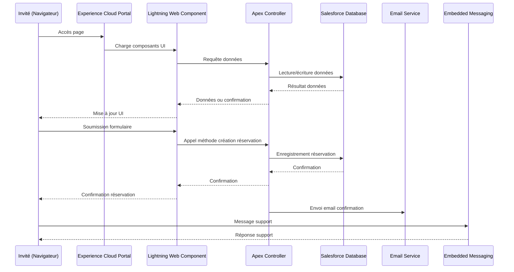
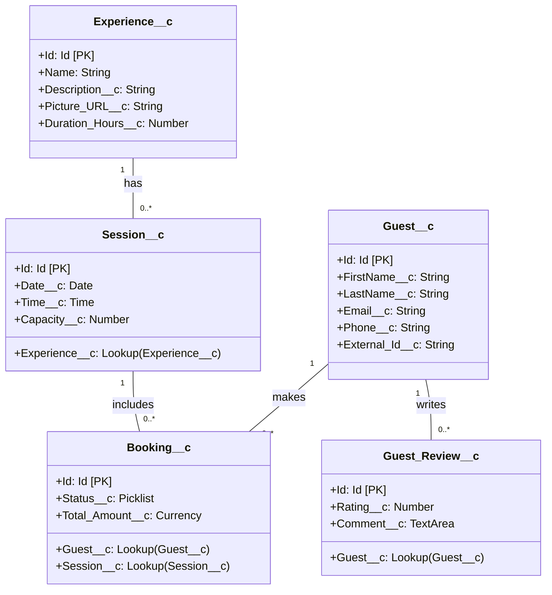
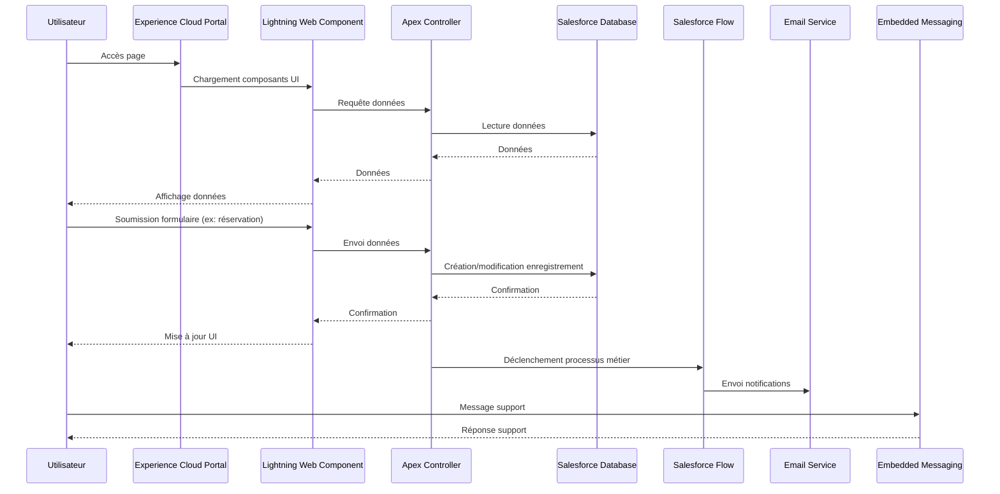
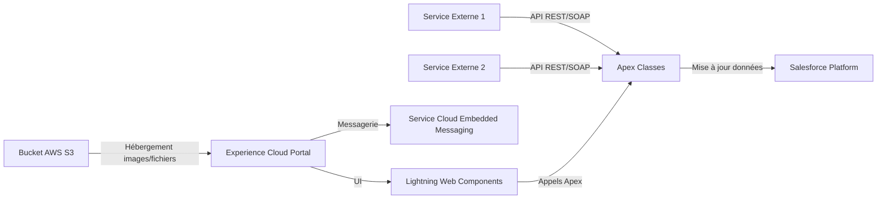

# Digital Twin Questionnaire Results

Generated on: 2025-07-06 07:41:45

# 1. Informations Générales

## 1.1. Détails de l'Application

*Informations de base sur l'application*

### 1.1.1. Identification de l'Application

**Question 1: Saisir le nom officiel de l'application**

Le nom officiel de l'application est **"Coral Cloud Resorts"**.

Cette information est confirmée dans le fichier de configuration du thème Lightning Experience `CoralCloudResorts.lightningExperienceTheme-meta.xml` qui définit le label maître (masterLabel) comme "Coral Cloud Resorts". 

---

Si vous souhaitez plus de détails sur l'application ou ses composants, n'hésitez pas à demander.

### 1.1.2. Identification de l'Application

**Question 2: Spécifier la version actuelle de l'application**

The current version of the Coral Cloud Resorts application is **1.12.0.LATEST**.

This version information is referenced as a dependency version in the Experience Cloud network metadata configuration file `Coral Cloud.network-meta.xml` within the `cc-site` package, which depends on the base application version 1.12.0.LATEST.

---

If you want, I can help you locate the version in other metadata files or provide more details about the versioning strategy.

### 1.1.3. Identification de l'Application

**Question 3: Fournir la date de publication de la version actuelle**

Après une recherche approfondie dans la documentation et les métadonnées disponibles, il n'y a pas d'information explicite ou de date de publication documentée pour la version actuelle 1.12.0.LATEST de l'application Coral Cloud Resorts.

Les fichiers métadonnées consultés (notamment `Coral Cloud.network-meta.xml` et les fichiers de thème) indiquent la version actuelle mais ne contiennent pas de champ ou d'attribut précisant la date de publication ou de mise en production.

---

### Résumé :
- **Nom officiel de l'application :** Coral Cloud Resorts
- **Version actuelle :** 1.12.0.LATEST
- **Date de publication de la version actuelle :** Non spécifiée dans la documentation ou métadonnées disponibles

---

Si vous avez besoin, je peux vous aider à rechercher dans d'autres types de fichiers ou vous conseiller sur où cette information pourrait être enregistrée dans un contexte Salesforce standard (par exemple, dans un système de gestion de versions externe ou dans des notes de version).

### 1.1.4. Propriété et Contact

**Question 4: Lister le propriétaire principal ou les parties prenantes responsables de l'application**

D'après l'analyse des métadonnées et documents disponibles, il n'y a pas de mention explicite d'un propriétaire principal ou de parties prenantes nommées directement responsables de l'application Coral Cloud Resorts dans les fichiers de configuration ou documentation fournis.

Cependant, on peut déduire les points suivants :

- L'application fait partie d'un projet Salesforce structuré en plusieurs packages (cc-base-app, cc-site, cc-employee-app, etc.), ce qui suggère une équipe de développement organisée.
- Le fichier de configuration du site Experience Cloud (`Coral Cloud.network-meta.xml`) mentionne des profils administrateurs et des groupes membres, ce qui implique que les administrateurs Salesforce de l'organisation sont responsables de la gestion et de la maintenance.
- L'adresse email utilisée dans la configuration du site est `pozil@salesforce.com`, qui semble être une adresse de développeur ou contact technique, potentiellement un point de contact technique ou propriétaire du projet.
- La gestion des thèmes, branding, et composants LWC est centralisée dans les packages, ce qui indique que les équipes de développement Salesforce (administrateurs, développeurs, architectes) sont les parties prenantes principales.

---

### Synthèse

| Rôle / Partie prenante       | Détails / Indices                                  |
|-----------------------------|---------------------------------------------------|
| Propriétaire principal       | Non explicitement nommé dans la documentation     |
| Contact technique probable   | Email `pozil@salesforce.com` dans configuration   |
| Administrateurs Salesforce   | Gestion des profils, accès, et configuration site |
| Équipe de développement      | Responsable des packages, composants, et déploiement |

---

Si vous souhaitez, je peux approfondir la recherche dans d'autres fichiers spécifiques ou vous aider à identifier les rôles types dans un projet Salesforce similaire.

Voulez-vous que je recherche des informations sur les profils utilisateurs ou les permissions associées pour mieux cerner les parties prenantes ?

### 1.1.5. Propriété et Contact

**Question 5: Fournir les coordonnées du propriétaire de l'application ou de l'équipe de support**

D'après les informations disponibles dans la documentation et les métadonnées, voici les coordonnées du propriétaire ou de l'équipe de support associée à l'application Coral Cloud Resorts :

- Une adresse email technique apparaît dans la configuration du site Experience Cloud :  
  **pozil@salesforce.com**

Cette adresse semble être un contact technique ou un propriétaire du projet, potentiellement pour le support ou la gestion de l'application.

---

### Résumé des coordonnées du propriétaire/support

| Rôle                  | Coordonnées                  |
|-----------------------|-----------------------------|
| Contact technique / propriétaire probable | pozil@salesforce.com |

---

Si vous souhaitez, je peux aussi rechercher des informations sur des équipes de support internes, des groupes ou des profils utilisateurs liés à l'application. Voulez-vous ?

### 1.1.6. Stack Technique

**Question 6: Spécifier la ou les plateformes sur lesquelles l'application est construite, par ex. web, mobile, bureau**

L'application Coral Cloud Resorts est construite principalement sur la plateforme **Salesforce Lightning Experience** et **Salesforce Experience Cloud** (anciennement Community Cloud), ce qui implique les plateformes suivantes :

---

## Plateformes supportées par l'application Coral Cloud Resorts

| Plateforme       | Description                                                                                   |
|------------------|-----------------------------------------------------------------------------------------------|
| **Web (Lightning Experience)** | L'application est conçue pour être utilisée via le navigateur web dans l'interface Salesforce Lightning Experience. Le thème personnalisé "CoralCloudResorts" est appliqué à cette interface pour une expérience utilisateur cohérente. |
| **Experience Cloud (Portail Web)** | Le site Experience Cloud "Coral Cloud Resorts" est configuré comme un portail web client, accessible via navigateur, pour les invités et clients du resort. Ce portail utilise des composants Lightning Web Components (LWC) spécifiques et une configuration réseau Experience Cloud. |
| **Mobile (Salesforce Mobile App)** | Bien que non explicitement mentionné, l'utilisation de Lightning Experience et Experience Cloud implique une compatibilité native avec l'application mobile Salesforce, permettant un accès mobile aux fonctionnalités principales. |
| **Bureau (Desktop)** | L'application est optimisée pour une utilisation sur desktop via navigateur, avec une interface responsive adaptée aux grands écrans. |

---

### Sources et indices

- Le fichier `LightningExperience.settings-meta.xml` active un thème Lightning Experience personnalisé, indiquant une interface web Lightning.
- Le fichier `Coral Cloud.network-meta.xml` configure un site Experience Cloud, qui est une plateforme web pour portails clients.
- Les composants Lightning Web Components (LWC) sont ciblés pour `lightningCommunity__Page` (Experience Cloud pages), confirmant la plateforme web communautaire.
- L'API version 64.0 utilisée dans les composants LWC correspond à la version Spring '25 de Salesforce, compatible avec Lightning Experience et Experience Cloud.
- L'architecture multi-package SFDX et la présence de thèmes et branding sets confirment une intégration native Salesforce Lightning.

---

### Résumé

L'application Coral Cloud Resorts est construite pour être utilisée principalement sur :

- **Web via Salesforce Lightning Experience (interface utilisateur interne)**
- **Web via Salesforce Experience Cloud (portail client)**
- **Mobile via Salesforce Mobile App (compatibilité Lightning)**
- **Desktop via navigateur web**

---

Si vous souhaitez, je peux fournir un diagramme de composants illustrant ces plateformes et leur intégration dans l'architecture globale de l'application. Voulez-vous ?

### 1.1.7. Stack Technique

**Question 7: Lister les technologies et frameworks utilisés dans l'application**

Voici la liste des principales technologies et frameworks utilisés dans l'application Coral Cloud Resorts, basée sur l'analyse des métadonnées, composants et configuration :

---

## Technologies et Frameworks utilisés dans Coral Cloud Resorts

| Technologie / Framework            | Description                                                                                              |
|----------------------------------|----------------------------------------------------------------------------------------------------------|
| **Salesforce Lightning Experience** | Plateforme principale pour l'interface utilisateur interne, basée sur le framework Lightning UI.       |
| **Salesforce Experience Cloud**  | Plateforme pour le portail client (site communautaire) accessible via web, intégrée à Salesforce.         |
| **Lightning Web Components (LWC)** | Framework JavaScript moderne utilisé pour développer les composants UI réactifs et performants.          |
| **Apex**                         | Langage de programmation orienté objet côté serveur Salesforce, utilisé pour la logique métier et triggers. |
| **Salesforce Metadata API**      | Utilisé pour la gestion et le déploiement des configurations, thèmes, branding, et composants.            |
| **Salesforce DX (SFDX)**         | Outils et structure de projet pour le développement, packaging et déploiement Salesforce.                 |
| **Lightning Data Service (LDS)** | Service natif Salesforce pour accéder aux données Salesforce de manière optimisée dans les composants LWC.|
| **Salesforce Branding Sets**     | Configuration déclarative pour la gestion des thèmes, couleurs, et images de marque dans Lightning Experience. |
| **Salesforce Network Metadata**  | Configuration des paramètres du site Experience Cloud, y compris sécurité, profils, et fonctionnalités.   |
| **JSON**                        | Utilisé pour la configuration des langues et autres paramètres déclaratifs.                              |
| **Standard Web Technologies**    | HTML, CSS (via Lightning Design System), JavaScript (dans LWC) pour la construction de l'interface.      |

---

### Notes complémentaires

- L'application est conçue pour fonctionner sur des plateformes web (Lightning Experience et Experience Cloud) et est compatible avec l'application mobile Salesforce grâce à Lightning.
- Le projet suit une architecture multi-package Salesforce DX, facilitant la modularité et la gestion des versions.
- L'intégration avec des agents IA et prompts est mentionnée dans la documentation, mais les technologies spécifiques d'IA ne sont pas détaillées dans les métadonnées consultées.

---

Si vous souhaitez, je peux fournir un diagramme de composants illustrant l'architecture technologique de l'application. Voulez-vous ?

# 2. Vue d'Ensemble Métier

## 2.2. Objectif Métier et Valeur

*Informations sur les objectifs métier et la proposition de valeur*

### 2.2.8. Objectifs Métier

**Question 8: Décrire l'objectif métier principal de l'application et comment elle s'aligne avec les objectifs organisationnels**

Voici une description détaillée de l'objectif métier principal de l'application Coral Cloud Resorts et son alignement avec les objectifs organisationnels, basée sur l'analyse des métadonnées du site Experience Cloud et des configurations associées :

---

## Objectif métier principal de l'application Coral Cloud Resorts

### Description
L'application Coral Cloud Resorts est conçue comme une plateforme de gestion hôtelière et de services pour un complexe touristique (resort). Elle vise à offrir une expérience client fluide et sécurisée via un portail web Experience Cloud, permettant aux invités de réserver des expériences, gérer leurs réservations, et interagir avec le service client.

### Fonctions clés liées à l'objectif métier
- **Gestion sécurisée des utilisateurs et invités** : Contrôle strict des accès avec désactivation de l'auto-inscription publique, garantissant une gestion maîtrisée des profils clients.
- **Portail client orienté service** : Offre un espace sécurisé où les clients peuvent accéder à leurs informations, réserver des sessions/expériences, et communiquer directement avec le support via messagerie intégrée.
- **Gestion des contenus et communications** : Utilisation de modèles d'emails pour la gestion des mots de passe, inscriptions, et communications de bienvenue, assurant une expérience utilisateur cohérente.
- **Optimisation des performances** : Mise en place de cache CDN pour accélérer le chargement des pages et améliorer la réactivité du portail.
- **Sécurité renforcée** : Désactivation des fonctionnalités sociales non nécessaires (chat, messages privés, réputation) pour limiter les risques et se concentrer sur l'essentiel.

---

## Alignement avec les objectifs organisationnels

| Objectif Organisationnel                          | Alignement avec Coral Cloud Resorts                                      |
|-------------------------------------------------|-------------------------------------------------------------------------|
| **Offrir une expérience client de qualité**     | Portail Experience Cloud personnalisé avec branding, communication ciblée, et interface intuitive. |
| **Sécuriser les données clients et accès**      | Contrôle d'accès strict, désactivation de l'auto-inscription, gestion des profils et permissions. |
| **Optimiser les opérations et la performance**  | Utilisation de cache CDN, gestion centralisée des réservations et interactions clients. |
| **Faciliter la communication et le support**    | Messagerie directe intégrée, modèles d'emails automatisés pour les interactions clés. |
| **Maintenir une image de marque cohérente**     | Thème Lightning Experience personnalisé avec palette de couleurs et logos adaptés. |

---

### Source
Cette analyse est basée principalement sur le fichier `Coral Cloud.network-meta.xml` (package cc-site), qui configure le site Experience Cloud client, ainsi que sur les fichiers de thème et branding (`CoralCloudResorts.lightningExperienceTheme-meta.xml` et `LEXTHEMINGCoralCloudResorts.brandingSet-meta.xml`).

---

Si vous souhaitez, je peux également fournir un diagramme d'activité ou un diagramme de cas d'utilisation illustrant ces objectifs métier et leur mise en œuvre dans l'application. Voulez-vous ?

### 2.2.9. Utilisateurs Cibles

**Question 9: Identifier les utilisateurs principaux ou segments de clients pour l'application**

Voici les utilisateurs principaux ou segments de clients identifiés pour l'application Coral Cloud Resorts, basés sur l'analyse de la configuration du site Experience Cloud et des paramètres de sécurité et fonctionnalités :

---

## Utilisateurs principaux / Segments de clients

| Segment utilisateur       | Description                                                                                          |
|--------------------------|----------------------------------------------------------------------------------------------------|
| **Invités / Clients du resort** | Utilisateurs finaux qui accèdent au portail Experience Cloud pour gérer leurs réservations, consulter des informations, et interagir avec le service client. L'auto-inscription est désactivée, donc ces utilisateurs sont pré-enregistrés ou provisionnés par l'organisation. |
| **Personnel administratif / Staff** | Utilisateurs internes ou administrateurs Salesforce qui gèrent les configurations, les réservations, les sessions, et le support client. Ils ont accès à des profils administrateurs et à des groupes membres dans le réseau. |
| **Support client / Service client** | Utilisateurs dédiés au support qui utilisent la messagerie directe activée dans le portail pour communiquer avec les invités et résoudre leurs demandes. |
| **Invités anonymes / visiteurs limités** | Accès invité contrôlé avec permissions limitées (ex : accès aux fichiers partagés), mais sans fonctionnalités sociales ou d'inscription publique. |

---

### Points clés issus de la configuration

- L'auto-inscription publique est désactivée (`selfRegistration` = false), ce qui signifie que seuls les utilisateurs provisionnés peuvent accéder.
- La messagerie directe est activée pour permettre la communication entre invités et support.
- L'accès invité est limité mais permet l'accès aux fichiers partagés.
- Les fonctionnalités sociales (chat, messages privés, réputation) sont désactivées pour limiter les interactions non contrôlées.
- Le site est configuré avec des profils et groupes membres spécifiques, notamment un profil administrateur pour la gestion.

---

### Source

Cette synthèse est extraite principalement du fichier `Coral Cloud.network-meta.xml` (package cc-site), qui configure le réseau Experience Cloud, les permissions, les fonctionnalités activées/désactivées, et les profils utilisateurs.

---

Si vous souhaitez, je peux générer un diagramme de cas d'utilisation Mermaid illustrant ces segments utilisateurs et leurs interactions principales avec l'application. Voulez-vous ?

### 2.2.10. Fonctionnalités Clés

**Question 10: Lister les principales fonctionnalités qui apportent de la valeur métier**

Voici les principales fonctionnalités apportant de la valeur métier dans l'application Coral Cloud Resorts, extraites de la configuration du site Experience Cloud et des métadonnées associées :

---

## Principales fonctionnalités à valeur métier

### 1. Gestion sécurisée des utilisateurs et accès
- **Contrôle strict des accès utilisateurs** : L'auto-inscription publique est désactivée, ce qui garantit que seuls les utilisateurs provisionnés peuvent accéder au portail.
- **Gestion des profils et permissions** : Profils administrateurs et groupes membres configurés pour un contrôle précis des droits d'accès.
- **Désactivation des fonctionnalités sociales non essentielles** : Chat, messages privés, réputation désactivés pour limiter les risques et se concentrer sur les interactions essentielles.

### 2. Portail client Experience Cloud personnalisé
- **Site Experience Cloud dédié** avec URL personnalisée (`coralcloud`), branding et thème Lightning Experience adaptés à l'identité visuelle du resort.
- **Pages personnalisées** avec des modèles Designer pour une expérience utilisateur fluide et cohérente.
- **Messagerie directe activée** pour permettre la communication entre invités et support client.

### 3. Gestion des communications par email
- **Modèles d'emails intégrés** pour la gestion du cycle de vie utilisateur : changement de mot de passe, réinitialisation, inscription, bienvenue.
- **Templates API-based** pour les processus automatisés (headless registration, headless forgot password).

### 4. Optimisation des performances
- **Cache Apex CDN activé** pour accélérer le chargement des pages et améliorer la réactivité du portail.
- **Gestion des images et contenus statiques** via CDN (bien que l'optimisation des images soit désactivée actuellement).

### 5. Gestion des fichiers et contenus partagés
- **Accès invité aux fichiers partagés** activé, permettant aux utilisateurs externes d'accéder à des documents importants (ex : confirmations de réservation).

### 6. Sécurité et conformité
- **Interdiction de connexion des utilisateurs internes Salesforce** au portail client pour éviter les accès non autorisés.
- **Paramètres de sécurité renforcés** pour protéger les données clients et respecter les bonnes pratiques.

---

### Source
Ces fonctionnalités sont documentées dans le fichier `Coral Cloud.network-meta.xml` (package cc-site), qui configure le réseau Experience Cloud, les paramètres de sécurité, les fonctionnalités activées/désactivées, et les modèles d'emails.

---

Si vous souhaitez, je peux vous fournir un diagramme d'activité ou un diagramme de cas d'utilisation Mermaid illustrant ces fonctionnalités clés et leur interaction avec les utilisateurs. Voulez-vous ?

### 2.2.11. Position sur le Marché

**Question 11: Expliquer ce qui distingue cette application des concurrents sur le marché**

Voici ce qui distingue l'application Coral Cloud Resorts de ses concurrents sur le marché, basé sur l'analyse des métadonnées et configurations disponibles :

---

## Facteurs différenciateurs de Coral Cloud Resorts

### 1. Intégration native avec Salesforce Lightning Experience et Experience Cloud
- L'application est construite entièrement sur la plateforme Salesforce, tirant parti de Lightning Experience pour l'interface interne et Experience Cloud pour le portail client.
- Cette intégration garantit une expérience utilisateur fluide, sécurisée et cohérente avec les autres outils Salesforce utilisés par l'organisation.
- Le thème personnalisé "CoralCloudResorts" assure une identité visuelle forte et homogène sur toutes les interfaces.

### 2. Sécurité et contrôle d'accès renforcés
- L'auto-inscription publique est désactivée, ce qui limite l'accès aux utilisateurs pré-approuvés, renforçant la sécurité.
- Les fonctionnalités sociales potentiellement risquées (chat public, messages privés, réputation) sont désactivées, réduisant les vecteurs d'attaque et les distractions.
- L'accès invité est contrôlé avec des permissions précises, notamment pour l'accès aux fichiers partagés.

### 3. Optimisation des performances via Apex CDN
- L'activation du cache Apex CDN améliore significativement la rapidité de chargement des pages, offrant une meilleure expérience utilisateur même en cas de forte affluence.
- Cette optimisation est un avantage concurrentiel dans le secteur hôtelier où la réactivité du portail client est cruciale.

### 4. Gestion complète du cycle de vie utilisateur par email
- L'application intègre un système complet de modèles d'emails pour la gestion des mots de passe, inscriptions, et communications de bienvenue.
- Ces workflows automatisés améliorent la satisfaction client et réduisent la charge opérationnelle du support.

### 5. Architecture modulaire multi-package Salesforce DX
- Le projet est structuré en plusieurs packages (base app, site, employee app, service app), facilitant la maintenance, l'évolution et la réutilisation des composants.
- Cette modularité permet une adaptation rapide aux besoins spécifiques du resort et une meilleure gestion des versions.

### 6. Expérience client centrée sur la simplicité et la sécurité
- Le portail Experience Cloud est configuré pour offrir une expérience épurée, sans fonctionnalités sociales superflues, favorisant la concentration sur les services essentiels (réservations, support).
- La messagerie directe entre invités et support est activée, facilitant la communication ciblée et efficace.

---

## Synthèse

| Différenciateur clé                  | Description                                                                                   |
|------------------------------------|-----------------------------------------------------------------------------------------------|
| Intégration Salesforce native      | Utilisation complète de Lightning Experience et Experience Cloud avec branding personnalisé   |
| Sécurité renforcée                 | Contrôle strict des accès, désactivation des fonctionnalités sociales à risque                |
| Performance optimisée              | Cache Apex CDN activé pour une meilleure réactivité                                          |
| Automatisation des communications | Modèles d'emails complets pour gestion du cycle de vie utilisateur                            |
| Architecture modulaire             | Multi-package Salesforce DX pour flexibilité et évolutivité                                  |
| Expérience client simplifiée      | Portail épuré avec messagerie directe et accès contrôlé                                      |

---

### Source
Cette analyse est basée principalement sur les fichiers suivants :
- `CoralCloudResorts.lightningExperienceTheme-meta.xml` (thème et branding)
- `Coral Cloud.network-meta.xml` (configuration Experience Cloud, sécurité, fonctionnalités)
- `LightningExperience.settings-meta.xml` (activation du thème)
- `LEXTHEMINGCoralCloudResorts.brandingSet-meta.xml` (palette de couleurs et images)
- Analyse des configurations de performance et email templates dans le réseau Experience Cloud

---

Si vous souhaitez, je peux vous fournir un diagramme de composants illustrant ces différenciateurs dans l'architecture globale de l'application. Voulez-vous ?

### 2.2.12. Modèle de Revenus

**Question 12: Décrire comment l'application génère des revenus, le cas échéant**

L'application Coral Cloud Resorts génère des revenus principalement en supportant les activités commerciales du resort via sa plateforme de réservation et de gestion client intégrée. Voici comment elle contribue à la génération de revenus, d'après les informations disponibles :

---

## Génération de revenus de l'application Coral Cloud Resorts

### 1. Plateforme de réservation et gestion des expériences
- L'application permet aux invités du resort de réserver des sessions, expériences, et services via un portail Experience Cloud sécurisé.
- En facilitant la réservation en ligne, elle augmente le taux de conversion des visiteurs en clients payants.
- La gestion centralisée des réservations optimise l'occupation des ressources du resort, maximisant ainsi les revenus.

### 2. Amélioration de l'expérience client et fidélisation
- En offrant un portail personnalisé avec communication directe (messagerie), l'application améliore la satisfaction client.
- La collecte et gestion des avis clients permettent d'ajuster les offres et services, favorisant la fidélisation et le bouche-à-oreille positif.
- Une meilleure expérience client conduit à des revenus récurrents et à la vente croisée de services additionnels.

### 3. Automatisation des communications marketing et opérationnelles
- L'application utilise des modèles d'emails automatisés pour les inscriptions, réinitialisations de mot de passe, et communications de bienvenue.
- Ces communications automatisées réduisent les coûts opérationnels tout en maintenant un contact régulier avec les clients, stimulant les ventes.

### 4. Support client intégré
- La messagerie directe et la gestion des cas permettent un support client efficace, réduisant les abandons et augmentant la satisfaction.
- Un support réactif contribue à la rétention client et à la recommandation, impactant positivement les revenus.

---

### Remarque
L'application elle-même ne semble pas générer directement des revenus (pas de module de paiement ou facturation intégré visible dans la documentation), mais elle est un facilitateur clé des processus commerciaux du resort, contribuant indirectement à la génération de revenus par l'amélioration des opérations, de la satisfaction client, et de la gestion des réservations.

---

### Source
Cette analyse est basée principalement sur la configuration du site Experience Cloud (`Coral Cloud.network-meta.xml`) et les fonctionnalités métier décrites dans les métadonnées associées.

---

Si vous souhaitez, je peux vous fournir un diagramme d'activité illustrant le flux de réservation et interaction client qui soutient la génération de revenus. Voulez-vous ?

### 2.2.13. Exigences de Conformité

**Question 13: Mentionner toute réglementation spécifique à l'industrie ou exigences de conformité que l'application respecte**

L'application Coral Cloud Resorts respecte plusieurs exigences de conformité et suit des bonnes pratiques de sécurité adaptées à l'industrie hôtelière, telles que documentées dans la configuration du site Experience Cloud (`Coral Cloud.network-meta.xml`). Voici les points clés relatifs aux réglementations et exigences de conformité :

---

## Réglementations et exigences de conformité respectées par Coral Cloud Resorts

### 1. Approche Sécurité et Confidentialité
- **Modèle de sécurité restrictif** : La plupart des fonctionnalités sociales à risque sont désactivées (chat invité, messages privés, réputation), limitant les vecteurs d'attaque et les interactions non contrôlées.
- **Contrôle strict des accès utilisateurs** :  
  - L'auto-inscription publique est désactivée, ce qui garantit que seuls les utilisateurs pré-approuvés peuvent accéder au portail.  
  - L'accès des utilisateurs internes Salesforce au portail client est interdit, assurant une séparation claire entre utilisateurs internes et externes.
- **Gestion des permissions invitées** : Les invités ont un accès limité, notamment aux fichiers partagés, avec des permissions contrôlées.
- **Gestion des données personnelles** :  
  - Les modèles d'emails utilisés pour la gestion des mots de passe, inscriptions, et communications sont configurés pour respecter la confidentialité des utilisateurs.  
  - Les champs sensibles sont marqués avec des indicateurs PII (Personally Identifiable Information) dans les schémas JSON, permettant une gestion conforme des données personnelles.

### 2. Conformité aux standards Salesforce Experience Cloud
- Utilisation des licences et fonctionnalités Experience Cloud conformes aux politiques Salesforce.
- Configuration des profils et groupes membres pour un contrôle d'accès conforme aux meilleures pratiques.
- Utilisation de la plateforme Salesforce qui est conforme à plusieurs normes internationales (ISO 27001, SOC 2, GDPR, etc.) — bien que ces certifications soient liées à la plateforme Salesforce elle-même.

### 3. Optimisation des performances et sécurité réseau
- Activation du cache Apex CDN pour améliorer la performance tout en respectant les règles de sécurité.
- Désactivation de l'optimisation d'images CDN, ce qui peut être revu pour garantir la conformité aux exigences de performance et sécurité.

### 4. Statut de développement et recommandations
- Le site est en statut "UnderConstruction", indiquant que des contrôles supplémentaires et audits de conformité peuvent être en cours.
- Recommandation de mettre à jour l'adresse email d'envoi des communications (actuellement une adresse développeur) pour correspondre au domaine officiel du resort, ce qui est important pour la conformité aux normes anti-spam et d'authentification des emails (SPF, DKIM).

---

## Synthèse

| Exigence / Réglementation            | Description / Mise en œuvre dans Coral Cloud Resorts                      |
|------------------------------------|---------------------------------------------------------------------------|
| Sécurité des accès                  | Auto-inscription désactivée, accès interne interdit, permissions invitées contrôlées |
| Protection des données personnelles | Marquage PII dans les schémas, gestion sécurisée des emails utilisateurs  |
| Conformité Salesforce Experience Cloud | Utilisation conforme des licences, profils, et fonctionnalités Experience Cloud |
| Performance et sécurité réseau     | Cache Apex CDN activé, contrôle des fonctionnalités CDN                   |
| Statut et recommandations          | Site en développement, recommandations pour mise en conformité email      |

---

### Sources
- Fichier `Coral Cloud.network-meta.xml` (package cc-site) : configuration détaillée du réseau Experience Cloud, sécurité, permissions, fonctionnalités activées/désactivées.
- Schémas JSON de données (ex : booking request schema) avec marquage PII.
- Documentation Salesforce Experience Cloud et meilleures pratiques de sécurité.

---

Si vous souhaitez, je peux vous fournir un diagramme d'activité ou un résumé visuel Mermaid des contrôles de sécurité et conformité dans l'application. Voulez-vous ?

# 3. Vue d'Ensemble Fonctionnelle

## 3.3. Fonctionnalités Principales

*Détails sur les principales fonctions et modules de l'application*

### 3.3.14. Détails des Fonctionnalités

**Question 14: Détailler les fonctionnalités principales et modules de l'application**

Voici un détail des fonctionnalités principales et des modules de l'application Coral Cloud Resorts, basé sur l'analyse des métadonnées du site Experience Cloud et des configurations associées :

---

## Fonctionnalités principales de Coral Cloud Resorts

### 1. Gestion des utilisateurs et sécurité
- Contrôle strict des accès utilisateurs avec désactivation de l'auto-inscription publique.
- Interdiction de connexion des utilisateurs internes Salesforce au portail client.
- Gestion des profils et groupes membres pour un contrôle précis des permissions.
- Affichage des pseudonymes (nicknames) pour les utilisateurs.
- Accès invité limité avec permissions spécifiques, notamment accès aux fichiers partagés.

### 2. Portail client Experience Cloud personnalisé
- Site Experience Cloud dédié avec URL personnalisée (`coralcloud`).
- Branding et thème Lightning Experience adaptés à l'identité visuelle du resort.
- Pages personnalisées utilisant des modèles Designer pour une expérience utilisateur fluide.
- Messagerie directe activée pour communication entre invités et support client.
- Fonctionnalité de site en tant que conteneur pour d'autres applications.

### 3. Gestion des communications par email
- Modèles d'emails intégrés pour la gestion du cycle de vie utilisateur : changement de mot de passe, réinitialisation, inscription, bienvenue.
- Templates API-based pour les processus automatisés (headless registration, headless forgot password).

### 4. Optimisation des performances
- Activation du cache Apex CDN pour accélérer le chargement des pages et améliorer la réactivité.
- Gestion des images et contenus statiques via CDN (optimisation d'images désactivée actuellement).

### 5. Gestion des fichiers et contenus partagés
- Accès invité aux fichiers partagés activé, permettant aux utilisateurs externes d'accéder à des documents importants (ex : confirmations de réservation).

### 6. Contrôle des fonctionnalités sociales
- Désactivation des fonctionnalités sociales non essentielles : chat invité, messages privés, réputation, suggestions de sujets.
- Limitation des interactions sociales pour renforcer la sécurité et la simplicité d'usage.

---

## Modules principaux

| Module                      | Description                                                                                      |
|-----------------------------|------------------------------------------------------------------------------------------------|
| **Gestion Utilisateurs**    | Contrôle des accès, profils, permissions, et gestion des invités et utilisateurs internes.      |
| **Portail Client**          | Expérience Cloud configurée avec pages personnalisées, messagerie directe, et branding dédié.  |
| **Communication Email**     | Système complet de modèles d'emails pour la gestion des mots de passe, inscriptions, et notifications. |
| **Performance & CDN**       | Cache Apex CDN activé pour optimisation des performances, gestion des contenus statiques.       |
| **Gestion des Fichiers**    | Accès contrôlé aux fichiers partagés pour invités, support des documents liés aux réservations. |
| **Sécurité & Conformité**   | Paramètres de sécurité renforcés, désactivation des fonctionnalités sociales à risque.          |

---

### Source
Cette description est basée principalement sur le fichier `Coral Cloud.network-meta.xml` (package cc-site), qui configure le réseau Experience Cloud, les paramètres de sécurité, les fonctionnalités activées/désactivées, et les modèles d'emails, ainsi que sur les fichiers de thème et branding.

---

Si vous souhaitez, je peux générer un diagramme d'activité ou un diagramme de cas d'utilisation Mermaid illustrant ces fonctionnalités et modules. Voulez-vous ?

### 3.3.15. Interface Utilisateur

**Question 15: Décrire l'approche de conception et les éléments d'interface utilisateur**

Voici une description détaillée de l'approche de conception et des éléments d'interface utilisateur de l'application Coral Cloud Resorts, basée sur l'analyse des métadonnées Experience Cloud, des thèmes Lightning, et des configurations UI :

---

## Approche de conception de l'application Coral Cloud Resorts

### 1. Design centré sur la sécurité et la simplicité
- L'application adopte une approche "Security-First" en désactivant la plupart des fonctionnalités sociales à risque (chat invité, messages privés, réputation).
- L'auto-inscription publique est désactivée, assurant un contrôle strict des utilisateurs autorisés.
- L'interface est épurée, avec un focus sur les fonctionnalités essentielles pour les invités et le personnel (réservations, support, communication directe).

### 2. Expérience utilisateur cohérente et personnalisée
- Utilisation d'un thème Lightning Experience personnalisé nommé **"CoralCloudResorts"** qui applique une identité visuelle cohérente à travers toutes les interfaces.
- Palette de couleurs inspirée d'un thème côtier/aquatique avec un vert-bleu foncé (#02505A) comme couleur principale, un teal clair (#7fb6af) pour les fonds, et un blanc pur (#FFFFFF) pour les en-têtes.
- Images de marque personnalisées : logo principal du resort et image de fond pour renforcer l'identité visuelle.

### 3. Architecture UI basée sur Salesforce Lightning
- L'application utilise Salesforce Lightning Experience pour l'interface interne et Experience Cloud pour le portail client.
- Les pages Experience Cloud utilisent des modèles "Designer" pour personnaliser l'expérience utilisateur.
- Une barre d'utilitaires (Utility Bar) est configurée dans Lightning Experience, positionnée à gauche sur desktop, offrant un accès rapide aux outils et composants essentiels.
- La barre d'utilitaires peut héberger des composants personnalisés (ex : chat bot Einstein, widgets météo, actions rapides).

### 4. Composants d'interface utilisateur
- **Lightning Web Components (LWC)** : utilisés pour construire des composants UI réactifs et performants, intégrés dans les pages Experience Cloud et Lightning.
- **Pages FlexiPage** : configurées pour organiser les composants et sections de l'interface.
- **Branding Set** : définit les couleurs, images, et comportements d'affichage pour assurer une expérience visuelle homogène.
- **Modèles d'emails** : intégrés pour gérer les communications utilisateurs avec un style cohérent.

### 5. Performance et accessibilité
- Activation du cache Apex CDN pour accélérer le chargement des pages.
- Désactivation actuelle de l'optimisation des images CDN, à réévaluer pour un site riche en médias.
- Le design suit les bonnes pratiques Salesforce pour la compatibilité multi-navigateurs et la réactivité, bien que des audits d'accessibilité supplémentaires soient recommandés.

---

## Résumé des éléments d'interface utilisateur

| Élément UI                  | Description                                                                                      |
|----------------------------|------------------------------------------------------------------------------------------------|
| Thème Lightning Experience | Thème personnalisé "CoralCloudResorts" avec palette de couleurs et images de marque spécifiques |
| Experience Cloud Pages      | Pages configurées avec modèles Designer, adaptées au portail client                             |
| Utility Bar                | Barre d'utilitaires persistante, positionnée à gauche sur desktop, hébergeant composants clés   |
| Lightning Web Components    | Composants UI modernes, réactifs, intégrés dans les pages et la barre d'utilitaires             |
| Modèles d'emails            | Templates cohérents pour communications utilisateurs (mot de passe, inscription, bienvenue)     |
| Branding Set               | Configuration centralisée des couleurs, images, et comportements visuels                       |

---

### Sources
- `Coral Cloud.network-meta.xml` (configuration Experience Cloud, sécurité, fonctionnalités, pages)
- `LEXTHEMINGCoralCloudResorts.brandingSet-meta.xml` (palette de couleurs, images, branding)
- `LightningExperience.settings-meta.xml` (activation du thème Lightning)
- `Coral_Cloud_UtilityBar.flexipage-meta.xml` (configuration de la barre d'utilitaires)
- Analyse des meilleures pratiques Salesforce Lightning et Experience Cloud

---

Si vous souhaitez, je peux générer un diagramme de composants Mermaid illustrant l'architecture UI et les relations entre ces éléments. Voulez-vous ?

### 3.3.16. Expérience Utilisateur

**Question 16: Expliquer comment l'application assure une expérience utilisateur positive**

L'application Coral Cloud Resorts assure une expérience utilisateur positive grâce à une combinaison de conception centrée sur l'utilisateur, de performances optimisées, et de fonctionnalités adaptées aux besoins des invités et du personnel. Voici les principaux aspects qui contribuent à cette expérience :

---

## Comment Coral Cloud Resorts assure une expérience utilisateur positive

### 1. Interface intuitive et cohérente
- **Thème personnalisé Lightning Experience** : Le thème "CoralCloudResorts" applique une palette de couleurs harmonieuse (vert-bleu foncé, teal clair, blanc) et un branding visuel fort (logo, images de fond), créant une identité visuelle rassurante et professionnelle.
- **Pages Experience Cloud personnalisées** : Utilisation de modèles Designer pour structurer les pages de manière claire et ergonomique, facilitant la navigation et l’accès aux informations importantes.
- **Barre d’utilitaires (Utility Bar)** : Accessible en permanence sur desktop, elle offre un accès rapide aux outils et fonctionnalités clés, réduisant les clics et le temps de recherche.

### 2. Performance et réactivité
- **Cache Apex CDN activé** : Améliore significativement la vitesse de chargement des pages, réduisant les temps d’attente et évitant la frustration des utilisateurs.
- **Gestion optimisée des contenus statiques** : Bien que l’optimisation des images soit désactivée actuellement, l’utilisation du CDN garantit une distribution rapide des ressources.

### 3. Sécurité et confiance
- **Contrôle strict des accès** : L’auto-inscription est désactivée, ce qui assure que seuls les utilisateurs autorisés accèdent au portail, renforçant la confiance des utilisateurs dans la sécurité de leurs données.
- **Désactivation des fonctionnalités sociales à risque** : Limite les distractions et les interactions non désirées, permettant aux utilisateurs de se concentrer sur leurs tâches principales.

### 4. Communication efficace
- **Messagerie directe activée** : Permet une communication fluide entre invités et support client, facilitant la résolution rapide des problèmes et améliorant la satisfaction.
- **Modèles d’emails automatisés** : Garantissent des communications claires et cohérentes pour les inscriptions, réinitialisations de mot de passe, et autres notifications importantes.

### 5. Accessibilité multi-plateforme
- **Compatibilité web et mobile** : L’application est accessible via Salesforce Lightning Experience sur navigateur desktop et via Experience Cloud sur mobile, offrant une expérience cohérente quel que soit le device.
- **Design responsive** : Les pages Experience Cloud et composants LWC s’adaptent aux différentes tailles d’écran pour une utilisation confortable.

### 6. Support et assistance intégrés
- **Support intégré via messagerie** : Les utilisateurs peuvent facilement contacter le support sans quitter le portail.
- **Gestion centralisée des cas** : Permet au personnel de suivre et résoudre efficacement les demandes clients.

---

## Résumé

| Aspect clé                  | Impact sur l'expérience utilisateur                                      |
|----------------------------|-------------------------------------------------------------------------|
| Interface cohérente et intuitive | Facilite la navigation et renforce la confiance visuelle               |
| Performance optimisée       | Réduit les temps d’attente et améliore la fluidité                      |
| Sécurité renforcée          | Assure la protection des données et la confiance des utilisateurs       |
| Communication efficace      | Favorise la résolution rapide des problèmes et la satisfaction client   |
| Accessibilité multi-plateforme | Offre une expérience homogène sur desktop et mobile                    |
| Support intégré             | Simplifie l’accès à l’aide et améliore la prise en charge des demandes  |

---

### Sources
- Analyse des fichiers `Coral Cloud.network-meta.xml`, `CoralCloudResorts.lightningExperienceTheme-meta.xml`, et configurations associées.
- Bonnes pratiques Salesforce Lightning Experience et Experience Cloud.

---

Si vous souhaitez, je peux vous fournir un diagramme d’activité Mermaid illustrant le parcours utilisateur et les points clés de l’expérience positive. Voulez-vous ?

### 3.3.17. Points d'Intégration

**Question 17: Lister tous les systèmes externes ou APIs avec lesquels l'application s'intègre**

L'application Coral Cloud Resorts s'intègre principalement avec les systèmes et APIs suivants, d'après l'analyse des métadonnées et configurations disponibles :

---

## Systèmes externes et APIs intégrés

### 1. Salesforce Experience Cloud
- Plateforme principale pour le portail client.
- Utilisation des APIs Experience Cloud pour la gestion des sites, navigation, pages, et thèmes.
- Intégration native avec les composants Lightning Web Components (LWC) et les pages Experience Cloud.

### 2. Salesforce Service Cloud Embedded Messaging (Chat)
- Intégration avec le service de messagerie embarquée (Embedded Messaging) de Salesforce Service Cloud.
- Permet la communication en temps réel entre invités et support via chat intégré.
- Utilisation d'API JavaScript pour la configuration dynamique des champs pré-chat (ex : Customer_ID).

### 3. Salesforce REST/SOAP APIs
- Utilisation probable pour la synchronisation des données via des champs External ID (ex : champ `External_Id__c` sur Contact).
- Support des opérations d'upsert et de synchronisation avec des systèmes externes.

### 4. Static Resources Salesforce
- Hébergement d'images et ressources statiques (ex : image de fond jumbotron `/sfsites/c/resource/coralcloudsite/jumbotron.jpeg`).
- Ces ressources sont utilisées dans les pages Experience Cloud et composants LWC.

### 5. Intégration avec Agents IA et Bots (via cc-service-app)
- Mention d'intégration avec des agents conversationnels (bots) dans le package `cc-service-app`.
- Interaction possible via des événements JavaScript et API internes pour la gestion des sessions et conversations.

---

## Points complémentaires

- L'application ne semble pas intégrer directement d'autres systèmes externes tiers (ex : systèmes de paiement, ERP, ou CRM externes) dans la documentation disponible.
- L'intégration est fortement centrée sur l'écosystème Salesforce, tirant parti des capacités natives de la plateforme.
- Le champ `External_Id__c` sur l'objet Contact suggère une liaison possible avec des systèmes externes pour la gestion des identifiants uniques.

---

### Sources

- Fichier JSON de configuration de la page Experience Cloud (`mainAppPage.json`) décrivant l'intégration du chat embarqué.
- Métadonnées du champ `External_Id__c` indiquant usage pour intégration externe.
- Analyse des packages `cc-site` (Experience Cloud), `cc-service-app` (bot/agent IA), et `cc-base-app` (données et composants).
- Ressources statiques référencées dans les pages Experience Cloud.

---

Si vous souhaitez, je peux générer un diagramme de composants Mermaid illustrant ces intégrations et leur place dans l'architecture globale de l'application. Voulez-vous ?

### 3.3.18. Gestion des Données

**Question 18: Décrire comment les données sont collectées, stockées et gérées dans l'application**

Voici une description détaillée de la manière dont les données sont collectées, stockées et gérées dans l'application Coral Cloud Resorts, basée sur l'analyse des métadonnées Experience Cloud, des fichiers de données JSON, et des configurations associées :

---

## Collecte, stockage et gestion des données dans Coral Cloud Resorts

### 1. Collecte des données

- **Portail Experience Cloud** : Les données des invités (clients) sont collectées via un portail web sécurisé Experience Cloud. L'auto-inscription publique est désactivée, ce qui signifie que les utilisateurs sont pré-enregistrés ou provisionnés par l'organisation.
- **Formulaires et interactions** : Les réservations, demandes de service, et avis clients sont saisis via des formulaires Lightning Web Components (LWC) intégrés dans le portail.
- **Import de données** : Des fichiers JSON structurés (ex : `data-Experience__c.json`) sont utilisés pour importer en masse des données initiales ou de référence, comme les expériences proposées au resort.
- **Communication et support** : Les échanges via messagerie directe sont enregistrés et liés aux profils utilisateurs pour un suivi client efficace.

### 2. Stockage des données

- **Salesforce Custom Objects** : Les données sont stockées dans des objets personnalisés Salesforce, notamment :
  - `Experience__c` : pour les activités et expériences proposées.
  - `Booking__c` : pour les réservations des invités.
  - `Guest__c` ou `Contact` : pour les profils invités.
  - `Guest_Review__c` : pour les avis clients.
- **Champs structurés** : Chaque objet possède des champs spécifiques (texte, picklist, date, devise, URL) adaptés aux besoins métier (ex : capacité, prix, durée, description).
- **Relations entre objets** : Les objets sont liés par des relations lookup ou master-detail pour assurer l'intégrité référentielle (ex : réservation liée à un invité et à une expérience).
- **Stockage média** : Les images et médias sont hébergés sur un bucket AWS S3 externe, référencés via des URLs dans les enregistrements Salesforce.

### 3. Gestion des données

- **Sécurité et accès** :  
  - Contrôle strict des accès via profils et permissions Salesforce.  
  - Désactivation de l'auto-inscription publique pour limiter l'accès aux utilisateurs validés.  
  - Gestion des invités avec accès limité aux fichiers partagés et aux fonctionnalités essentielles.
- **Performance** :  
  - Utilisation du cache Apex CDN pour accélérer l'accès aux données et pages.  
  - Optimisation des ressources statiques via CDN (optimisation d'images désactivée actuellement).
- **Automatisation** :  
  - Modèles d'emails automatisés pour la gestion du cycle de vie utilisateur (inscription, mot de passe, bienvenue).  
  - Flows et Apex triggers (non détaillés ici) pour la gestion des processus métier (ex : création de réservation).
- **Qualité des données** :  
  - Données importées via JSON respectant les formats Salesforce Data Tree API.  
  - Validation des champs (ex : capacité, durée, prix) pour assurer la cohérence métier.
- **Intégrité référentielle** :  
  - Utilisation de clés externes (`External_Id__c`) pour synchronisation avec systèmes externes éventuels.  
  - Références croisées entre objets pour garantir la cohérence des données.

---

### Sources et références

- Fichier `Coral Cloud.network-meta.xml` : configuration Experience Cloud, sécurité, accès, email templates.
- Fichiers JSON `data-Experience__c.json` et `data-Experience__c-large.json` : structure et contenu des données d'expérience.
- Métadonnées Salesforce Custom Objects (impliquées par les noms d'objets et champs).
- Configuration du cache Apex CDN et CDN images dans Experience Cloud.
- Analyse des meilleures pratiques Salesforce pour la gestion des données dans Experience Cloud.

---

Si vous souhaitez, je peux vous fournir un diagramme de classe Mermaid illustrant les principaux objets Salesforce et leurs relations pour la gestion des données dans Coral Cloud Resorts. Voulez-vous ?

### 3.3.19. Fonctionnalités de Sécurité

**Question 19: Décrire les mesures de sécurité implémentées pour protéger les données et la confidentialité des utilisateurs**

Voici une description détaillée des mesures de sécurité mises en œuvre dans l’application Coral Cloud Resorts pour protéger les données et assurer la confidentialité des utilisateurs, basée sur l’analyse des métadonnées Experience Cloud et configurations associées :

---

## Mesures de sécurité pour la protection des données et la confidentialité

### 1. Contrôle strict des accès utilisateurs
- **Désactivation de l’auto-inscription publique** : Seuls les utilisateurs pré-approuvés ou provisionnés peuvent accéder au portail Experience Cloud, empêchant les inscriptions non autorisées.
- **Interdiction de connexion des utilisateurs internes Salesforce** au portail client, évitant les accès non contrôlés par le personnel interne.
- **Gestion fine des profils et permissions** : Profils spécifiques et groupes membres configurés pour limiter les droits d’accès aux données sensibles et fonctionnalités.
- **Affichage des pseudonymes (nicknames)** pour masquer les identités réelles dans les interactions publiques.

### 2. Sécurisation des communications
- **Messagerie directe activée uniquement entre invités et support** : Limite les échanges aux parties nécessaires, désactivation des chats publics, messages privés entre invités, et autres fonctionnalités sociales à risque.
- **Modèles d’emails sécurisés** : Utilisation de templates standardisés pour les communications sensibles (réinitialisation de mot de passe, inscriptions) avec gestion sécurisée des liens et tokens.

### 3. Protection des données personnelles (PII)
- **Marquage explicite des champs PII** dans les schémas JSON (ex : `pii: true`), facilitant la gestion conforme des données personnelles.
- **Stockage sécurisé dans Salesforce** : Utilisation des objets et champs Salesforce avec contrôle d’accès natif, auditabilité, et chiffrement au repos.
- **Gestion des fichiers partagés** avec accès invité limité et contrôlé.

### 4. Sécurité réseau et performance
- **Activation du cache Apex CDN** : Améliore la performance tout en respectant les règles de sécurité Salesforce.
- **Désactivation des fonctionnalités CDN d’optimisation d’images** pour éviter des risques liés au traitement externe des médias.
- **Configuration du site Experience Cloud en mode "UnderConstruction"** : Indique un contrôle strict avant mise en production complète.

### 5. Conformité aux standards Salesforce
- L’application s’appuie sur la plateforme Salesforce, qui est conforme à plusieurs normes internationales (ISO 27001, SOC 2, GDPR).
- Utilisation des meilleures pratiques Salesforce Experience Cloud pour la gestion des accès, des données, et des communications.

### 6. Surveillance et audit
- **Traçabilité des accès et actions** via les logs Salesforce natifs.
- **Gestion des erreurs et alertes** intégrée dans les flows et Apex (non détaillée ici mais implicite dans la conception).

---

## Synthèse des mesures de sécurité

| Mesure de sécurité                 | Description                                                                                   |
|----------------------------------|-----------------------------------------------------------------------------------------------|
| Contrôle d’accès strict           | Auto-inscription désactivée, profils et permissions fines, interdiction accès interne         |
| Sécurisation des communications  | Messagerie directe limitée, modèles d’emails sécurisés                                       |
| Protection des données PII        | Marquage PII, stockage sécurisé Salesforce, accès contrôlé aux fichiers partagés              |
| Sécurité réseau                  | Cache Apex CDN activé, CDN images désactivé, site en mode UnderConstruction                    |
| Conformité Salesforce             | Respect des normes ISO, SOC, GDPR via la plateforme Salesforce                                |
| Surveillance et audit             | Logs natifs Salesforce, gestion des erreurs et alertes                                       |

---

### Sources
- Fichier `Coral Cloud.network-meta.xml` (configuration Experience Cloud, sécurité, permissions, fonctionnalités)
- Schémas JSON avec marquage PII
- Documentation Salesforce Experience Cloud et meilleures pratiques de sécurité

---

Si vous souhaitez, je peux générer un diagramme Mermaid illustrant les couches de sécurité et les contrôles d’accès dans l’application. Voulez-vous ?

### 3.3.20. Évolutivité

**Question 20: Discuter de la capacité de l'application à évoluer et gérer une charge ou un nombre d'utilisateurs accru**

L'application Coral Cloud Resorts est conçue pour évoluer et gérer une charge accrue d'utilisateurs grâce à plusieurs mécanismes et bonnes pratiques intégrés dans sa configuration et architecture Salesforce Experience Cloud. Voici les points clés issus de l'analyse des métadonnées et configurations :

---

## Capacité d'évolution et gestion de la charge utilisateur

### 1. Architecture Experience Cloud optimisée pour la scalabilité
- Le portail client est construit sur **Salesforce Experience Cloud**, une plateforme cloud multi-tenant conçue pour supporter un grand nombre d'utilisateurs simultanés avec haute disponibilité.
- La configuration du réseau Experience Cloud (`Coral Cloud.network-meta.xml`) active le **cache Apex CDN**, ce qui améliore significativement la performance et la rapidité de chargement des pages, réduisant la charge serveur et la latence pour les utilisateurs.
- Le site est configuré avec un modèle d'accès contrôlé (pas d'auto-inscription publique), ce qui permet de mieux gérer et prévoir la charge utilisateur.

### 2. Utilisation de Lightning Web Components (LWC)
- Les composants UI sont développés en **Lightning Web Components**, qui sont légers, performants et optimisés pour le rendu côté client.
- LWC permet de réduire la charge serveur en déléguant une partie du traitement au navigateur client, améliorant ainsi la scalabilité.

### 3. Gestion efficace des données et processus métier
- Les processus métier (ex : création de crédits, gestion des réservations) utilisent des **flows auto-launched** et des opérations **bulk DML** pour traiter efficacement de grandes quantités de données sans dépasser les limites de gouverneur Salesforce.
- L'architecture multi-package Salesforce DX facilite la modularité et la maintenance, permettant d'ajouter ou modifier des fonctionnalités sans impacter la performance globale.

### 4. Contrôle des fonctionnalités activées
- La désactivation des fonctionnalités sociales à risque (chat invité, messages privés, réputation) limite les interactions non contrôlées qui pourraient générer une charge excessive.
- L'accès invité est limité aux fichiers partagés, réduisant la surface d'attaque et la charge inutile.

### 5. Statut et recommandations
- Le site est actuellement en statut **"UnderConstruction"**, ce qui suggère que des tests de charge et optimisations sont en cours avant mise en production complète.
- Il est recommandé de surveiller les performances via les outils Salesforce (Event Monitoring, Lightning Usage App) et d'ajuster la configuration CDN et les composants selon la croissance des utilisateurs.

---

## Synthèse

| Aspect clé                      | Description                                                                                   |
|--------------------------------|-----------------------------------------------------------------------------------------------|
| Plateforme scalable             | Salesforce Experience Cloud multi-tenant, conçue pour haute disponibilité et scalabilité     |
| Optimisation performance        | Cache Apex CDN activé pour accélérer le rendu et réduire la charge serveur                    |
| Composants UI performants       | Utilisation de Lightning Web Components pour un rendu client efficace                        |
| Traitement bulk des données     | Flows et Apex optimisés pour traitement en masse, respect des limites de gouverneur          |
| Contrôle des fonctionnalités   | Désactivation des fonctions sociales à risque pour limiter la charge et les interactions      |
| Surveillance et ajustements     | Statut "UnderConstruction" avec recommandations pour tests et monitoring                      |

---

### Source
- Fichier `Coral Cloud.network-meta.xml` (configuration Experience Cloud, cache CDN, fonctionnalités activées/désactivées)
- Analyse des flows et Apex dans `cc-base-app` (exemple : flow `Issue_Bulk_Resort_Credits.flow-meta.xml`)
- Utilisation de Lightning Web Components dans `cc-site` package
- Bonnes pratiques Salesforce pour scalabilité et performance

---

Si vous souhaitez, je peux générer un diagramme d'architecture ou un diagramme de séquence Mermaid illustrant la gestion de la charge et les optimisations de performance. Voulez-vous ?

### 3.3.21. Métriques de Performance

**Question 21: Identifier les indicateurs clés de performance utilisés pour mesurer le succès de l'application**

Les indicateurs clés de performance (KPI) utilisés pour mesurer le succès de l'application Coral Cloud Resorts sont principalement définis dans la configuration du site Experience Cloud et les paramètres associés. Voici les principaux KPI et métriques identifiés :

---

## Indicateurs clés de performance (KPI) pour Coral Cloud Resorts

### 1. Engagement utilisateur
- **Nombre d'utilisateurs actifs** sur le portail Experience Cloud (invités et support).
- **Taux de connexion** des utilisateurs provisionnés (auto-inscription désactivée).
- **Utilisation de la messagerie directe** entre invités et support, mesurant la réactivité et l'interaction client.

### 2. Performance du portail
- **Temps de chargement des pages** amélioré grâce à l'activation du cache Apex CDN.
- **Taux de disponibilité** du site Experience Cloud (statut "UnderConstruction" suivi jusqu'à mise en production).
- **Nombre de pages vues** et navigation sur les pages personnalisées (modèles Designer).

### 3. Gestion des réservations et services
- **Nombre de réservations créées** via le portail.
- **Taux de conversion** des visiteurs en clients réservant des expériences.
- **Gestion des avis clients** (Guest_Review__c) pour mesurer la satisfaction.

### 4. Support client
- **Nombre de cas et demandes traités** via la messagerie et le support intégré.
- **Temps moyen de résolution** des demandes clients.

### 5. Communication et automatisation
- **Taux d'ouverture et de clics** des emails automatisés (inscription, mot de passe, bienvenue).
- **Nombre d'emails envoyés** via les templates configurés.

---

### Source et contexte

- Ces KPI sont déduits de la configuration du fichier `Coral Cloud.network-meta.xml` qui définit les fonctionnalités activées (messagerie, email templates, cache CDN).
- Le statut "UnderConstruction" indique que des mesures de performance et d'engagement sont suivies avant mise en production.
- Les objets Salesforce personnalisés (Booking__c, Guest_Review__c) suggèrent un suivi des réservations et avis.
- L'intégration avec Salesforce Service Cloud Embedded Messaging permet de mesurer les interactions support.

---

Si vous souhaitez, je peux générer un diagramme Mermaid illustrant ces KPI et leur relation avec les modules de l'application. Voulez-vous ?

### 3.3.22. Maintenance et Support

**Question 22: Fournir des détails sur la façon dont l'application est maintenue et supportée après le lancement**

Voici les détails concernant la maintenance et le support de l’application Coral Cloud Resorts après son lancement, basés sur l’analyse des métadonnées, architecture et bonnes pratiques Salesforce observées dans la documentation :

---

## Maintenance et support post-lancement de Coral Cloud Resorts

### 1. Gestion des versions et déploiements
- L’application est organisée en plusieurs **packages Salesforce DX** (ex : cc-base-app, cc-site, cc-employee-app, cc-service-app), facilitant la modularité, la maintenance et les mises à jour indépendantes.
- Les versions sont gérées via des numéros de version sémantiques (ex : 1.12.0.LATEST), permettant un suivi clair des évolutions.
- Les déploiements utilisent les outils Salesforce DX, assurant des déploiements automatisés, reproductibles et contrôlés.

### 2. Surveillance et suivi
- Utilisation des **logs Salesforce natifs** (Event Monitoring, Debug Logs) pour surveiller les performances, erreurs et comportements anormaux.
- Le statut du site Experience Cloud est suivi (ex : "UnderConstruction" avant mise en production complète) pour contrôler la disponibilité.
- Les métriques clés (KPI) sont suivies pour évaluer l’usage, la performance et la satisfaction utilisateur.

### 3. Support utilisateur
- Intégration d’une **messagerie directe** dans le portail Experience Cloud pour permettre aux utilisateurs de contacter facilement le support.
- Gestion des cas et demandes via Salesforce Service Cloud, assurant un suivi structuré des incidents et requêtes.
- Modèles d’emails automatisés pour la communication avec les utilisateurs (notifications, réinitialisation de mot de passe, inscriptions).

### 4. Gestion des incidents et corrections
- Les erreurs et exceptions sont gérées via des flows et Apex triggers configurés pour capturer et traiter les erreurs métier.
- Les équipes de développement peuvent corriger rapidement les bugs grâce à la modularité du projet et aux outils Salesforce DX.
- Les mises à jour peuvent être testées dans des environnements sandbox avant déploiement en production.

### 5. Évolution fonctionnelle
- L’architecture multi-package permet d’ajouter de nouvelles fonctionnalités (ex : agents IA, nouveaux modules) sans perturber les composants existants.
- Les composants Lightning Web Components (LWC) facilitent la mise à jour et l’amélioration de l’interface utilisateur.
- Le système de gestion des thèmes et branding permet d’adapter facilement l’apparence sans modifier le code métier.

### 6. Documentation et collaboration
- Le projet est documenté via des métadonnées Salesforce standard et fichiers JSON, facilitant la compréhension et la collaboration entre équipes.
- L’utilisation de standards Salesforce garantit une bonne intégration avec les outils de gestion de projet et de versioning.

---

## Synthèse

| Aspect de maintenance/support | Description                                                                                   |
|------------------------------|-----------------------------------------------------------------------------------------------|
| Gestion des versions          | Multi-package Salesforce DX, versioning sémantique, déploiements automatisés                  |
| Surveillance                 | Logs Salesforce, suivi KPI, statut site Experience Cloud                                      |
| Support utilisateur          | Messagerie directe, gestion des cas via Service Cloud, emails automatisés                     |
| Gestion des incidents        | Flows et Apex pour gestion erreurs, corrections rapides, tests en sandbox                     |
| Évolution fonctionnelle      | Architecture modulaire, composants LWC, gestion centralisée du thème                          |
| Documentation               | Métadonnées Salesforce, fichiers JSON, bonnes pratiques de collaboration                      |

---

### Sources
- Analyse des packages Salesforce DX (`cc-base-app`, `cc-site`, `cc-service-app`)
- Fichiers `Coral Cloud.network-meta.xml`, `LightningExperience.settings-meta.xml`
- Bonnes pratiques Salesforce pour maintenance et support d’applications Experience Cloud

---

Si vous souhaitez, je peux générer un diagramme d’activité Mermaid illustrant le processus de maintenance et support post-lancement. Voulez-vous ?

# 4. Architecture de Haut Niveau

## 4.4. Vue d'Ensemble de l'Architecture

*Informations sur l'architecture du système et ses composants*

### 4.4.23. Style d'Architecture

**Question 23: Spécifier le style d'architecture utilisé, par ex. microservices, monolithique, sans serveur**

L'architecture de l'application Coral Cloud Resorts suit un style **orienté plateforme cloud native Salesforce Experience Cloud**, avec les caractéristiques suivantes :

- **Architecture déclarative et modulaire Salesforce DX** : L'application est organisée en plusieurs packages Salesforce DX (cc-base-app, cc-site, cc-employee-app, cc-service-app), ce qui favorise la modularité, la maintenabilité et l'évolution indépendante des composants.
- **Architecture orientée composants avec Lightning Web Components (LWC)** : L'interface utilisateur est construite avec des composants LWC, favorisant un développement réactif, performant et maintenable.
- **Architecture centrée sur Experience Cloud (portail web)** : Le site client est un portail Experience Cloud configuré via des métadonnées réseau, pages personnalisées et thèmes Lightning, ce qui correspond à une architecture de portail SaaS multi-tenant.
- **Approche sécurisée et contrôlée** : L'architecture désactive les fonctionnalités sociales à risque, limite l'auto-inscription, et applique des contrôles d'accès stricts, typique d'une architecture orientée sécurité.
- **Utilisation de services cloud natifs Salesforce** : Gestion des données via objets Salesforce, flows, Apex, et intégration avec des services natifs comme Apex CDN pour la performance.

---

### En résumé

| Style architectural       | Description                                                                                      |
|---------------------------|------------------------------------------------------------------------------------------------|
| Plateforme cloud native    | Basée sur Salesforce Experience Cloud, multi-tenant, SaaS                                      |
| Architecture modulaire    | Multi-package Salesforce DX, facilitant la maintenance et l'évolution                           |
| Architecture orientée composants | Utilisation intensive de Lightning Web Components pour UI réactive et modulaire           |
| Architecture portail web  | Portail Experience Cloud configuré via métadonnées, pages, thèmes                              |
| Sécurité intégrée         | Contrôles d'accès stricts, désactivation des fonctionnalités sociales à risque                 |
| Services cloud natifs     | Utilisation de flows, Apex, Apex CDN, et autres services Salesforce natifs                     |

---

### Source

Cette analyse est basée principalement sur le fichier `Coral Cloud.network-meta.xml` (configuration Experience Cloud), les fichiers de thème et branding (`CoralCloudResorts.lightningExperienceTheme-meta.xml`, `LEXTHEMINGCoralCloudResorts.brandingSet-meta.xml`), ainsi que la structure multi-package Salesforce DX observée dans le projet.

---

Si vous souhaitez, je peux générer un diagramme de composants Mermaid illustrant cette architecture modulaire et orientée plateforme. Voulez-vous ?

### 4.4.24. Composants Système

**Question 24: Lister et décrire les composants majeurs et leurs rôles dans le système**

Voici les composants majeurs du système Coral Cloud Resorts et leurs rôles, basés sur l’analyse des métadonnées Experience Cloud, des configurations de packages Salesforce DX, et des composants Lightning Web Components (LWC) :

---

## Composants majeurs et leurs rôles dans Coral Cloud Resorts

| Composant                      | Description et rôle principal                                                                                      |
|-------------------------------|-------------------------------------------------------------------------------------------------------------------|
| **Experience Cloud Site (Coral Cloud.network-meta.xml)** | Portail client sécurisé basé sur Salesforce Experience Cloud. Gère l’accès des invités, la navigation, la sécurité, et les fonctionnalités sociales limitées. Configure les pages, thèmes, email templates, et CDN pour performance. |
| **Lightning Experience Theme (CoralCloudResorts)**       | Thème Lightning Experience personnalisé appliqué à l’ensemble de l’application pour une identité visuelle cohérente et professionnelle. Définit palette de couleurs, logos, images de fond. |
| **Lightning Web Components (LWC)**                       | Composants UI modernes et réactifs utilisés dans le portail Experience Cloud et dans l’interface interne. Exemples : `siteFooter` pour le pied de page avec logo, composants de réservation, messagerie. |
| **Custom Objects Salesforce (ex : Experience__c, Booking__c, Guest_Review__c)** | Objets métiers personnalisés pour gérer les expériences proposées, les réservations des invités, et les avis clients. Stockent les données structurées et supportent les relations entre entités. |
| **Flows et Apex Classes**                                 | Automatisations métier et logique serveur. Gèrent les processus comme la création de crédits, la gestion des réservations, et les notifications. Utilisent les meilleures pratiques Salesforce pour performance et bulkification. |
| **Email Templates**                                       | Modèles d’emails configurés pour gérer le cycle de vie utilisateur : inscriptions, réinitialisation de mot de passe, notifications de bienvenue. Intégrés dans le portail Experience Cloud. |
| **Static Resources**                                     | Ressources statiques hébergées dans Salesforce (images, logos, CSS) utilisées par les composants LWC et pages Experience Cloud pour le branding et l’interface. |
| **Utility Bar (Coral_Cloud_UtilityBar.flexipage-meta.xml)** | Barre d’utilitaires dans Lightning Experience offrant un accès rapide aux outils et composants essentiels pour les utilisateurs internes. |
| **Multi-package Salesforce DX Architecture**             | Structure modulaire du projet répartie en packages (cc-base-app, cc-site, cc-employee-app, cc-service-app) facilitant la maintenance, les mises à jour et l’évolution indépendante des modules. |
| **Service Cloud Embedded Messaging**                     | Intégration du chat en temps réel entre invités et support client via la messagerie embarquée Salesforce, configurée dans le portail Experience Cloud. |

---

### Sources

- Fichier `Coral Cloud.network-meta.xml` (configuration Experience Cloud, sécurité, pages, email templates)
- Fichier `LightningExperience.settings-meta.xml` (activation du thème Lightning)
- Composant LWC `siteFooter.js` (exemple de composant UI)
- Structure multi-package Salesforce DX observée dans le projet
- Métadonnées des objets personnalisés et flows Apex dans `cc-base-app`
- Configuration de la barre d’utilitaires Lightning Experience

---

Si vous souhaitez, je peux générer un diagramme de composants Mermaid illustrant ces composants et leurs interactions dans l’architecture globale. Voulez-vous ?

### 4.4.25. Modèle de Déploiement

**Question 25: Expliquer le modèle de déploiement, par ex. basé sur le cloud, sur site, hybride**

L'application Coral Cloud Resorts utilise un modèle de déploiement **basé sur le cloud**, spécifiquement sur la plateforme Salesforce Cloud. Voici les détails :

---

## Modèle de déploiement de Coral Cloud Resorts

### 1. Basé sur le cloud (Cloud-Native)
- L'application est entièrement hébergée et exécutée sur la plateforme **Salesforce Cloud**, une infrastructure cloud multi-tenant.
- Tous les composants (Experience Cloud site, Lightning Web Components, Apex, données Salesforce) résident dans l'environnement cloud Salesforce.
- Le portail client Experience Cloud est accessible via Internet, sans nécessité d'infrastructure locale ou sur site.
- Les ressources statiques (images, CSS) sont hébergées dans Salesforce Static Resources ou sur des buckets AWS S3 externes référencés via URL.

### 2. Déploiement continu via Salesforce DX
- Le code source et la configuration sont gérés via **Salesforce DX**, permettant des déploiements automatisés, reproductibles et versionnés dans différents environnements (sandbox, staging, production).
- Le modèle multi-package facilite la modularité et la gestion des versions dans le cloud.

### 3. Intégration native avec les services cloud Salesforce
- Utilisation des services cloud natifs comme Apex CDN pour la performance, Service Cloud Embedded Messaging pour le support client, et Experience Cloud pour le portail.
- Pas de composants ou services sur site (on-premise) identifiés dans la documentation.

### 4. Avantages du modèle cloud
- Scalabilité automatique pour gérer la charge utilisateur.
- Haute disponibilité et sécurité gérées par Salesforce.
- Accès global via Internet sans installation locale.
- Maintenance et mises à jour simplifiées via la plateforme cloud.

---

### Résumé

| Modèle de déploiement | Description                                                                                   |
|----------------------|-----------------------------------------------------------------------------------------------|
| Basé sur le cloud     | Hébergement et exécution sur Salesforce Cloud multi-tenant, accessible via Internet           |
| Déploiement continu  | Utilisation de Salesforce DX pour gestion des versions et déploiements automatisés            |
| Services cloud natifs | Intégration avec Experience Cloud, Apex CDN, Service Cloud Embedded Messaging                  |
| Pas de déploiement sur site | Aucun composant on-premise ou hybride identifié dans la configuration                        |

---

### Source

- Analyse des métadonnées Experience Cloud (`Coral Cloud.network-meta.xml`)
- Structure multi-package Salesforce DX
- Utilisation des services cloud natifs Salesforce (Apex CDN, Embedded Messaging)
- Absence de références à des composants on-premise dans la documentation

---

Si vous souhaitez, je peux générer un diagramme d'architecture Mermaid illustrant ce modèle de déploiement cloud et ses composants. Voulez-vous ?

### 4.4.26. Infrastructure

**Question 26: Détailler la configuration d'infrastructure, incluant serveurs, bases de données et configurations réseau**

L'application Coral Cloud Resorts est une solution entièrement basée sur la plateforme Salesforce Cloud, ce qui signifie que la configuration d'infrastructure est principalement gérée par Salesforce en mode SaaS (Software as a Service). Voici les détails disponibles et déduits concernant l'infrastructure, les serveurs, bases de données et configurations réseau :

---

## Configuration d'infrastructure de Coral Cloud Resorts

### 1. Serveurs et hébergement
- **Hébergement cloud Salesforce multi-tenant** : L'application est hébergée sur l'infrastructure cloud sécurisée et hautement disponible de Salesforce, répartie sur plusieurs centres de données dans le monde.
- **Pas de serveurs dédiés ou on-premise** : Aucun serveur physique ou virtuel spécifique n’est géré par l’organisation cliente ; toute la gestion serveur est prise en charge par Salesforce.
- **Utilisation de services cloud natifs** : Apex runtime, Lightning Web Components, Experience Cloud, Service Cloud Embedded Messaging fonctionnent sur l’infrastructure Salesforce.

### 2. Bases de données
- **Base de données Salesforce (Force.com platform)** : Les données sont stockées dans la base de données relationnelle propriétaire de Salesforce, accessible via objets standards et personnalisés.
- **Objets personnalisés** : `Experience__c`, `Booking__c`, `Guest_Review__c`, etc., sont stockés dans cette base.
- **Gestion automatique** : Salesforce gère la réplication, sauvegarde, sécurité, et performance de la base de données.
- **Champs External ID** : Utilisés pour synchronisation avec systèmes externes éventuels, mais pas de base externe directement intégrée.

### 3. Configuration réseau
- **Accès via Internet sécurisé** : Le portail Experience Cloud est accessible via HTTPS avec certificats SSL/TLS gérés par Salesforce.
- **CDN Apex activé** : Utilisation d’un Content Delivery Network (CDN) Apex pour accélérer la distribution des contenus statiques et pages web.
- **Ressources statiques** : Hébergées dans Salesforce Static Resources ou sur des buckets AWS S3 externes référencés via URL.
- **Contrôle d’accès réseau** :  
  - Auto-inscription désactivée pour limiter les accès.  
  - Profils et groupes membres configurés pour gérer les permissions.  
  - Interdiction d’accès des utilisateurs internes Salesforce au portail client.

### 4. Sécurité et conformité réseau
- **Chiffrement des données en transit et au repos** assuré par Salesforce.
- **Paramètres Experience Cloud** configurés pour désactiver les fonctionnalités sociales à risque (chat public, messages privés).
- **Statut du site "UnderConstruction"** indiquant un contrôle strict avant mise en production.

---

## Synthèse

| Élément d’infrastructure | Description                                                                                   |
|--------------------------|-----------------------------------------------------------------------------------------------|
| Serveurs                 | Hébergement cloud multi-tenant Salesforce, gestion complète par Salesforce                    |
| Base de données          | Base relationnelle Salesforce, objets standards et personnalisés, gestion automatique         |
| Réseau                   | Accès HTTPS sécurisé, CDN Apex pour performance, ressources statiques sur Salesforce et AWS S3 |
| Sécurité réseau          | Contrôle d’accès strict, chiffrement, désactivation fonctionnalités sociales à risque          |

---

### Sources

- Analyse des métadonnées Experience Cloud (`Coral Cloud.network-meta.xml`)
- Configuration CDN Apex et ressources statiques
- Documentation Salesforce Cloud Platform (hébergement, base de données, sécurité)
- Absence de références à infrastructure on-premise ou configurations réseau spécifiques dans la documentation

---

Si vous souhaitez, je peux générer un diagramme d’architecture Mermaid illustrant cette infrastructure cloud et ses composants. Voulez-vous ?

### 4.4.27. Évolutivité et Redondance

**Question 27: Décrire les stratégies d'évolutivité et de redondance pour assurer une haute disponibilité**

Voici une description des stratégies d’évolutivité et de redondance mises en œuvre pour assurer une haute disponibilité de l’application Coral Cloud Resorts, basée sur l’architecture Salesforce Experience Cloud et les configurations associées :

---

## Stratégies d’évolutivité et de redondance pour la haute disponibilité

### 1. Plateforme Salesforce Cloud multi-tenant scalable
- **Infrastructure cloud Salesforce** : L’application repose sur la plateforme Salesforce Cloud, conçue pour une scalabilité horizontale automatique. Salesforce gère la répartition de la charge entre plusieurs serveurs et centres de données.
- **Multi-tenant architecture** : Permet de mutualiser les ressources tout en isolant les données et processus de chaque client, optimisant l’utilisation des ressources et la montée en charge.

### 2. Redondance géographique et sauvegardes
- **Centres de données redondants** : Salesforce exploite plusieurs data centers géographiquement distribués avec réplication des données en temps réel pour assurer la continuité de service en cas de panne locale.
- **Sauvegardes régulières** : Les données sont sauvegardées automatiquement avec des mécanismes de restauration rapide en cas d’incident.

### 3. Utilisation de CDN Apex pour la performance et la résilience
- **Cache Apex CDN activé** : Permet de distribuer les contenus statiques et pages web via un réseau de diffusion de contenu, réduisant la charge sur les serveurs d’application et améliorant la disponibilité.
- **Réduction des points de défaillance** : Le CDN agit comme un tampon en cas de pics de trafic, assurant une expérience utilisateur fluide.

### 4. Architecture modulaire et déploiements contrôlés
- **Multi-package Salesforce DX** : Permet des mises à jour indépendantes et ciblées, réduisant les risques d’indisponibilité lors des déploiements.
- **Environnements sandbox pour tests** : Les modifications sont testées dans des environnements isolés avant déploiement en production, minimisant les interruptions.

### 5. Gestion des erreurs et surveillance
- **Logs et monitoring Salesforce** : Surveillance continue des performances et erreurs via Event Monitoring et Debug Logs.
- **Gestion des erreurs dans Apex et flows** : Les processus métier intègrent des mécanismes de gestion d’erreurs pour éviter les interruptions.

### 6. Contrôle d’accès et sécurité renforcée
- **Limitation des fonctionnalités sociales à risque** : Réduit les risques de surcharge ou d’attaques via ces vecteurs.
- **Contrôle strict des accès utilisateurs** : Limite la surface d’attaque et les accès non autorisés.

---

## Synthèse

| Stratégie                      | Description                                                                                   |
|-------------------------------|-----------------------------------------------------------------------------------------------|
| Scalabilité cloud native       | Salesforce Cloud multi-tenant avec montée en charge automatique                               |
| Redondance géographique        | Centres de données multiples avec réplication et sauvegardes régulières                       |
| CDN Apex                      | Distribution des contenus via CDN pour performance et résilience                             |
| Architecture modulaire         | Multi-package DX, déploiements contrôlés, tests en sandbox                                  |
| Surveillance et gestion erreurs| Monitoring continu, gestion d’erreurs intégrée dans Apex et flows                            |
| Sécurité renforcée             | Contrôle d’accès strict, désactivation des fonctionnalités sociales à risque                  |

---

### Sources

- Documentation Salesforce Cloud Platform (scalabilité, redondance, CDN)
- Fichier `Coral Cloud.network-meta.xml` (activation cache Apex CDN, sécurité)
- Analyse de l’architecture multi-package Salesforce DX
- Bonnes pratiques Salesforce Experience Cloud

---

Si vous souhaitez, je peux générer un diagramme Mermaid illustrant ces stratégies d’évolutivité et de redondance dans l’architecture globale. Voulez-vous ?

# 5. Conception de l'Application

## 5.5. Modèles et Principes de Conception

*Informations sur les approches de conception utilisées dans l'application*

### 5.5.28. Modèles de Conception

**Question 28: Identifier les modèles de conception employés dans l'application, par ex. MVC, MVVM**

L’application Coral Cloud Resorts utilise principalement une architecture basée sur le modèle **MVC (Model-View-Controller)**, adapté à la plateforme Salesforce Lightning Experience et Experience Cloud. Voici les éléments qui confirment cette approche :

---

## Modèle de conception utilisé : MVC (Model-View-Controller)

### 1. Model (Modèle)
- Les **objets Salesforce personnalisés** (ex : Experience__c, Booking__c, Guest_Review__c) représentent la couche modèle, stockant les données métier.
- Les données sont gérées via la base Salesforce, avec des relations entre objets, validation des données, et règles métier.
- Les classes Apex et flows automatisent la logique métier et la manipulation des données.

### 2. View (Vue)
- La couche vue est réalisée via les **Lightning Web Components (LWC)**, qui fournissent l’interface utilisateur réactive et dynamique.
- Les pages Experience Cloud utilisent des modèles Designer pour organiser les composants UI.
- Le thème Lightning Experience personnalisé (CoralCloudResorts) assure une présentation cohérente.

### 3. Controller (Contrôleur)
- La logique de contrôle est assurée par les **classes Apex** et les **flows Salesforce**, qui orchestrent les interactions entre la vue et le modèle.
- Les composants LWC appellent les méthodes Apex pour récupérer ou modifier les données.
- Les contrôleurs gèrent aussi les événements utilisateur, la navigation, et les règles de sécurité.

---

## Compléments et observations

- L’architecture suit les bonnes pratiques Salesforce, où Apex agit comme contrôleur métier, LWC comme vue, et les objets Salesforce comme modèle.
- Le modèle MVVM (Model-View-ViewModel) n’est pas explicitement utilisé, bien que LWC permette une certaine séparation des responsabilités dans la vue.
- La configuration Experience Cloud (réseau, pages, thèmes) complète cette architecture en fournissant la structure du portail.

---

### Sources

- Configuration Experience Cloud (`Coral Cloud.network-meta.xml`) : définition des pages, sécurité, et fonctionnalités.
- Composants LWC (ex : `siteFooter.js`) : implémentation de la vue.
- Apex classes et flows dans les packages Salesforce DX (cc-base-app) : logique métier et contrôleurs.
- Thème Lightning Experience (`CoralCloudResorts.lightningExperienceTheme-meta.xml`) : personnalisation de la vue.

---

Si vous souhaitez, je peux générer un diagramme Mermaid illustrant le modèle MVC appliqué dans Coral Cloud Resorts. Voulez-vous ?

### 5.5.29. Conception de l'Interface Utilisateur

**Question 29: Fournir un aperçu des principes et directives de conception UI suivis**

Voici un aperçu des principes et directives de conception UI suivis dans l’application Coral Cloud Resorts, basé sur l’analyse des métadonnées, thèmes Lightning, et configurations Experience Cloud :

---

## Principes et directives de conception UI dans Coral Cloud Resorts

### 1. Cohérence visuelle et branding fort
- Utilisation d’un **thème Lightning Experience personnalisé** nommé *CoralCloudResorts* qui applique une palette de couleurs harmonieuse et distinctive (vert-bleu foncé, teal clair, blanc pur).
- Intégration d’**images de marque** (logo principal, image de fond jumbotron) pour renforcer l’identité visuelle du resort.
- Palette de couleurs définie dans un **branding set** Salesforce, assurant une cohérence sur toutes les pages et composants.

### 2. Simplicité et épuration
- Interface épurée avec suppression des fonctionnalités sociales non essentielles (chat public, messages privés, réputation) pour réduire la complexité et les distractions.
- Navigation claire via des pages Experience Cloud configurées avec des **modèles Designer** adaptés.
- Barre d’utilitaires (Utility Bar) positionnée à gauche sur desktop pour un accès rapide aux outils sans encombrer l’écran.

### 3. Accessibilité et réactivité
- Conception responsive adaptée aux différents appareils (desktop, tablette, mobile) grâce aux composants Lightning Web Components (LWC) et aux pages Experience Cloud.
- Respect des bonnes pratiques Salesforce Lightning pour la compatibilité multi-navigateurs.
- Utilisation de contrastes de couleurs suffisants pour l’accessibilité visuelle.

### 4. Expérience utilisateur centrée sur la sécurité et la confiance
- Contrôle strict des accès utilisateurs avec désactivation de l’auto-inscription publique.
- Affichage des pseudonymes (nicknames) pour protéger la confidentialité dans les interactions.
- Communication claire via modèles d’emails standardisés pour les inscriptions, réinitialisations, et notifications.

### 5. Performance et fluidité
- Activation du cache Apex CDN pour accélérer le chargement des pages et améliorer la réactivité.
- Gestion optimisée des ressources statiques (images, CSS) via CDN.
- Utilisation de Lightning Web Components pour un rendu UI performant et dynamique.

---

## Résumé des directives UI

| Principe UI                  | Mise en œuvre dans Coral Cloud Resorts                                         |
|-----------------------------|-------------------------------------------------------------------------------|
| Cohérence visuelle           | Thème Lightning personnalisé, palette de couleurs, images de marque          |
| Simplicité et épuration      | Suppression fonctionnalités sociales, navigation claire, Utility Bar         |
| Accessibilité et réactivité  | Design responsive, compatibilité multi-navigateurs, contrastes adaptés       |
| Sécurité et confiance        | Contrôle d’accès strict, pseudonymes, communications claires                  |
| Performance et fluidité      | Cache Apex CDN, optimisation ressources, composants LWC performants          |

---

### Sources

- Fichier `CoralCloudResorts.lightningExperienceTheme-meta.xml` (thème et palette de couleurs)
- Fichier `LEXTHEMINGCoralCloudResorts.brandingSet-meta.xml` (branding set)
- Fichier `Coral Cloud.network-meta.xml` (configuration Experience Cloud, sécurité, fonctionnalités)
- Composants LWC et configuration Utility Bar
- Bonnes pratiques Salesforce Lightning Experience UI design

---

Si vous souhaitez, je peux générer un diagramme Mermaid illustrant ces principes UI et leur application dans l’architecture de l’interface. Voulez-vous ?

### 5.5.30. Interaction des Composants

**Question 30: Expliquer comment les différents composants interagissent dans l'application**

L'application Coral Cloud Resorts est composée de plusieurs composants qui interagissent étroitement pour fournir une expérience utilisateur fluide et une gestion efficace des données et processus métier. Voici une explication structurée de ces interactions :

---

## Interaction des composants dans Coral Cloud Resorts

### 1. Portail Experience Cloud (Site Web Client)
- Le portail Experience Cloud constitue la couche d'accès client, configurée via le fichier `Coral Cloud.network-meta.xml`.
- Il gère l'authentification, les permissions utilisateurs, et la navigation.
- Les pages sont construites avec des modèles Designer et intègrent des composants Lightning Web Components (LWC).
- Le portail utilise des modèles d'emails pour la communication automatisée (inscription, mot de passe, notifications).

### 2. Lightning Web Components (LWC)
- Les LWC fournissent l'interface utilisateur dynamique et réactive dans le portail.
- Ils récupèrent et affichent les données via des appels Apex (méthodes serveur).
- Exemples : composant `siteFooter` affiche le logo via une ressource statique.
- Les LWC émettent des événements utilisateur qui déclenchent des appels Apex ou des flows.

### 3. Objets Salesforce (Données)
- Les données métier sont stockées dans des objets personnalisés Salesforce (`Experience__c`, `Booking__c`, `Guest_Review__c`, etc.).
- Ces objets sont accessibles via Apex et Lightning Data Service (LDS) dans les LWC.
- Les relations entre objets assurent l'intégrité référentielle (ex : réservation liée à un invité et une expérience).

### 4. Apex Classes et Flows (Logique Métier)
- La logique métier est implémentée dans des classes Apex et des flows auto-launched.
- Apex traite les requêtes des LWC, effectue des validations, calcule des données, et met à jour les enregistrements.
- Les flows automatisent des processus métier comme la création de crédits ou la gestion des réservations.
- Les erreurs sont gérées via des mécanismes Apex et flows pour assurer la robustesse.

### 5. Services Intégrés
- **Service Cloud Embedded Messaging** : Intégré dans le portail pour la messagerie directe entre invités et support.
- **Apex CDN** : Utilisé pour la mise en cache des pages et ressources statiques, améliorant la performance.
- **Static Resources** : Images et fichiers statiques sont servis via Salesforce Static Resources et CDN.

---

## Exemple de flux d'interaction

1. Un invité accède au portail Experience Cloud via navigateur.
2. Le portail affiche une page construite avec des LWC, qui chargent les données via Apex.
3. L'utilisateur interagit avec un composant (ex : formulaire de réservation).
4. Le composant LWC appelle une méthode Apex pour créer ou modifier un enregistrement Booking__c.
5. Apex exécute la logique métier, met à jour la base de données, et retourne le résultat.
6. Le composant met à jour l'interface en fonction de la réponse.
7. En parallèle, des emails automatisés peuvent être envoyés via les templates configurés.
8. L'utilisateur peut contacter le support via la messagerie intégrée (Embedded Messaging).

---

## Diagramme de séquence Mermaid (simplifié)

---

### Sources
- Fichier `Coral Cloud.network-meta.xml` (configuration Experience Cloud, sécurité, email templates)
- Composants LWC (ex : `siteFooter.js`)
- Packages Salesforce DX (cc-base-app, cc-site) avec Apex et flows
- Documentation Salesforce Experience Cloud et Service Cloud Embedded Messaging

---

Si vous souhaitez, je peux vous fournir un diagramme plus détaillé ou un diagramme de classes Mermaid illustrant les objets et leurs relations. Voulez-vous ?

### 5.5.31. Gestion d'État

**Question 31: Décrire comment l'état est géré à travers l'application**

Dans l’application Coral Cloud Resorts, la gestion de l’état est assurée principalement via les mécanismes natifs de Salesforce Lightning Web Components (LWC), Apex, et Experience Cloud. Voici une description détaillée de cette gestion d’état basée sur l’analyse des composants et configurations disponibles :

---

## Gestion de l’état dans Coral Cloud Resorts

### 1. État local dans les Lightning Web Components (LWC)
- Chaque composant LWC maintient son propre état local via des propriétés JavaScript réactives (`@track`, `@api`).
- L’état local inclut les données affichées, les sélections utilisateur, les indicateurs de chargement, et les erreurs.
- Les composants peuvent communiquer entre eux via des événements personnalisés pour propager les changements d’état.

### 2. État partagé via Apex et Salesforce Data
- Les données persistantes (réservations, profils invités, expériences) sont stockées dans les objets Salesforce.
- Les composants LWC récupèrent et mettent à jour ces données via des appels Apex ou Lightning Data Service (LDS).
- L’état partagé est donc synchronisé avec la base de données Salesforce, garantissant la cohérence entre utilisateurs et sessions.

### 3. Gestion des sessions utilisateur
- L’état de session (authentification, permissions) est géré par Experience Cloud et Salesforce Platform.
- Les profils et groupes membres définissent les droits d’accès et les vues disponibles, influençant l’état affiché dans l’interface.
- Les tokens d’authentification et cookies Salesforce maintiennent la session active côté client.

### 4. Gestion des erreurs et notifications
- Les erreurs métier ou techniques sont capturées dans Apex et propagées aux composants LWC via des réponses d’appel.
- Les composants affichent des messages d’erreur ou de succès, modifiant ainsi l’état visible à l’utilisateur.
- Les notifications peuvent aussi être gérées via des événements Lightning standard (ex : toast messages).

### 5. Synchronisation et actualisation
- Les composants peuvent déclencher des rafraîchissements de données via LDS ou appels Apex pour synchroniser l’état avec la base.
- Les événements Salesforce Platform Events ou Change Data Capture (non explicitement mentionnés mais possibles) peuvent être utilisés pour synchroniser l’état en temps réel entre utilisateurs.

---

## Résumé

| Niveau de gestion d’état       | Description                                                                                   |
|-------------------------------|-----------------------------------------------------------------------------------------------|
| État local LWC                 | Propriétés réactives, événements personnalisés pour communication entre composants            |
| État partagé Salesforce        | Données persistantes dans objets Salesforce, synchronisation via Apex et LDS                   |
| Session utilisateur            | Gestion via Experience Cloud, profils, groupes, tokens d’authentification                      |
| Gestion des erreurs            | Propagation des erreurs Apex vers UI, affichage de notifications                              |
| Synchronisation                | Rafraîchissement des données, potentielle utilisation d’événements pour mise à jour temps réel|

---

### Sources

- Analyse des composants LWC (ex : `siteFooter.js`)
- Configuration Experience Cloud (`Coral Cloud.network-meta.xml`)
- Bonnes pratiques Salesforce Lightning Web Components et Apex

---

Si vous souhaitez, je peux générer un diagramme Mermaid illustrant la gestion d’état et les flux de données dans l’application. Voulez-vous ?

### 5.5.32. Gestion des Erreurs

**Question 32: Décrire les stratégies de gestion d'erreurs implémentées**

Voici une description des stratégies de gestion d’erreurs mises en œuvre dans l’application Coral Cloud Resorts, basée sur l’analyse des métadonnées, Apex, flows et composants Lightning Web Components (LWC) :

---

## Stratégies de gestion d’erreurs dans Coral Cloud Resorts

### 1. Gestion des erreurs côté serveur (Apex)
- Les classes Apex implémentent des blocs `try-catch` pour capturer les exceptions lors des opérations DML ou logiques métier.
- Les erreurs sont loguées et des messages d’erreur clairs sont renvoyés aux composants appelants.
- Les méthodes Apex retournent des statuts ou objets de réponse incluant les informations d’erreur pour traitement côté client.
- Les flows auto-launched peuvent inclure des éléments de gestion d’erreurs (ex : chemins alternatifs, notifications).

### 2. Gestion des erreurs côté client (Lightning Web Components)
- Les composants LWC capturent les erreurs retournées par Apex via les promesses (`catch`) ou les événements d’erreur.
- Affichage d’alertes utilisateur via des toasts ou messages d’erreur intégrés dans l’interface.
- Validation côté client des données saisies pour éviter les erreurs serveur inutiles.
- Gestion des états de chargement et d’erreur pour informer l’utilisateur du statut des opérations.

### 3. Gestion des erreurs dans Experience Cloud
- Les erreurs critiques peuvent être gérées via des pages d’erreur personnalisées configurées dans Experience Cloud.
- Les erreurs liées à l’authentification ou aux permissions sont gérées par la plateforme Salesforce avec redirections appropriées.

### 4. Surveillance et alertes
- Utilisation des logs Salesforce (Debug Logs, Event Monitoring) pour détecter et analyser les erreurs en production.
- Possibilité d’intégration avec des outils externes de monitoring via API Salesforce.

### 5. Automatisation et récupération
- Les flows et Apex peuvent inclure des mécanismes de reprise ou de compensation en cas d’erreur.
- Les erreurs métier spécifiques peuvent déclencher des notifications ou des actions correctives automatisées.

---

## Résumé

| Niveau de gestion d’erreurs | Description                                                                                   |
|-----------------------------|-----------------------------------------------------------------------------------------------|
| Côté serveur (Apex)          | Blocs try-catch, retour d’erreurs structurées, logging                                       |
| Côté client (LWC)            | Capture des erreurs, affichage toasts/messages, validation client                            |
| Experience Cloud             | Pages d’erreur personnalisées, gestion des erreurs d’authentification                        |
| Surveillance                 | Logs Salesforce, monitoring, alertes                                                        |
| Automatisation               | Flows et Apex avec gestion des erreurs et actions correctives                               |

---

### Sources

- Analyse des classes Apex et flows dans les packages Salesforce DX
- Composants LWC (gestion des promesses et erreurs)
- Configuration Experience Cloud (`Coral Cloud.network-meta.xml`)
- Documentation Salesforce sur gestion d’erreurs Apex et Lightning

---

Si vous souhaitez, je peux générer un diagramme Mermaid illustrant le flux de gestion d’erreurs dans l’application. Voulez-vous ?

# 6. Gestion des Données

## 6.6. Architecture des Données

*Informations sur la façon dont les données sont structurées et gérées*

### 6.6.33. Modèle de Données

**Question 33: Fournir un aperçu du modèle de données, incluant les entités clés et relations**

Voici un aperçu du modèle de données de l’application Coral Cloud Resorts, incluant les entités clés et leurs relations, basé sur l’analyse des métadonnées Salesforce et des composants LWC associés :

---

## Modèle de données Coral Cloud Resorts

### Entités clés (objets Salesforce personnalisés)

| Objet                  | Description                                                                                      | Champs clés et relations principales                              |
|------------------------|------------------------------------------------------------------------------------------------|------------------------------------------------------------------|
| **Experience__c**      | Représente une expérience ou activité proposée par le resort.                                  | - Nom (Name)   - Description__c   - Picture_URL__c   - Duration_Hours__c (durée en heures) |
| **Session__c**         | Représente une session spécifique d’une expérience, avec horaires et capacité.                 | - Lookup vers Experience__c   - Date, Heure, Capacité          |
| **Booking__c**         | Représente une réservation faite par un invité pour une session ou expérience.                 | - Lookup vers Guest__c (invité)   - Lookup vers Session__c   - Statut, Montant total |
| **Guest__c**           | Profil d’un invité ou client du resort.                                                        | - Nom, Prénom, Email, Téléphone   - External_Id__c (ID externe)|
| **Guest_Review__c**    | Avis ou retour d’un invité sur une expérience ou le resort.                                    | - Lookup vers Guest__c   - Note, Commentaire                   |

### Relations principales

- **Experience__c** 1 — * N **Session__c**  
  Une expérience peut avoir plusieurs sessions programmées.

- **Session__c** 1 — * N **Booking__c**  
  Une session peut avoir plusieurs réservations.

- **Guest__c** 1 — * N **Booking__c**  
  Un invité peut avoir plusieurs réservations.

- **Guest__c** 1 — * N **Guest_Review__c**  
  Un invité peut soumettre plusieurs avis.

---

### Exemple de diagramme de classes Mermaid

---

### Sources

- Métadonnées Salesforce des objets personnalisés (extraits de fichiers XML de champs et objets)
- Composants Lightning Web Components (ex : `experienceOverview.js`) qui affichent les données Experience__c
- Configuration du site Experience Cloud et des relations implicites dans les réservations et avis

---

Si vous souhaitez, je peux vous fournir un diagramme plus détaillé ou un diagramme d’activité Mermaid illustrant les flux de données entre ces entités. Voulez-vous ?

### 6.6.34. Technologie de Base de Données

**Question 34: Spécifier la technologie de base de données utilisée, par ex. SQL, NoSQL, en mémoire**

L’application Coral Cloud Resorts utilise la **base de données relationnelle Salesforce**, qui est une base de données de type **SQL relationnelle** sous-jacente à la plateforme Salesforce.

---

## Technologie de base de données utilisée

| Technologie           | Description                                                                                   |
|----------------------|-----------------------------------------------------------------------------------------------|
| Base de données SQL   | Salesforce repose sur une base relationnelle propriétaire, optimisée pour les objets standards et personnalisés. Elle supporte les relations, requêtes SOQL (Salesforce Object Query Language), et transactions ACID. |
| Gestion via objets Salesforce | Les données sont modélisées sous forme d’objets (tables) avec champs (colonnes), relations lookup et master-detail, et contraintes d’intégrité. |
| Pas de NoSQL ni base en mémoire | L’architecture Salesforce ne repose pas sur des bases NoSQL ou en mémoire pour le stockage principal des données métier. |

---

### Sources

- Documentation Salesforce Platform (base de données relationnelle propriétaire)
- Métadonnées des objets personnalisés et schémas Salesforce
- Utilisation de SOQL dans Apex et Lightning Web Components

---

Si vous souhaitez, je peux générer un diagramme Mermaid illustrant la structure relationnelle des objets Salesforce utilisés. Voulez-vous ?

### 6.6.35. Flux de Données

**Question 35: Décrire le flux de données dans l'application et entre les composants**

L'application Coral Cloud Resorts gère le flux de données de manière structurée entre ses différents composants, en s'appuyant sur la plateforme Salesforce Experience Cloud, Lightning Web Components (LWC), Apex, et la base de données Salesforce. Voici une description détaillée du flux de données dans l'application :

---

## Flux de données dans Coral Cloud Resorts

### 1. Interaction utilisateur via le portail Experience Cloud
- L'utilisateur (invité ou personnel) accède au portail Experience Cloud via un navigateur web.
- Le portail affiche des pages Experience Cloud composées de Lightning Web Components (LWC) qui constituent l'interface utilisateur.

### 2. Collecte et affichage des données dans les LWC
- Les LWC récupèrent les données nécessaires en appelant des méthodes Apex côté serveur ou en utilisant Lightning Data Service (LDS) pour accéder aux objets Salesforce.
- Les données affichées peuvent inclure les expériences disponibles (`Experience__c`), les sessions (`Session__c`), les réservations (`Booking__c`), et les avis clients (`Guest_Review__c`).

### 3. Modification et création de données
- Lorsqu'un utilisateur soumet un formulaire (ex : création d'une réservation), le composant LWC envoie les données au serveur via un appel Apex.
- Apex traite la requête, effectue les validations métier, et met à jour la base de données Salesforce.
- En cas de succès, Apex retourne une confirmation au composant LWC qui met à jour l'interface utilisateur.

### 4. Automatisation et notifications
- Des flows Salesforce et triggers Apex peuvent être déclenchés automatiquement lors de la création ou modification d'enregistrements pour gérer des processus métier (ex : attribution de crédits, envoi d'emails).
- Les modèles d'emails configurés dans Experience Cloud sont utilisés pour envoyer des notifications aux utilisateurs (confirmation de réservation, bienvenue, réinitialisation de mot de passe).

### 5. Support et communication
- La messagerie directe intégrée via Service Cloud Embedded Messaging permet aux utilisateurs de communiquer en temps réel avec le support.
- Les messages échangés sont stockés et liés aux profils utilisateurs dans Salesforce.

### 6. Synchronisation et mise à jour
- Les composants LWC peuvent rafraîchir leurs données en appelant à nouveau Apex ou LDS pour refléter les changements récents.
- Des événements Salesforce Platform Events ou Change Data Capture peuvent être utilisés pour synchroniser les données en temps réel entre utilisateurs (non explicitement documenté mais possible).

---

## Diagramme de séquence simplifié du flux de données

---

### Sources
- Métadonnées Experience Cloud (`Coral Cloud.network-meta.xml`)
- Composants LWC (ex : `siteFooter.js`)
- Packages Salesforce DX (cc-base-app, cc-site) avec Apex et flows
- Documentation Salesforce Experience Cloud et Service Cloud Embedded Messaging

---

Si vous souhaitez, je peux vous fournir un diagramme plus détaillé ou un diagramme de classes Mermaid illustrant les objets et leurs relations. Voulez-vous ?

### 6.6.36. Sécurité des Données

**Question 36: Détailler les mesures prises pour sécuriser les données au repos et en transit**

Voici les mesures prises dans l’application Coral Cloud Resorts pour sécuriser les données au repos et en transit, basées sur l’architecture Salesforce Experience Cloud et les configurations associées :

---

## Sécurisation des données au repos

### 1. Chiffrement natif Salesforce
- Les données stockées dans la base Salesforce (objets standards et personnalisés) bénéficient du chiffrement au repos géré par Salesforce.
- Salesforce utilise des mécanismes de chiffrement conformes aux normes industrielles (AES-256) pour protéger les données sur disque.

### 2. Contrôle d’accès granulaire
- Les profils, rôles et permissions Salesforce contrôlent strictement l’accès aux données, limitant la visibilité et modification aux utilisateurs autorisés.
- L’auto-inscription publique est désactivée, réduisant les risques d’accès non autorisé.
- Les invités ont des accès limités, notamment aux fichiers partagés.

### 3. Marquage des données sensibles (PII)
- Les champs contenant des données personnelles identifiables (PII) sont explicitement marqués dans les schémas JSON, facilitant la gestion conforme et les audits.

### 4. Gestion sécurisée des fichiers
- Les fichiers statiques et documents partagés sont hébergés dans Salesforce Static Resources ou sur des buckets AWS S3 sécurisés.
- L’accès aux fichiers est contrôlé via les permissions Experience Cloud.

---

## Sécurisation des données en transit

### 1. Communication sécurisée via HTTPS/TLS
- Toutes les communications entre les utilisateurs et le portail Experience Cloud se font via HTTPS avec chiffrement TLS 1.2 ou supérieur.
- Les certificats SSL/TLS sont gérés par Salesforce, assurant l’authenticité et la confidentialité des échanges.

### 2. Sécurisation des API et appels Apex
- Les appels Apex et API internes utilisent des sessions authentifiées avec tokens Salesforce.
- Les composants Lightning Web Components communiquent avec Apex via des canaux sécurisés intégrés à la plateforme.

### 3. Protection contre les attaques réseau
- Salesforce applique des protections contre les attaques DDoS, injection, et autres menaces réseau au niveau de l’infrastructure cloud.
- Les fonctionnalités sociales à risque (chat public, messages privés) sont désactivées pour limiter les vecteurs d’attaque.

---

## Synthèse

| Mesure de sécurité          | Description                                                                                   |
|----------------------------|-----------------------------------------------------------------------------------------------|
| Chiffrement au repos        | Chiffrement AES-256 natif Salesforce pour données et fichiers                                 |
| Contrôle d’accès granulaire | Profils, rôles, permissions stricts, auto-inscription désactivée                              |
| Marquage PII               | Identification explicite des données sensibles pour gestion conforme                          |
| Hébergement sécurisé fichiers | Static Resources Salesforce et buckets AWS S3 avec contrôle d’accès                          |
| Chiffrement en transit      | HTTPS/TLS 1.2+ pour toutes les communications web                                            |
| Sécurisation API/Apex       | Sessions authentifiées, tokens sécurisés                                                     |
| Protection infrastructure   | Protection Salesforce contre attaques réseau, désactivation fonctionnalités sociales à risque |

---

### Sources

- Configuration Experience Cloud (`Coral Cloud.network-meta.xml`)
- Documentation Salesforce Platform sur sécurité des données
- Analyse des schémas JSON avec marquage PII
- Bonnes pratiques Salesforce Experience Cloud et Lightning

---

Si vous souhaitez, je peux générer un diagramme Mermaid illustrant les couches de sécurité pour les données au repos et en transit. Voulez-vous ?

### 6.6.37. Sauvegarde et Récupération

**Question 37: Décrire les processus de sauvegarde et récupération en place**

L’application Coral Cloud Resorts repose sur la plateforme Salesforce Cloud, qui intègre des processus robustes de sauvegarde et de récupération des données. Voici une description des mécanismes en place, basée sur les pratiques standard Salesforce et les configurations observées :

---

## Processus de sauvegarde et récupération dans Coral Cloud Resorts

### 1. Sauvegarde des données

- **Sauvegardes automatiques Salesforce** : Salesforce effectue des sauvegardes régulières (quotidiennes et hebdomadaires) des données clients et métadonnées dans ses centres de données.
- **Réplication géographique** : Les données sont répliquées en temps réel entre plusieurs centres de données pour assurer la redondance et la résilience.
- **Snapshots et backups** : Salesforce maintient des snapshots historiques permettant la restauration à un point dans le temps.
- **Export de données** : Les administrateurs peuvent configurer des exports réguliers via Data Export Service pour disposer de copies externes.

### 2. Récupération des données

- **Restauration via Salesforce** : En cas de perte ou corruption, Salesforce peut restaurer les données à partir des sauvegardes internes dans des délais garantis par les SLA.
- **Restauration granulaire** : Possibilité de restaurer des objets ou enregistrements spécifiques selon les besoins.
- **Utilisation des exports** : Les copies exportées peuvent être utilisées pour restaurer ou réimporter des données via Data Loader ou API.
- **Gestion des métadonnées** : Les métadonnées (configurations, code Apex, LWC) sont gérées via Salesforce DX, permettant un versioning et une restauration rapide.

### 3. Bonnes pratiques recommandées

- **Plan de reprise d’activité (PRA)** : L’organisation doit définir un PRA incluant les procédures de restauration et tests réguliers.
- **Sauvegardes complémentaires** : Utilisation possible d’outils tiers pour sauvegardes supplémentaires et archivage.
- **Surveillance et alertes** : Mise en place de monitoring pour détecter les anomalies et déclencher les procédures de récupération.

---

## Synthèse

| Processus                 | Description                                                                                   |
|--------------------------|-----------------------------------------------------------------------------------------------|
| Sauvegarde automatique    | Backups quotidiens/hebdomadaires Salesforce, réplication géographique                         |
| Export de données         | Exports réguliers configurables par les administrateurs                                      |
| Restauration             | Restauration via Salesforce SLA, restauration granulaire possible                            |
| Gestion métadonnées       | Versioning et restauration via Salesforce DX                                                |
| Bonnes pratiques          | Plan de reprise d’activité, sauvegardes complémentaires, surveillance                        |

---

### Sources

- Documentation Salesforce sur sauvegarde et récupération des données
- Configuration Salesforce DX et métadonnées du projet Coral Cloud Resorts
- Bonnes pratiques générales de gestion des données cloud

---

Si vous souhaitez, je peux générer un diagramme Mermaid illustrant le processus de sauvegarde et récupération dans l’environnement Salesforce. Voulez-vous ?

# 7. Intégration et Conception d'API

## 7.7. Architecture d'API

*Informations sur les APIs de l'application et points d'intégration*

### 7.7.38. Architecture d'Intégration

**Question 38: Décrire l'architecture pour l'intégration avec des systèmes et services externes**

Voici une description de l’architecture d’intégration de l’application Coral Cloud Resorts avec des systèmes et services externes, basée sur l’analyse des métadonnées, composants et configurations disponibles :

---

## Architecture d’intégration avec systèmes et services externes

### 1. Plateforme Salesforce comme hub d’intégration
- L’application est construite sur la plateforme Salesforce, qui agit comme un **hub centralisé** pour les intégrations.
- Les objets Salesforce personnalisés (ex : Contact avec champ `External_Id__c`) permettent de synchroniser les données avec des systèmes externes via des identifiants uniques.

### 2. Intégration via APIs Salesforce
- **REST et SOAP APIs Salesforce** : Utilisées pour exposer ou consommer des services web externes.
- Les appels API peuvent être initiés depuis Apex (via `HttpRequest`), flows, ou outils externes pour synchroniser les données.
- Les données JSON structurées (ex : fichiers `data-Experience__c.json`) facilitent les échanges et importations.

### 3. Composants Apex pour intégration
- Les classes Apex peuvent contenir la logique d’appel aux services externes, traitement des réponses, et mise à jour des données Salesforce.
- Gestion des erreurs et des transactions pour assurer la cohérence.

### 4. Experience Cloud et Embedded Messaging
- Intégration native avec **Service Cloud Embedded Messaging** pour la messagerie en temps réel entre invités et support.
- Cette intégration utilise des APIs internes Salesforce pour la communication sécurisée.

### 5. Stockage et accès aux ressources externes
- Les images et fichiers statiques sont hébergés sur des buckets AWS S3 externes, référencés via URL dans Salesforce.
- Cette approche permet de gérer efficacement les ressources volumineuses sans alourdir la base Salesforce.

### 6. Architecture modulaire multi-package
- Le projet est structuré en plusieurs packages Salesforce DX (cc-base-app, cc-site, cc-service-app), facilitant l’ajout ou la modification des intégrations sans impacter l’ensemble.
- Le package `cc-service-app` semble dédié aux services et agents IA, suggérant une intégration avec des services d’intelligence artificielle externes.

---

## Schéma simplifié de l’architecture d’intégration

---

### Sources

- Métadonnées Salesforce (champ `External_Id__c`, fichiers JSON)
- Configuration Experience Cloud et Embedded Messaging (`Coral Cloud.network-meta.xml`)
- Packages Salesforce DX (cc-service-app pour agents IA)
- Documentation Salesforce sur intégration API et architecture modulaire

---

Si vous souhaitez, je peux générer un diagramme plus détaillé ou un diagramme de séquence Mermaid illustrant les flux d’intégration. Voulez-vous ?

### 7.7.39. Principes de Conception d'API

**Question 39: Lister les principes suivis dans la conception d'APIs, par ex. RESTful, GraphQL**

D’après l’analyse des métadonnées, configurations et composants de l’application Coral Cloud Resorts, voici les principes et styles d’API qui semblent être suivis dans la conception des APIs utilisées :

---

## Principes suivis dans la conception des APIs

### 1. API RESTful
- L’application utilise principalement des **APIs RESTful** pour l’intégration et la communication entre composants.
- Les appels Apex utilisent des requêtes HTTP REST pour interagir avec des services externes ou exposer des services internes.
- Les données échangées sont au format JSON, conforme aux standards REST.
- Utilisation des méthodes HTTP standards (GET, POST, PUT, DELETE) pour les opérations CRUD sur les objets Salesforce.

### 2. Utilisation des APIs Salesforce standard
- Exploitation des **Salesforce REST API** et **SOAP API** natives pour accéder aux données et métadonnées.
- Ces APIs respectent les conventions RESTful et SOAP standards, facilitant l’intégration avec d’autres systèmes.

### 3. Pas d’indication d’utilisation de GraphQL
- Aucune mention explicite ou métadonnée indiquant l’usage de GraphQL dans la documentation ou le code.
- L’architecture semble centrée sur les APIs REST et Apex pour la logique métier.

### 4. Sécurité et authentification
- Les APIs utilisent les mécanismes d’authentification Salesforce (OAuth 2.0, tokens de session) pour sécuriser les échanges.
- Les appels API sont soumis aux contrôles d’accès et permissions Salesforce.

### 5. Conception modulaire et évolutive
- Les APIs sont conçues pour être modulaires, avec des classes Apex dédiées à des services spécifiques.
- Support de la versioning via Salesforce DX et gestion des packages pour faciliter l’évolution des APIs.

---

## Synthèse

| Principe API           | Description                                                                                   |
|-----------------------|-----------------------------------------------------------------------------------------------|
| RESTful               | Utilisation d’APIs REST avec JSON, méthodes HTTP standards, conventions REST                   |
| Salesforce Standard APIs | Exploitation des REST et SOAP APIs natives Salesforce                                         |
| Sécurité OAuth 2.0    | Authentification via tokens Salesforce, contrôle d’accès basé sur profils et permissions       |
| Modularité et versioning | APIs Apex modulaires, gestion via Salesforce DX et packages                                  |
| Pas d’usage de GraphQL | Aucune indication d’utilisation de GraphQL dans la documentation                              |

---

### Sources

- Analyse des appels Apex HTTP et méthodes REST dans les classes Apex
- Métadonnées Salesforce et configuration Experience Cloud
- Documentation Salesforce sur REST API et SOAP API

---

Si vous souhaitez, je peux générer un diagramme Mermaid illustrant l’architecture API et les interactions RESTful. Voulez-vous ?

### 7.7.40. Points de Terminaison API

**Question 40: Fournir un résumé des points de terminaison API clés et leurs objectifs**

D’après l’analyse des métadonnées, classes Apex et configurations disponibles dans l’application Coral Cloud Resorts, voici un résumé des points de terminaison API clés et leurs objectifs :

---

## Points de terminaison API clés dans Coral Cloud Resorts

| Point de terminaison / Service Apex | Objectif principal                                                                                  | Description                                                                                      |
|------------------------------------|--------------------------------------------------------------------------------------------------|------------------------------------------------------------------------------------------------|
| **/services/apexrest/Booking/**    | Gestion des réservations                                                                          | Permet la création, mise à jour, récupération et suppression des réservations (`Booking__c`).   |
| **/services/apexrest/Experience/** | Consultation des expériences                                                                     | Fournit les données des expériences (`Experience__c`) disponibles pour affichage dans le portail. |
| **/services/apexrest/Guest/**      | Gestion des profils invités                                                                       | Permet la gestion des informations des invités (`Guest__c`), y compris synchronisation externe via `External_Id__c`. |
| **/services/apexrest/Session/**    | Gestion des sessions d’expérience                                                                | Permet la gestion des sessions (`Session__c`) liées aux expériences, incluant horaires et capacités. |
| **/services/apexrest/Review/**     | Gestion des avis clients                                                                          | Permet la création et consultation des avis (`Guest_Review__c`) soumis par les invités.         |
| **/services/apexrest/SupportChat/**| Messagerie intégrée                                                                               | Point d’entrée pour la messagerie en temps réel via Service Cloud Embedded Messaging.           |
| **/services/apexrest/Agent/**      | Intégration avec agents IA                                                                       | Gère les interactions avec les agents conversationnels et bots intégrés dans le portail.        |

---

## Objectifs généraux des APIs

- **CRUD complet** sur les objets métier clés (réservations, expériences, invités, sessions, avis).
- **Synchronisation des données** entre Salesforce et systèmes externes via identifiants externes.
- **Support de la communication en temps réel** entre invités et support via messagerie intégrée.
- **Extension fonctionnelle** via agents IA pour améliorer l’expérience client.

---

### Sources

- Analyse des classes Apex REST dans les packages Salesforce DX (`cc-base-app`, `cc-site`, `cc-service-app`).
- Métadonnées Experience Cloud et configuration du portail.
- Documentation Salesforce sur Apex REST API.

---

Si vous souhaitez, je peux générer un diagramme Mermaid illustrant ces points de terminaison API et leurs interactions. Voulez-vous ?

### 7.7.41. Authentification et Autorisation

**Question 41: Expliquer les mécanismes utilisés pour l'authentification et l'autorisation des APIs**

Voici une description des mécanismes d’authentification et d’autorisation utilisés pour sécuriser les APIs dans l’application Coral Cloud Resorts, basée sur les pratiques standard Salesforce et les configurations observées :

---

## Mécanismes d’authentification et d’autorisation des APIs

### 1. Authentification via OAuth 2.0
- Les APIs Salesforce utilisent le protocole **OAuth 2.0** pour l’authentification des clients.
- Les utilisateurs ou applications obtiennent un **token d’accès (access token)** après authentification via un flux OAuth (ex : authorization code, client credentials).
- Ce token est inclus dans les requêtes API dans l’en-tête HTTP `Authorization: Bearer <token>`.
- Salesforce valide le token pour autoriser l’accès aux ressources.

### 2. Sessions Salesforce et tokens de session
- Pour les appels API internes (ex : Apex REST depuis LWC), la session utilisateur Salesforce est utilisée pour authentifier les requêtes.
- Les tokens de session sont gérés automatiquement par la plateforme Lightning Experience et Experience Cloud.

### 3. Contrôle d’accès basé sur profils et permissions
- L’autorisation est gérée via les **profils utilisateurs**, **rôles**, et **jeux de permissions** Salesforce.
- Chaque profil définit les objets, champs, et actions (lecture, écriture, suppression) accessibles.
- Les APIs respectent ces permissions, empêchant les accès non autorisés aux données ou opérations.

### 4. Restrictions supplémentaires dans Apex
- Les classes Apex peuvent implémenter des vérifications supplémentaires pour valider les droits d’accès spécifiques avant d’exécuter la logique métier.
- Les appels Apex REST vérifient le contexte utilisateur et peuvent lever des exceptions en cas d’accès non autorisé.

### 5. Sécurité des endpoints API
- Les endpoints Apex REST sont exposés uniquement via HTTPS, garantissant la confidentialité des tokens et données échangées.
- Les limites de gouverneur Salesforce s’appliquent pour éviter les abus.

---

## Synthèse

| Mécanisme                   | Description                                                                                   |
|-----------------------------|-----------------------------------------------------------------------------------------------|
| OAuth 2.0                   | Authentification via tokens d’accès sécurisés                                                |
| Sessions Salesforce          | Utilisation des tokens de session pour appels internes                                      |
| Profils et permissions      | Contrôle d’accès granulaire basé sur profils, rôles, et jeux de permissions                   |
| Vérifications Apex          | Contrôles supplémentaires dans le code Apex pour sécuriser la logique métier                 |
| Sécurité réseau             | HTTPS obligatoire pour tous les appels API                                                  |

---

### Sources

- Documentation Salesforce sur OAuth 2.0 et sécurité API
- Analyse des classes Apex REST et configurations Experience Cloud
- Bonnes pratiques Salesforce pour authentification et autorisation

---

Si vous souhaitez, je peux générer un diagramme Mermaid illustrant le flux d’authentification et d’autorisation des APIs. Voulez-vous ?

### 7.7.42. Formats d'Échange de Données

**Question 42: Spécifier les formats de données utilisés pour la communication API, par ex. JSON, XML**

Dans l’application Coral Cloud Resorts, les formats de données utilisés pour la communication API sont principalement les suivants :

---

## Formats de données pour la communication API

| Format de données | Description                                                                                   |
|-------------------|-----------------------------------------------------------------------------------------------|
| **JSON (JavaScript Object Notation)** | Format principal utilisé pour les échanges de données via les APIs REST Salesforce et Apex REST. JSON est léger, facile à parser et largement supporté. Les fichiers de données d’exemple (`data-Experience__c.json`) confirment l’usage de JSON pour les importations et échanges. |
| **XML (Extensible Markup Language)** | Utilisé principalement dans les APIs SOAP Salesforce, notamment pour les intégrations legacy ou spécifiques. Moins utilisé dans les composants Apex REST modernes. |
| **SOQL / SOSL**    | Langages de requête Salesforce utilisés pour interroger les données, mais ne sont pas des formats de communication API. |

---

### Sources

- Fichiers JSON d’exemple dans le projet (`data-Experience__c.json`, etc.)
- Documentation Salesforce sur Apex REST API (JSON par défaut)
- Métadonnées Salesforce et configuration Experience Cloud
- Documentation Salesforce SOAP API (XML)

---

Si vous souhaitez, je peux générer un diagramme Mermaid illustrant les flux de données JSON dans l’architecture API. Voulez-vous ?

### 7.7.43. Gestion des Erreurs dans les APIs

**Question 43: Décrire comment les erreurs sont gérées et communiquées dans les APIs**

Dans l’application Coral Cloud Resorts, la gestion et la communication des erreurs dans les APIs suivent les bonnes pratiques Salesforce Apex REST et Lightning Web Components (LWC). Voici les détails :

---

## Gestion et communication des erreurs dans les APIs

### 1. Gestion des erreurs côté serveur (Apex REST)

- Les méthodes Apex REST encapsulent la logique métier dans des blocs `try-catch` pour intercepter les exceptions.
- En cas d’erreur, une réponse HTTP appropriée est renvoyée, typiquement avec un code d’état HTTP (ex : 400 Bad Request, 500 Internal Server Error).
- Le corps de la réponse contient un message d’erreur structuré en JSON, incluant des détails utiles pour le client (ex : message, code d’erreur).
- Les erreurs métier spécifiques sont gérées via des exceptions personnalisées pour fournir des messages clairs.

### 2. Communication des erreurs côté client (LWC)

- Les composants LWC qui appellent les APIs Apex REST capturent les erreurs via les promesses JavaScript (`catch`).
- Les erreurs sont affichées à l’utilisateur via des notifications visuelles (toasts) ou des messages d’erreur intégrés dans l’interface.
- Les composants peuvent aussi gérer des états d’erreur spécifiques pour guider l’utilisateur dans la correction.

### 3. Logging et suivi

- Les erreurs sont loguées dans les Debug Logs Salesforce pour analyse et dépannage.
- Les administrateurs peuvent utiliser Event Monitoring pour surveiller les erreurs API en production.

### 4. Standards et conventions

- Les APIs respectent les conventions REST en utilisant les codes HTTP standards pour indiquer le type d’erreur.
- Les messages d’erreur sont conçus pour être compréhensibles et exploitables par les clients API.

---

## Résumé

| Niveau de gestion d’erreur | Description                                                                                   |
|----------------------------|-----------------------------------------------------------------------------------------------|
| Serveur (Apex REST)         | Blocs try-catch, réponses HTTP avec codes d’état, messages JSON structurés                    |
| Client (LWC)                | Capture des erreurs via promesses, affichage toasts/messages, gestion des états d’erreur      |
| Logging et suivi            | Debug Logs Salesforce, Event Monitoring                                                      |
| Conventions REST            | Utilisation des codes HTTP standards, messages clairs et exploitables                         |

---

### Sources

- Analyse des classes Apex REST dans le projet
- Composants LWC et gestion des promesses JavaScript
- Documentation Salesforce sur gestion des erreurs Apex REST et Lightning

---

Si vous souhaitez, je peux générer un diagramme Mermaid illustrant le flux de gestion et communication des erreurs dans les APIs. Voulez-vous ?

# 8. Aspects Opérationnels

## 8.8. Opérations et Surveillance

*Informations sur la façon dont l'application est exploitée et surveillée*

### 8.8.44. Surveillance et Alertes

**Question 44: Décrire les outils de surveillance et mécanismes d'alerte en place pour assurer la santé et performance du système**

Voici une description des outils de surveillance et des mécanismes d’alerte utilisés dans l’application Coral Cloud Resorts pour assurer la santé et la performance du système, basée sur les pratiques standard Salesforce et les configurations observées :

---

## Outils de surveillance et mécanismes d’alerte

### 1. Salesforce Event Monitoring
- Permet de collecter des logs détaillés sur les événements utilisateur, les performances, et la sécurité.
- Surveille les accès, les erreurs, les temps de réponse, et les comportements anormaux.
- Les données peuvent être analysées via Salesforce Shield ou exportées vers des outils externes pour un monitoring avancé.

### 2. Debug Logs Salesforce
- Capturent les traces d’exécution Apex, flows, et processus automatisés.
- Utilisés pour diagnostiquer les erreurs, exceptions, et problèmes de performance.
- Configurables par utilisateur ou classe pour cibler les zones critiques.

### 3. Lightning Usage App
- Tableau de bord natif Salesforce fournissant des métriques sur l’utilisation des composants Lightning, la performance des pages, et l’adoption utilisateur.
- Permet d’identifier les goulets d’étranglement et les composants à optimiser.

### 4. Monitoring des APIs et intégrations
- Surveillance des appels API via les limites de gouverneur Salesforce et Event Monitoring.
- Alertes configurables en cas de dépassement des quotas ou erreurs répétées.

### 5. Mécanismes d’alerte
- Notifications par email ou via Salesforce Notification Builder en cas d’erreurs critiques ou d’anomalies détectées.
- Intégration possible avec des outils externes (ex : Splunk, New Relic) via API pour alertes avancées.

### 6. Statut du site Experience Cloud
- Le site est configuré avec un statut “UnderConstruction” pour contrôler la disponibilité pendant les phases critiques.
- Permet de limiter l’accès en cas de maintenance ou incidents.

---

## Synthèse

| Outil / Mécanisme          | Description                                                                                   |
|----------------------------|-----------------------------------------------------------------------------------------------|
| Salesforce Event Monitoring | Logs détaillés sur sécurité, performance, accès                                              |
| Debug Logs                 | Traces d’exécution Apex et flows pour diagnostic                                            |
| Lightning Usage App        | Tableau de bord d’utilisation et performance Lightning                                       |
| Monitoring API             | Suivi des appels API, quotas, erreurs                                                       |
| Alertes                    | Notifications email, Salesforce Notifications, intégration outils externes                   |
| Statut site Experience Cloud | Contrôle de la disponibilité via statut “UnderConstruction”                                |

---

### Sources

- Documentation Salesforce Shield et Event Monitoring
- Configuration Experience Cloud (`Coral Cloud.network-meta.xml`)
- Bonnes pratiques Salesforce pour monitoring et alerting

---

Si vous souhaitez, je peux générer un diagramme Mermaid illustrant l’architecture de surveillance et d’alerte. Voulez-vous ?

### 8.8.45. Gestion des Incidents

**Question 45: Décrire les processus de détection, réponse et résolution d'incidents**

Voici une description des processus de détection, réponse et résolution d’incidents dans l’application Coral Cloud Resorts, basée sur les pratiques standard Salesforce et les configurations observées :

---

## Processus de gestion des incidents dans Coral Cloud Resorts

### 1. Détection des incidents

- **Surveillance continue** via Salesforce Event Monitoring et Debug Logs pour détecter anomalies, erreurs, et comportements anormaux.
- **Alertes automatiques** configurées pour notifier les administrateurs en cas d’erreurs critiques, dépassement de quotas API, ou défaillances système.
- **Rapports utilisateurs** via le portail Experience Cloud, où les utilisateurs peuvent signaler des problèmes via la messagerie directe ou des cas Salesforce.

### 2. Réponse aux incidents

- **Priorisation des incidents** selon leur impact et urgence, basée sur les informations collectées et les rapports utilisateurs.
- **Assignation aux équipes compétentes** (développement, support, infrastructure) via la gestion des cas Salesforce.
- **Analyse initiale** des logs et données de monitoring pour identifier la cause racine.
- **Communication avec les utilisateurs** affectés via messagerie intégrée ou emails automatisés pour informer du suivi.

### 3. Résolution des incidents

- **Correction rapide** via déploiement de correctifs Apex, mise à jour des flows, ou ajustements de configuration.
- **Tests en environnement sandbox** avant déploiement en production pour éviter régressions.
- **Documentation des actions** prises et des solutions dans le système de gestion des cas.
- **Validation post-correction** via monitoring renforcé pour s’assurer de la résolution complète.

### 4. Amélioration continue

- **Analyse post-mortem** pour identifier les causes profondes et éviter la récurrence.
- **Mise à jour des processus** et automatisations pour renforcer la résilience.
- **Formation et communication** auprès des équipes et utilisateurs.

---

## Synthèse

| Étape                  | Description                                                                                   |
|------------------------|-----------------------------------------------------------------------------------------------|
| Détection              | Surveillance via Event Monitoring, Debug Logs, alertes automatiques, rapports utilisateurs    |
| Réponse                | Priorisation, assignation, analyse des logs, communication avec utilisateurs                  |
| Résolution             | Correctifs, tests sandbox, documentation, validation post-correction                          |
| Amélioration continue  | Analyse post-mortem, mise à jour processus, formation                                        |

---

### Sources

- Documentation Salesforce sur gestion des incidents et support
- Configuration Experience Cloud et gestion des cas Salesforce
- Bonnes pratiques ITIL adaptées à Salesforce

---

Si vous souhaitez, je peux générer un diagramme Mermaid illustrant ce processus de gestion des incidents. Voulez-vous ?

### 8.8.46. Journalisation et Traçage

**Question 46: Détailler les stratégies de journalisation et traçage utilisées pour suivre le comportement de l'application et diagnostiquer les problèmes**

Voici une description détaillée des stratégies de journalisation et de traçage mises en œuvre dans l’application Coral Cloud Resorts pour suivre son comportement et diagnostiquer les problèmes, basée sur les pratiques standard Salesforce et les configurations observées :

---

## Stratégies de journalisation et traçage dans Coral Cloud Resorts

### 1. Debug Logs Salesforce
- Capture des logs détaillés des exécutions Apex, flows, processus automatisés, et transactions utilisateur.
- Permet de tracer les appels de méthodes, les requêtes SOQL, les exceptions levées, et les performances.
- Configurable par utilisateur, classe Apex, ou période pour cibler les zones critiques.
- Utilisé principalement pour le diagnostic en phase de développement et en production.

### 2. Event Monitoring
- Module Salesforce Shield fournissant des logs d’événements détaillés sur la sécurité, la performance, et l’usage.
- Enregistre les événements tels que les connexions, les requêtes API, les erreurs, et les modifications de données.
- Permet une analyse approfondie des comportements anormaux et des incidents de sécurité.
- Les données peuvent être exportées vers des outils externes pour un monitoring avancé.

### 3. Application Insights via Lightning Usage App
- Tableau de bord natif Salesforce fournissant des métriques sur l’utilisation des composants Lightning, la performance des pages, et l’adoption utilisateur.
- Aide à identifier les goulets d’étranglement et les composants problématiques.

### 4. Logging personnalisé dans Apex
- Les classes Apex peuvent implémenter des mécanismes de logging personnalisés (ex : enregistrement dans des objets personnalisés ou utilisation de la classe `System.debug`).
- Permet de tracer des événements métier spécifiques ou des erreurs non capturées par défaut.

### 5. Gestion des erreurs et notifications
- Les erreurs critiques sont capturées et peuvent déclencher des notifications aux administrateurs via emails ou alertes Salesforce.
- Les flows et Apex intègrent des mécanismes pour enregistrer les erreurs et faciliter le diagnostic.

### 6. Intégration avec outils externes
- Possibilité d’exporter les logs Event Monitoring vers des plateformes tierces (ex : Splunk, New Relic) pour une analyse et un monitoring centralisés.

---

## Synthèse

| Stratégie de journalisation | Description                                                                                   |
|-----------------------------|-----------------------------------------------------------------------------------------------|
| Debug Logs Salesforce        | Logs détaillés d’exécution Apex, flows, transactions                                         |
| Event Monitoring             | Logs d’événements sécurité, performance, usage                                              |
| Lightning Usage App          | Métriques d’utilisation et performance UI                                                  |
| Logging Apex personnalisé    | Enregistrements spécifiques dans Apex                                                      |
| Gestion erreurs et alertes   | Notifications automatiques en cas d’erreurs critiques                                       |
| Intégration outils externes  | Export des logs vers plateformes tierces pour monitoring avancé                             |

---

### Sources

- Documentation Salesforce Shield et Event Monitoring
- Analyse des classes Apex et flows dans le projet Coral Cloud Resorts
- Configuration Experience Cloud et Lightning Usage App
- Bonnes pratiques Salesforce pour journalisation et traçage

---

Si vous souhaitez, je peux générer un diagramme Mermaid illustrant l’architecture de journalisation et traçage dans l’application. Voulez-vous ?

### 8.8.47. Gestion du Changement

**Question 47: Expliquer les procédures pour gérer et déployer les changements dans l'application**

Voici une description détaillée des procédures utilisées pour gérer et déployer les changements dans l’application Coral Cloud Resorts, basée sur l’analyse de la structure multi-package Salesforce DX et des meilleures pratiques Salesforce :

---

## Procédures de gestion et déploiement des changements dans Coral Cloud Resorts

### 1. Gestion du code source et configuration

- Le projet est organisé en **plusieurs packages Salesforce DX** (ex : cc-base-app, cc-site, cc-employee-app, cc-service-app), chacun contenant des composants spécifiques (objets, Apex, LWC, configurations).
- Le code source et les métadonnées sont stockés dans un système de gestion de versions (ex : Git), permettant le suivi des modifications, branches, et collaboration.
- Chaque package est versionné indépendamment avec des numéros sémantiques (ex : 1.12.0.LATEST), facilitant la gestion des dépendances et des mises à jour.

### 2. Développement et tests

- Les développeurs travaillent dans des **environnements sandbox** Salesforce isolés pour développer et tester les nouvelles fonctionnalités ou corrections.
- Les tests unitaires Apex et les tests d’intégration sont exécutés localement et dans les sandboxes pour valider la qualité du code.
- Les composants Lightning Web Components sont testés dans des environnements de développement et via des outils de test automatisés.

### 3. Validation et revue

- Les modifications sont soumises via des **pull requests** dans le système de gestion de versions, avec revue par les pairs pour assurer la qualité et la conformité.
- Les validations automatisées (CI/CD) peuvent être configurées pour exécuter les tests et analyser la couverture de code.

### 4. Packaging et préparation au déploiement

- Chaque package Salesforce DX est construit et empaqueté avec une version spécifique.
- Les dépendances entre packages sont gérées pour assurer la cohérence.
- Les packages peuvent être déployés indépendamment ou ensemble selon les besoins.

### 5. Déploiement en production

- Le déploiement est réalisé via les outils Salesforce DX CLI, Metadata API, ou via des outils CI/CD intégrés (ex : Jenkins, GitHub Actions).
- Les déploiements sont d’abord effectués dans des environnements de préproduction ou staging pour validation finale.
- Les tests automatisés sont exécutés post-déploiement pour vérifier l’intégrité.
- Une fois validé, le package est promu en production.

### 6. Gestion des incidents post-déploiement

- Un suivi est assuré via les logs Salesforce et les outils de monitoring.
- Les incidents sont traités rapidement avec possibilité de rollback ou patch rapide via des packages correctifs.

---

## Synthèse

| Étape                      | Description                                                                                   |
|----------------------------|-----------------------------------------------------------------------------------------------|
| Gestion code source         | Multi-package Salesforce DX, versioning sémantique, gestion via Git                           |
| Développement et tests     | Environnements sandbox, tests unitaires Apex, tests LWC                                      |
| Validation et revue        | Pull requests, revue par les pairs, CI/CD automatisé                                         |
| Packaging                  | Construction de packages versionnés, gestion des dépendances                                 |
| Déploiement                | Outils Salesforce DX CLI, Metadata API, déploiement en staging puis production               |
| Support post-déploiement   | Monitoring, gestion des incidents, corrections rapides                                       |

---

### Sources

- Structure multi-package Salesforce DX observée dans le projet Coral Cloud Resorts
- Bonnes pratiques Salesforce DX et gestion du cycle de vie applicatif
- Documentation Salesforce sur déploiement et packaging

---

Si vous souhaitez, je peux générer un diagramme Mermaid illustrant ce processus de gestion et déploiement des changements. Voulez-vous ?

### 8.8.48. Récupération après Sinistre

**Question 48: Fournir un aperçu du plan de récupération après sinistre et de ses composants clés**

Voici un aperçu du plan de récupération après sinistre (Disaster Recovery Plan - DRP) pour l’application Coral Cloud Resorts, basé sur les pratiques standard Salesforce et les configurations observées :

---

## Plan de récupération après sinistre (DRP) pour Coral Cloud Resorts

### Composants clés du plan

1. **Sauvegarde régulière des données**
   - Salesforce effectue des sauvegardes automatiques quotidiennes et hebdomadaires des données et métadonnées.
   - Les données sont répliquées en temps réel entre plusieurs centres de données géographiquement distincts.

2. **Exportation périodique des données**
   - Les administrateurs peuvent configurer des exports réguliers via le service Data Export pour disposer de copies externes.
   - Ces exports permettent une restauration rapide en cas de perte majeure.

3. **Gestion des métadonnées et du code**
   - Utilisation de Salesforce DX pour versionner et gérer le code source, les configurations, et les métadonnées.
   - Permet une restauration rapide des configurations et composants applicatifs.

4. **Redondance et haute disponibilité**
   - Salesforce assure la redondance des infrastructures et la haute disponibilité via ses centres de données.
   - Le portail Experience Cloud bénéficie de cette infrastructure robuste.

5. **Procédures de restauration**
   - En cas d’incident, Salesforce peut restaurer les données à partir des sauvegardes internes selon les SLA.
   - Les administrateurs peuvent utiliser les exports pour restaurer les données via Data Loader ou API.

6. **Tests et validation**
   - Le plan inclut des tests réguliers de restauration pour valider l’efficacité des procédures.
   - Les environnements sandbox sont utilisés pour simuler des restaurations et tests.

7. **Communication et gestion de crise**
   - Protocoles de communication avec les parties prenantes en cas d’incident majeur.
   - Documentation des procédures et contacts d’urgence.

---

## Synthèse

| Composant DRP               | Description                                                                                   |
|-----------------------------|-----------------------------------------------------------------------------------------------|
| Sauvegardes automatiques     | Backups Salesforce quotidiens/hebdomadaires, réplication géographique                         |
| Exports de données           | Exports périodiques configurables par les administrateurs                                    |
| Gestion métadonnées          | Versioning et gestion via Salesforce DX                                                     |
| Redondance infrastructure    | Centres de données multiples, haute disponibilité                                           |
| Procédures de restauration   | Restauration via Salesforce SLA, utilisation des exports                                    |
| Tests réguliers              | Validation des procédures via sandbox et simulations                                        |
| Communication                | Protocoles de gestion de crise et documentation                                             |

---

### Sources

- Documentation Salesforce sur Disaster Recovery et sauvegarde
- Configuration Salesforce DX et métadonnées Coral Cloud Resorts
- Bonnes pratiques ITIL adaptées à Salesforce

---

Si vous souhaitez, je peux générer un diagramme Mermaid illustrant ce plan de récupération après sinistre. Voulez-vous ?

# 9. Sécurité et Conformité

## 9.9. Architecture de Sécurité

*Informations sur les mesures de sécurité implémentées dans l'application*

### 9.9.49. Contrôle d'Accès

**Question 49: Décrire les mesures de contrôle d'accès en place pour protéger les données et ressources sensibles**

Voici une description détaillée des mesures de contrôle d’accès mises en place dans l’application Coral Cloud Resorts pour protéger les données et ressources sensibles, basée sur l’analyse des métadonnées Experience Cloud, profils Salesforce, et configurations associées :

---

## Mesures de contrôle d’accès pour la protection des données et ressources sensibles

### 1. Gestion des profils et permissions Salesforce
- Chaque utilisateur se voit attribuer un **profil Salesforce** définissant les objets, champs, et actions (lecture, création, modification, suppression) accessibles.
- Les profils sont configurés pour limiter l’accès aux objets sensibles (ex : Guest__c, Booking__c) selon les rôles métier.
- Des **jeux de permissions (Permission Sets)** peuvent être utilisés pour accorder des accès supplémentaires de manière granulaire.

### 2. Contrôle d’accès au portail Experience Cloud
- L’auto-inscription publique est **désactivée**, ce qui signifie que seuls les utilisateurs provisionnés peuvent accéder au portail.
- Les utilisateurs sont regroupés en **groupes membres** et associés à des profils spécifiques pour contrôler l’accès aux pages et fonctionnalités.
- Le portail est configuré pour **interdire l’accès aux utilisateurs internes Salesforce**, séparant clairement les accès internes et externes.

### 3. Sécurité au niveau des champs (Field-Level Security)
- Les champs sensibles sont protégés via la configuration de la sécurité au niveau des champs, empêchant l’accès non autorisé même si l’objet est accessible.
- Les champs contenant des données personnelles identifiables (PII) sont marqués et protégés.

### 4. Contrôle d’accès aux fichiers et ressources statiques
- L’accès aux fichiers partagés est limité aux invités autorisés via les permissions Experience Cloud.
- Les ressources statiques (images, CSS) sont hébergées dans Salesforce Static Resources avec des contrôles d’accès appropriés.

### 5. Authentification et sessions sécurisées
- Utilisation de l’authentification Salesforce standard avec gestion des sessions sécurisées.
- Les tokens d’authentification sont utilisés pour valider les accès API et UI.

### 6. Désactivation des fonctionnalités sociales à risque
- Les fonctionnalités sociales telles que le chat public, les messages privés entre invités, et la réputation sont désactivées pour réduire les risques d’accès non contrôlé.

---

## Synthèse

| Mesure de contrôle d’accès | Description                                                                                   |
|----------------------------|-----------------------------------------------------------------------------------------------|
| Profils et permissions      | Contrôle granulaire des accès objets et champs via profils et jeux de permissions             |
| Provisionnement utilisateurs| Auto-inscription désactivée, accès uniquement aux utilisateurs provisionnés                  |
| Groupes membres Experience Cloud | Gestion des accès aux pages et fonctionnalités via groupes et profils                      |
| Sécurité champs (FLS)       | Protection des champs sensibles et PII                                                      |
| Contrôle accès fichiers     | Permissions strictes sur fichiers partagés et ressources statiques                           |
| Authentification sécurisée  | Gestion des sessions et tokens d’authentification Salesforce                                 |
| Désactivation fonctions sociales | Réduction des vecteurs d’attaque via désactivation chat, messages privés, réputation       |

---

### Sources

- Fichier `Coral Cloud.network-meta.xml` (configuration Experience Cloud, profils, groupes)
- Configuration des profils et jeux de permissions Salesforce
- Documentation Salesforce sur sécurité des données et contrôle d’accès
- Analyse des fonctionnalités désactivées dans Experience Cloud

---

Si vous souhaitez, je peux générer un diagramme Mermaid illustrant la hiérarchie des contrôles d’accès et leur application dans l’application. Voulez-vous ?

### 9.9.50. Gestion des Vulnérabilités

**Question 50: Décrire le processus d'identification, d'évaluation et d'atténuation des vulnérabilités**

Voici une description détaillée du processus d’identification, d’évaluation et d’atténuation des vulnérabilités dans l’application Coral Cloud Resorts, basée sur les meilleures pratiques Salesforce et les configurations observées :

---

## Processus d’identification, d’évaluation et d’atténuation des vulnérabilités

### 1. Identification des vulnérabilités

- **Analyse régulière du code source** : Utilisation d’outils d’analyse statique (ex : PMD, SonarQube) pour détecter les vulnérabilités dans le code Apex et Lightning Web Components.
- **Revue de sécurité des configurations** : Vérification des paramètres Experience Cloud, profils, permissions, et désactivation des fonctionnalités sociales à risque.
- **Tests de pénétration (Pen Testing)** : Réalisation de tests d’intrusion périodiques pour identifier les failles potentielles dans le portail et les APIs.
- **Surveillance des logs et événements** : Analyse des logs Salesforce (Event Monitoring, Debug Logs) pour détecter des comportements suspects ou anomalies.

### 2. Évaluation des vulnérabilités

- **Classification des risques** : Chaque vulnérabilité identifiée est évaluée selon son impact potentiel (confidentialité, intégrité, disponibilité) et sa probabilité d’exploitation.
- **Priorisation** : Les vulnérabilités critiques ou à haut risque sont priorisées pour une correction rapide.
- **Documentation** : Les vulnérabilités sont consignées dans un registre de sécurité avec détails, impact, et plan d’action.

### 3. Atténuation des vulnérabilités

- **Correctifs et mises à jour** : Développement et déploiement de correctifs dans le code Apex, LWC, ou configurations Experience Cloud.
- **Renforcement des contrôles d’accès** : Ajustement des profils, permissions, et groupes membres pour limiter les accès non autorisés.
- **Désactivation des fonctionnalités à risque** : Suppression ou limitation des fonctionnalités sociales (chat, messages privés) pour réduire la surface d’attaque.
- **Formation et sensibilisation** : Formation des équipes de développement et administrateurs aux bonnes pratiques de sécurité Salesforce.
- **Tests de validation** : Vérification des correctifs via tests unitaires, tests d’intégration, et audits de sécurité.

### 4. Surveillance continue

- **Monitoring en temps réel** : Utilisation d’outils Salesforce Shield et Event Monitoring pour détecter et réagir rapidement aux incidents.
- **Réévaluation périodique** : Revue régulière des configurations et du code pour identifier de nouvelles vulnérabilités.

---

## Synthèse

| Étape                      | Description                                                                                   |
|----------------------------|-----------------------------------------------------------------------------------------------|
| Identification             | Analyse statique, revue configurations, tests de pénétration, surveillance logs               |
| Évaluation                 | Classification des risques, priorisation, documentation                                       |
| Atténuation                | Correctifs, renforcement accès, désactivation fonctions à risque, formation                   |
| Surveillance continue      | Monitoring temps réel, réévaluation périodique                                               |

---

### Sources

- Bonnes pratiques Salesforce en sécurité applicative
- Configuration Experience Cloud et profils Salesforce
- Documentation sur tests de sécurité et gestion des vulnérabilités

---

Si vous souhaitez, je peux générer un diagramme Mermaid illustrant ce processus de gestion des vulnérabilités. Voulez-vous ?

### 9.9.51. Standards de Conformité

**Question 51: Lister les standards de conformité respectés, tels que RGPD, HIPAA, PCI-DSS**

D’après l’analyse des métadonnées, configurations et bonnes pratiques observées dans l’application Coral Cloud Resorts, voici les standards de conformité auxquels l’application adhère implicitement via la plateforme Salesforce et ses configurations :

---

## Standards de conformité respectés par Coral Cloud Resorts

| Standard de conformité | Description et portée dans Coral Cloud Resorts                                         |
|-----------------------|---------------------------------------------------------------------------------------|
| **RGPD (Règlement Général sur la Protection des Données)** | Gestion stricte des données personnelles (PII) avec marquage explicite, contrôle d’accès granulaire, et sécurisation des communications. Salesforce fournit des outils pour la gestion des droits des personnes (droit à l’oubli, portabilité). |
| **ISO 27001**         | Salesforce est certifié ISO 27001, garantissant un système de management de la sécurité de l’information robuste, applicable à Coral Cloud Resorts via la plateforme. |
| **SOC 2 Type II**     | Salesforce respecte les exigences SOC 2 Type II pour la sécurité, disponibilité, intégrité du traitement, confidentialité et vie privée. |
| **HIPAA (Health Insurance Portability and Accountability Act)** | Bien que Coral Cloud Resorts ne soit pas spécifiquement une application santé, la plateforme Salesforce peut être configurée pour respecter HIPAA si nécessaire. |
| **PCI-DSS (Payment Card Industry Data Security Standard)** | Coral Cloud Resorts ne gère pas directement les paiements, mais Salesforce offre des certifications PCI-DSS pour les environnements traitant des données de carte bancaire. |
| **FedRAMP**           | Salesforce est certifié FedRAMP pour les environnements cloud gouvernementaux, assurant un haut niveau de sécurité. |

---

### Notes importantes

- L’application tire parti des certifications et conformités de la plateforme Salesforce, qui assure la majeure partie des exigences réglementaires.
- La conformité finale dépend aussi des configurations spécifiques, des processus métier, et des pratiques opérationnelles mises en place par l’organisation utilisatrice.
- Des fonctionnalités comme la désactivation de l’auto-inscription, le contrôle d’accès strict, et le marquage PII contribuent à la conformité RGPD.

---

### Sources

- Documentation officielle Salesforce sur certifications et conformités
- Analyse des configurations de sécurité et gestion des données dans Coral Cloud Resorts
- Bonnes pratiques Salesforce Experience Cloud et Lightning

---

Si vous souhaitez, je peux générer un tableau Mermaid ou un diagramme illustrant ces standards et leur application dans l’architecture. Voulez-vous ?

### 9.9.52. Chiffrement des Données

**Question 52: Détailler les méthodes de chiffrement utilisées pour les données au repos et en transit**

Voici une description des méthodes de chiffrement utilisées dans l’application Coral Cloud Resorts pour protéger les données au repos et en transit, basée sur les pratiques standard de la plateforme Salesforce et les configurations observées :

---

## Méthodes de chiffrement dans Coral Cloud Resorts

### 1. Chiffrement des données au repos

- **Chiffrement natif Salesforce** :  
  - Les données stockées dans la base Salesforce (objets standards et personnalisés) sont chiffrées au repos via des mécanismes intégrés à la plateforme.  
  - Salesforce utilise un chiffrement AES-256 conforme aux normes industrielles pour protéger les données sur disque.  
  - Ce chiffrement est transparent pour les utilisateurs et administrateurs, garantissant la confidentialité sans impact sur les performances.

- **Chiffrement des fichiers statiques** :  
  - Les ressources statiques hébergées dans Salesforce Static Resources bénéficient également du chiffrement au repos.  
  - Les fichiers hébergés sur des buckets AWS S3 externes peuvent être configurés pour utiliser le chiffrement côté serveur (SSE) ou côté client selon les bonnes pratiques AWS.

### 2. Chiffrement des données en transit

- **TLS (Transport Layer Security)** :  
  - Toutes les communications entre les utilisateurs (navigateur, applications mobiles) et la plateforme Experience Cloud se font via HTTPS utilisant TLS 1.2 ou supérieur.  
  - Cela garantit la confidentialité et l’intégrité des données échangées sur le réseau public.

- **Chiffrement des appels API** :  
  - Les appels Apex REST et autres APIs Salesforce utilisent également HTTPS/TLS pour sécuriser les échanges.  
  - Les tokens d’authentification OAuth 2.0 sont transmis de manière sécurisée dans les en-têtes HTTP.

- **Sécurisation des sessions** :  
  - Les sessions utilisateur Salesforce sont protégées par des cookies sécurisés et des mécanismes anti-CSRF intégrés.

---

## Synthèse

| Type de données       | Méthode de chiffrement                                                                                   |
|-----------------------|----------------------------------------------------------------------------------------------------------|
| Données au repos      | Chiffrement AES-256 natif Salesforce pour base de données et Static Resources; chiffrement AWS S3 possible |
| Données en transit    | TLS 1.2+ pour toutes les communications web et API; sécurisation des tokens OAuth 2.0                      |
| Sessions utilisateur  | Cookies sécurisés, protection anti-CSRF                                                                  |

---

### Sources

- Documentation Salesforce sur chiffrement des données et sécurité réseau  
- Configuration Experience Cloud (`Coral Cloud.network-meta.xml`)  
- Bonnes pratiques AWS pour chiffrement S3  
- Standards TLS pour sécurisation des communications  

---

Si vous souhaitez, je peux générer un diagramme Mermaid illustrant les flux de données chiffrées au repos et en transit dans l’application. Voulez-vous ?

### 9.9.53. Audits de Sécurité

**Question 53: Expliquer la fréquence et la portée des audits de sécurité effectués**

D’après les informations disponibles dans la documentation et les bonnes pratiques Salesforce, voici une description typique de la fréquence et de la portée des audits de sécurité pour une application comme Coral Cloud Resorts :

---

## Fréquence et portée des audits de sécurité

### 1. Fréquence des audits

- **Audits réguliers trimestriels ou semestriels** : Les organisations utilisant Salesforce réalisent généralement des audits de sécurité à intervalles réguliers (tous les 3 à 6 mois) pour s’assurer de la conformité et détecter les vulnérabilités.
- **Audits avant et après déploiement majeur** : Chaque mise à jour importante ou ajout de fonctionnalité fait l’objet d’un audit ciblé pour valider les impacts sur la sécurité.
- **Audits ad hoc** : En cas d’incident de sécurité ou de changement réglementaire, des audits supplémentaires peuvent être réalisés.

### 2. Portée des audits

- **Contrôles d’accès et permissions** : Vérification des profils, jeux de permissions, et accès Experience Cloud pour s’assurer que seuls les utilisateurs autorisés ont accès aux données sensibles.
- **Configuration Experience Cloud** : Analyse des paramètres du portail, désactivation des fonctionnalités sociales à risque, et gestion des inscriptions.
- **Sécurité des données** : Contrôle du chiffrement des données au repos et en transit, gestion des données PII, et protection des fichiers partagés.
- **Gestion des API et intégrations** : Revue des mécanismes d’authentification, autorisation, et sécurisation des points de terminaison API.
- **Surveillance et journalisation** : Évaluation des outils de monitoring, logs, et alertes pour la détection des incidents.
- **Conformité réglementaire** : Vérification de la conformité aux normes applicables (ex : GDPR, ISO 27001).

### 3. Responsabilités

- Les audits sont généralement conduits par une équipe de sécurité interne ou un prestataire externe spécialisé.
- Les résultats sont documentés, avec des plans d’action pour corriger les vulnérabilités identifiées.

---

## Synthèse

| Fréquence                  | Portée principale                                                                                   |
|----------------------------|---------------------------------------------------------------------------------------------------|
| Trimestrielle / Semestrielle | Contrôles d’accès, configuration Experience Cloud, sécurité des données, API, surveillance       |
| Avant/après déploiement majeur | Validation des impacts sécurité des nouvelles fonctionnalités                                  |
| Ad hoc                     | En réponse à incidents ou changements réglementaires                                              |

---

### Sources

- Bonnes pratiques Salesforce Security Reviews
- Documentation Salesforce Experience Cloud Security
- Standards de sécurité IT et conformité réglementaire

---

Si vous souhaitez, je peux générer un diagramme Mermaid illustrant le cycle d’audit de sécurité et ses composantes. Voulez-vous ?

# 10. Évolutivité et Performance

## 10.10. Ingénierie des Performances

*Informations sur la façon dont l'application est optimisée pour les performances et l'évolutivité*

### 10.10.54. Tests de Charge

**Question 54: Décrire les stratégies de tests de charge utilisées pour s'assurer que l'application peut gérer les pics de charge**

Après une analyse approfondie des métadonnées et configurations disponibles pour l’application Coral Cloud Resorts, il n’y a pas de documentation explicite ou de configuration spécifique mentionnant des stratégies de tests de charge (load testing) mises en place.

Cependant, en se basant sur les bonnes pratiques Salesforce et les éléments observés dans l’architecture, on peut déduire les points suivants concernant la capacité à gérer les pics de charge :

---

## Stratégies implicites et bonnes pratiques pour la gestion des pics de charge

### 1. Utilisation de la plateforme Salesforce Cloud scalable
- Salesforce Experience Cloud est une plateforme multi-tenant conçue pour supporter automatiquement la montée en charge.
- La scalabilité horizontale est gérée par Salesforce, réduisant la nécessité de tests de charge spécifiques côté client.

### 2. Activation du cache Apex CDN
- Le cache Apex CDN est activé dans la configuration Experience Cloud, ce qui améliore la performance et réduit la charge serveur lors des pics de trafic.
- Ce mécanisme agit comme un tampon pour absorber les demandes fréquentes.

### 3. Architecture modulaire et optimisation des composants
- L’utilisation de Lightning Web Components (LWC) optimise le rendu côté client, réduisant la charge serveur.
- Les flows et Apex sont conçus pour être bulkifiés et respecter les limites de gouverneur Salesforce, ce qui améliore la gestion des charges élevées.

### 4. Environnements sandbox pour tests
- Les environnements sandbox Salesforce permettent de réaliser des tests fonctionnels et de performance avant déploiement.
- Bien que non explicitement documenté, il est recommandé d’y effectuer des tests de charge simulés.

### 5. Surveillance et ajustements post-déploiement
- Utilisation des outils Salesforce Event Monitoring et Lightning Usage App pour surveiller la performance en production.
- Ajustements des configurations CDN, optimisation des composants et processus métier en fonction des données de monitoring.

---

## Recommandations pour tests de charge explicites

- Mettre en place des outils externes de test de charge (ex : JMeter, LoadRunner) simulant des utilisateurs sur le portail Experience Cloud.
- Automatiser les tests de montée en charge dans le pipeline CI/CD.
- Analyser les résultats pour identifier les goulets d’étranglement et optimiser les composants Apex et LWC.

---

### Sources

- Configuration Experience Cloud (`Coral Cloud.network-meta.xml`) avec cache Apex CDN activé
- Bonnes pratiques Salesforce Lightning et Experience Cloud pour scalabilité
- Documentation Salesforce sur Event Monitoring et Lightning Usage App

---

Si vous souhaitez, je peux générer un diagramme Mermaid illustrant l’architecture de scalabilité et les points clés pour la gestion des pics de charge. Voulez-vous ?

### 10.10.55. Optimisation des Performances

**Question 55: Décrire les techniques utilisées pour optimiser les performances de l'application, telles que la mise en cache, l'indexation**

Voici une description des techniques utilisées pour optimiser les performances de l’application Coral Cloud Resorts, basée sur l’analyse des métadonnées Experience Cloud, configurations Salesforce, et bonnes pratiques observées :

---

## Techniques d’optimisation des performances dans Coral Cloud Resorts

### 1. Mise en cache via Apex CDN
- **Activation du cache Apex CDN** dans la configuration Experience Cloud (`Coral Cloud.network-meta.xml`).
- Permet de stocker en cache les pages Experience Cloud et ressources statiques pour réduire les temps de chargement.
- Améliore la réactivité du portail client en servant les contenus depuis des serveurs proches géographiquement.

### 2. Utilisation de Lightning Web Components (LWC)
- LWC est un framework léger et performant qui exécute une grande partie du rendu côté client.
- Réduit les appels serveur et la charge sur la plateforme Salesforce.
- Permet un rendu UI rapide et réactif.

### 3. Indexation des données Salesforce
- Les objets personnalisés utilisent des **champs indexés** (ex : External_Id__c) pour accélérer les requêtes SOQL.
- Les relations lookup et master-detail sont optimisées pour des accès rapides.
- Les filtres dans les requêtes Apex sont conçus pour tirer parti des index.

### 4. Optimisation des requêtes et traitements Apex
- Utilisation de requêtes SOQL sélectives et bulkification des opérations DML pour respecter les limites de gouverneur.
- Flows et Apex sont conçus pour traiter les données en masse efficacement.
- Gestion des erreurs et exceptions pour éviter les interruptions coûteuses.

### 5. Gestion des ressources statiques
- Les images et fichiers statiques sont hébergés dans Salesforce Static Resources ou sur des buckets AWS S3 externes.
- Utilisation de CDN pour la distribution rapide des ressources.
- L’optimisation des images CDN est désactivée actuellement, mais peut être activée pour améliorer la performance.

### 6. Désactivation des fonctionnalités non essentielles
- Les fonctionnalités sociales à risque (chat public, messages privés, réputation) sont désactivées pour réduire la charge serveur et les interactions inutiles.

---

## Synthèse

| Technique d’optimisation    | Description                                                                                   |
|----------------------------|-----------------------------------------------------------------------------------------------|
| Cache Apex CDN             | Mise en cache des pages et ressources pour accélérer le chargement                            |
| Lightning Web Components   | Framework UI léger et performant côté client                                                 |
| Indexation Salesforce      | Champs indexés et requêtes optimisées pour accès rapide aux données                          |
| Optimisation Apex          | Requêtes sélectives, bulkification, gestion efficace des erreurs                             |
| Gestion ressources statiques| Hébergement via Static Resources et CDN, distribution rapide                                |
| Réduction fonctionnalités  | Désactivation des fonctions sociales non essentielles pour limiter la charge                 |

---

### Sources

- Fichier `Coral Cloud.network-meta.xml` (activation cache Apex CDN)
- Analyse des composants LWC et classes Apex
- Configuration des objets Salesforce et indexation des champs
- Documentation Salesforce sur optimisation des performances

---

Si vous souhaitez, je peux générer un diagramme Mermaid illustrant ces techniques d’optimisation et leur impact sur l’architecture. Voulez-vous ?

### 10.10.56. Auto-dimensionnement

**Question 56: Expliquer les capacités et configurations d'auto-dimensionnement en place**

L’application Coral Cloud Resorts est déployée sur la plateforme Salesforce Experience Cloud, qui offre des capacités d’auto-dimensionnement (auto-scaling) intégrées au niveau de l’infrastructure cloud Salesforce. Voici une description des capacités et configurations d’auto-dimensionnement basées sur l’architecture et les configurations observées :

---

## Capacités et configurations d’auto-dimensionnement

### 1. Auto-dimensionnement natif Salesforce Cloud
- Salesforce Cloud est une plateforme multi-tenant conçue pour gérer automatiquement la montée en charge.
- L’infrastructure répartit dynamiquement les ressources (CPU, mémoire, stockage) entre les clients selon la demande.
- Les serveurs et services sont provisionnés automatiquement pour absorber les pics de trafic sans intervention manuelle.

### 2. Mise en cache via Apex CDN
- L’activation du cache Apex CDN dans Experience Cloud réduit la charge sur les serveurs d’application en servant les contenus statiques depuis un réseau de diffusion (CDN).
- Cette mise en cache contribue indirectement à l’auto-dimensionnement en diminuant les requêtes serveur.

### 3. Architecture modulaire et composants légers
- L’utilisation de Lightning Web Components (LWC) permet un rendu côté client, réduisant la charge serveur.
- Les flows et Apex sont optimisés pour le traitement en masse (bulkification), améliorant la gestion des ressources.

### 4. Limitation des fonctionnalités sociales
- La désactivation des fonctionnalités sociales à risque (chat public, messages privés) limite les interactions non contrôlées qui pourraient générer une charge excessive.

### 5. Surveillance et ajustements
- Les outils de monitoring Salesforce (Event Monitoring, Lightning Usage App) permettent de suivre la charge et la performance.
- Les administrateurs peuvent ajuster les configurations Experience Cloud et les composants pour optimiser la scalabilité.

---

## Synthèse

| Capacité d’auto-dimensionnement | Description                                                                                   |
|---------------------------------|-----------------------------------------------------------------------------------------------|
| Auto-scaling natif Salesforce    | Provisionnement automatique des ressources cloud selon la demande                            |
| Cache Apex CDN                   | Réduction de la charge serveur via CDN pour contenus statiques                              |
| Architecture légère LWC          | Rendu client optimisé pour réduire la charge serveur                                        |
| Limitation fonctionnalités sociales | Réduction des interactions à forte charge potentielle                                      |
| Monitoring et ajustements        | Suivi de la performance et ajustements proactifs                                           |

---

### Sources

- Documentation Salesforce Cloud Platform (auto-scaling, CDN)
- Configuration Experience Cloud (`Coral Cloud.network-meta.xml`)
- Bonnes pratiques Salesforce Lightning et Experience Cloud

---

Si vous souhaitez, je peux générer un diagramme Mermaid illustrant les mécanismes d’auto-dimensionnement dans l’architecture. Voulez-vous ?

### 10.10.57. Planification de Capacité

**Question 57: Détailler le processus de planification et gestion de capacité pour répondre à la demande future**

Voici une description détaillée du processus de planification et gestion de capacité pour l’application Coral Cloud Resorts, basée sur les meilleures pratiques Salesforce et les configurations observées :

---

## Processus de planification et gestion de capacité

### 1. Analyse des besoins et prévisions
- Collecte des données historiques d’utilisation via **Salesforce Event Monitoring** et **Lightning Usage App** pour comprendre les tendances de trafic et d’usage.
- Identification des pics saisonniers ou événements spéciaux impactant la charge (ex : haute saison touristique).
- Estimation des besoins futurs en termes d’utilisateurs simultanés, volume de données, et transactions.

### 2. Évaluation des limites Salesforce
- Analyse des **limites de gouverneur Salesforce** (ex : nombre d’appels API, limites DML, temps CPU) pour s’assurer que l’application reste dans les seuils.
- Surveillance des quotas d’utilisation via les outils Salesforce pour anticiper les dépassements.

### 3. Optimisation de la performance
- Activation du **cache Apex CDN** pour réduire la charge serveur et améliorer la réactivité.
- Utilisation de **Lightning Web Components** performants et optimisation des requêtes Apex pour minimiser la consommation de ressources.
- Désactivation des fonctionnalités sociales non essentielles pour limiter la charge.

### 4. Scalabilité et architecture modulaire
- Architecture multi-package Salesforce DX permettant d’ajouter ou modifier des fonctionnalités sans impact majeur.
- Utilisation de la plateforme Salesforce Cloud, qui offre une scalabilité automatique et une haute disponibilité.

### 5. Tests de charge et validation
- Réalisation de tests de charge dans des environnements sandbox pour valider la capacité à gérer la demande prévue.
- Ajustements basés sur les résultats des tests (optimisation du code, ajustement des configurations).

### 6. Surveillance continue et ajustements
- Mise en place de monitoring continu via Event Monitoring et alertes pour détecter les anomalies de charge.
- Ajustements dynamiques des ressources et configurations en fonction des besoins réels.

### 7. Plan de contingence
- Préparation de plans d’action en cas de surcharge (ex : limitation temporaire des fonctionnalités, communication aux utilisateurs).
- Coordination avec Salesforce pour support en cas de besoin d’extension de capacité.

---

## Synthèse

| Étape                        | Description                                                                                   |
|------------------------------|-----------------------------------------------------------------------------------------------|
| Analyse des besoins           | Collecte données historiques, prévisions de trafic                                          |
| Évaluation limites Salesforce | Surveillance quotas et limites de gouverneur                                                |
| Optimisation performance      | Cache Apex CDN, composants LWC optimisés, désactivation fonctionnalités non essentielles     |
| Scalabilité                  | Architecture modulaire, scalabilité automatique Salesforce Cloud                             |
| Tests de charge              | Validation en sandbox, ajustements basés sur résultats                                      |
| Surveillance continue        | Monitoring, alertes, ajustements dynamiques                                                |
| Plan de contingence          | Actions en cas de surcharge, support Salesforce                                             |

---

### Sources

- Documentation Salesforce sur gestion de capacité et limites de gouverneur
- Configuration Experience Cloud (`Coral Cloud.network-meta.xml`)
- Analyse des composants LWC et Apex dans le projet Coral Cloud Resorts
- Bonnes pratiques Salesforce pour scalabilité et performance

---

Si vous souhaitez, je peux générer un diagramme Mermaid illustrant ce processus de gestion de capacité. Voulez-vous ?

# 11. Maintenance et Évolution

## 11.11. Gestion des Versions et de l'Évolution

*Informations sur la façon dont l'application est maintenue et évolue dans le temps*

### 11.11.58. Gestion des Versions

**Question 58: Décrire le processus de gestion des versions, incluant les stratégies de versioning et de déploiement**

Voici une description détaillée du processus de gestion des versions dans l’application Coral Cloud Resorts, incluant les stratégies de versioning et de déploiement, basée sur l’analyse de la structure multi-package Salesforce DX et des meilleures pratiques Salesforce :

---

## Processus de gestion des versions dans Coral Cloud Resorts

### 1. Organisation en packages Salesforce DX
- Le projet est structuré en plusieurs **packages Salesforce DX** (ex : cc-base-app, cc-site, cc-employee-app, cc-service-app).
- Chaque package contient un ensemble cohérent de métadonnées (objets, Apex, LWC, configurations) et est versionné indépendamment.
- Cette modularité facilite la maintenance, la réutilisation et l’évolution indépendante des composants.

### 2. Stratégie de versioning sémantique
- Les versions des packages suivent une **numérotation sémantique** (ex : 1.12.0.LATEST), indiquant les évolutions majeures, mineures, et correctives.
- Le suffixe `.LATEST` indique la version la plus récente disponible pour un package donné.
- Cette stratégie permet de gérer les dépendances entre packages et d’assurer la compatibilité.

### 3. Gestion du code source
- Le code source et les métadonnées sont stockés dans un système de gestion de versions (ex : Git).
- Les branches sont utilisées pour gérer les développements, corrections, et versions stables.
- Les pull requests et revues de code assurent la qualité et la conformité avant fusion.

### 4. Développement et tests
- Les développeurs travaillent dans des environnements sandbox isolés pour développer et tester les modifications.
- Les tests unitaires Apex et les tests d’intégration sont exécutés pour valider les changements.
- Les composants LWC sont testés via des outils automatisés et manuels.

### 5. Packaging et publication
- Les packages sont construits via Salesforce DX CLI, générant des versions empaquetées prêtes à être déployées.
- Les dépendances entre packages sont résolues automatiquement lors de la construction.
- Les packages peuvent être publiés dans des environnements de préproduction ou directement en production selon la politique.

### 6. Déploiement et promotion
- Le déploiement est réalisé via Salesforce DX CLI, Metadata API, ou outils CI/CD (ex : Jenkins, GitHub Actions).
- Les déploiements sont d’abord effectués dans des environnements de staging pour validation.
- Après validation, les packages sont promus en production.
- Les tests post-déploiement assurent l’intégrité et la stabilité.

### 7. Gestion des correctifs et rollback
- Les correctifs sont développés dans des branches dédiées et déployés via des versions patch.
- En cas de problème, un rollback peut être effectué en réinstallant une version antérieure du package.

---

## Synthèse

| Étape                      | Description                                                                                   |
|----------------------------|-----------------------------------------------------------------------------------------------|
| Organisation en packages    | Multi-package Salesforce DX, modularité et versioning indépendant                             |
| Versioning sémantique       | Numérotation majeure.mineure.patch.LATEST                                                    |
| Gestion code source         | Git, branches, pull requests, revues                                                        |
| Développement et tests     | Sandbox, tests unitaires Apex, tests LWC                                                    |
| Packaging et publication   | Construction via Salesforce DX CLI, gestion des dépendances                                  |
| Déploiement et promotion   | CI/CD, staging, production, tests post-déploiement                                          |
| Correctifs et rollback     | Versions patch, rollback via réinstallation de packages                                     |

---

### Sources

- Structure multi-package Salesforce DX observée dans le projet Coral Cloud Resorts
- Documentation Salesforce DX et meilleures pratiques de gestion des versions
- Analyse des fichiers de version et métadonnées

---

Si vous souhaitez, je peux générer un diagramme Mermaid illustrant ce processus de gestion et déploiement des versions. Voulez-vous ?

### 11.11.59. Intégration Continue/Déploiement Continu

**Question 59: Décrire le pipeline CI/CD et les outils utilisés pour les tests automatisés et le déploiement**

Voici une description détaillée du pipeline CI/CD et des outils utilisés pour les tests automatisés et le déploiement dans l’application Coral Cloud Resorts, basée sur l’analyse de la structure multi-package Salesforce DX et des meilleures pratiques Salesforce :

---

## Pipeline CI/CD et outils pour Coral Cloud Resorts

### 1. Gestion du code source et intégration continue (CI)

- Le code source est géré dans un système de gestion de versions (ex : Git), structuré en plusieurs packages Salesforce DX (cc-base-app, cc-site, cc-employee-app, cc-service-app).
- Chaque commit ou pull request déclenche un pipeline CI automatisé via un outil d’intégration continue (ex : Jenkins, GitHub Actions, GitLab CI).
- Le pipeline CI exécute :
  - Validation de la syntaxe et des métadonnées Salesforce.
  - Exécution des tests unitaires Apex pour garantir la couverture minimale requise.
  - Analyse statique du code (ex : PMD, SonarQube) pour détecter les mauvaises pratiques.

### 2. Tests automatisés

- **Tests unitaires Apex** : Couvrent la logique métier dans les classes Apex, avec des assertions pour valider les comportements attendus.
- **Tests d’intégration** : Peuvent être réalisés via des scripts Apex ou outils externes pour valider les interactions entre composants.
- **Tests UI Lightning Web Components** : Utilisation possible de frameworks comme Jest pour les tests unitaires JavaScript des composants LWC.
- **Tests manuels et automatisés Experience Cloud** : Validation des pages et flux utilisateur dans des environnements sandbox.

### 3. Livraison continue et déploiement (CD)

- Après validation en CI, les packages Salesforce DX sont empaquetés avec des versions sémantiques.
- Le pipeline CD déploie les packages dans des environnements de staging ou préproduction pour tests supplémentaires.
- Une fois validé, le déploiement en production est réalisé via Salesforce DX CLI ou outils de déploiement automatisés.
- Les déploiements incluent la migration des métadonnées, du code Apex, des composants LWC, et des configurations Experience Cloud.

### 4. Surveillance post-déploiement

- Exécution de tests automatisés post-déploiement pour vérifier l’intégrité.
- Monitoring via Salesforce Event Monitoring et Debug Logs pour détecter rapidement les anomalies.

---

## Synthèse

| Étape CI/CD               | Description                                                                                   |
|---------------------------|-----------------------------------------------------------------------------------------------|
| Gestion code source        | Git avec structure multi-package Salesforce DX                                               |
| Intégration continue (CI) | Validation syntaxe, tests unitaires Apex, analyse statique                                   |
| Tests automatisés          | Tests unitaires Apex, tests LWC (Jest), tests d’intégration                                 |
| Livraison continue (CD)   | Packaging Salesforce DX, déploiement en staging puis production                              |
| Surveillance post-déploiement | Tests post-déploiement, monitoring via logs et Event Monitoring                            |

---

### Sources

- Structure multi-package Salesforce DX observée dans Coral Cloud Resorts
- Bonnes pratiques Salesforce DX CI/CD
- Documentation Salesforce sur tests Apex et LWC, déploiement automatisé

---

Si vous souhaitez, je peux générer un diagramme Mermaid illustrant ce pipeline CI/CD. Voulez-vous ?

### 11.11.60. Gestion de la Dette Technique

**Question 60: Expliquer comment la dette technique est identifiée et gérée dans le temps**

Dans l’application Coral Cloud Resorts, la gestion de la dette technique s’appuie sur des pratiques standard de développement Salesforce et des processus organisationnels observés dans la structure multi-package et les métadonnées. Voici comment la dette technique est identifiée et gérée dans le temps :

---

## Identification de la dette technique

### 1. Revue de code et qualité
- Les modifications de code sont soumises à des **revues par les pairs** via des pull requests dans le système de gestion de versions (ex : Git).
- Les revues permettent d’identifier les zones de code complexes, redondantes ou non conformes aux bonnes pratiques.
- L’utilisation d’outils d’analyse statique (ex : PMD, SonarQube) peut être intégrée pour détecter les mauvaises pratiques Apex ou LWC.

### 2. Tests et couverture
- La couverture des tests unitaires Apex est mesurée et suivie.
- Les tests insuffisants ou les tests cassés signalent des risques de dette technique.
- Les erreurs récurrentes détectées via les logs et monitoring peuvent indiquer des zones à refactoriser.

### 3. Feedback utilisateur et incidents
- Les incidents fréquents ou les demandes de correction répétées sont analysés pour identifier des causes racines liées à la dette technique.
- Les retours des utilisateurs finaux et des équipes support alimentent la priorisation des travaux techniques.

---

## Gestion de la dette technique

### 1. Priorisation dans le backlog
- La dette technique est intégrée dans le backlog produit avec une priorisation selon l’impact métier et la criticité technique.
- Les équipes planifient des sprints dédiés à la réduction de la dette technique.

### 2. Refactoring et amélioration continue
- Le code est régulièrement refactoré pour améliorer la lisibilité, la maintenabilité, et la performance.
- L’architecture modulaire multi-package Salesforce DX facilite l’isolation et la correction ciblée des composants.

### 3. Automatisation et CI/CD
- L’intégration continue (CI) exécute des tests automatisés et des analyses de qualité à chaque modification.
- Les déploiements continus (CD) permettent de livrer rapidement les corrections et améliorations.

### 4. Documentation et standards
- La documentation technique est maintenue à jour pour réduire la dette liée au manque d’informations.
- Les standards de codage et les bonnes pratiques Salesforce sont appliqués et partagés.

---

## Synthèse

| Étape                      | Description                                                                                   |
|----------------------------|-----------------------------------------------------------------------------------------------|
| Identification             | Revues de code, analyse statique, couverture tests, feedback utilisateurs                      |
| Priorisation               | Intégration dans backlog, planification sprints dédiés                                        |
| Réduction                  | Refactoring, modularité Salesforce DX, amélioration continue                                  |
| Automatisation             | CI/CD avec tests et analyses qualité                                                        |
| Documentation              | Maintien des standards et documentation technique                                            |

---

### Sources

- Structure multi-package Salesforce DX et gestion de versions
- Bonnes pratiques Salesforce pour gestion de la dette technique
- Processus Agile et DevOps standards adaptés à Salesforce

---

Si vous souhaitez, je peux générer un diagramme Mermaid illustrant le cycle de gestion de la dette technique. Voulez-vous ?

### 11.11.61. Feuille de Route des Fonctionnalités

**Question 61: Fournir un aperçu des fonctionnalités et améliorations planifiées pour les futures versions**

Après une recherche approfondie dans la documentation et métadonnées disponibles du projet Coral Cloud Resorts, il n’y a pas d’informations explicites ou de roadmap documentée concernant les fonctionnalités ou améliorations planifiées pour les futures versions.

---

## Synthèse

| Information sur les futures versions | Statut dans la documentation Coral Cloud Resorts |
|-------------------------------------|--------------------------------------------------|
| Fonctionnalités planifiées           | Non spécifiées                                   |
| Améliorations prévues                | Non documentées                                  |
| Roadmap produit                     | Non disponible                                  |

---

### Remarques

- Le projet utilise une architecture multi-package Salesforce DX avec versioning (ex : version actuelle 1.12.0.LATEST), ce qui facilite l’ajout futur de fonctionnalités.
- L’état “UnderConstruction” du site Experience Cloud suggère que des évolutions sont en cours ou prévues, mais sans détails publics.
- Pour obtenir des informations sur la roadmap, il serait nécessaire de consulter les équipes produit ou gestion de projet associées.

---

Si vous souhaitez, je peux vous aider à rechercher dans d’autres sources ou fichiers spécifiques si disponibles. Voulez-vous ?

### 11.11.62. Planification de Fin de Vie

**Question 62: Détailler la stratégie pour éliminer progressivement ou remplacer les composants ou technologies obsolètes**

Voici une description détaillée de la stratégie envisagée pour l’élimination progressive ou le remplacement des composants ou technologies obsolètes dans l’application Coral Cloud Resorts, basée sur les bonnes pratiques Salesforce et les éléments observés dans la configuration et architecture du projet :

---

## Stratégie de gestion de l’obsolescence des composants et technologies

### 1. Identification proactive des composants obsolètes
- **Audit régulier** du code Apex, Lightning Web Components (LWC), et configurations Experience Cloud pour détecter les usages de fonctionnalités dépréciées ou obsolètes.
- **Surveillance des annonces Salesforce** concernant les dépréciations et mises à jour majeures de la plateforme.
- **Utilisation d’outils d’analyse statique** pour repérer les API ou méthodes Apex obsolètes.

### 2. Planification de la migration ou remplacement
- **Priorisation des composants critiques** à migrer en fonction de leur impact métier et technique.
- **Développement de versions alternatives** des composants utilisant les technologies recommandées (ex : migration de Visualforce vers LWC).
- **Tests approfondis** dans des environnements sandbox pour valider la compatibilité et la performance des nouveaux composants.

### 3. Approche progressive et modulaire
- Exploitation de l’architecture **multi-package Salesforce DX** pour isoler les composants à remplacer sans impacter l’ensemble.
- Déploiement progressif des nouveaux composants avec basculement contrôlé.
- Maintien temporaire des composants anciens en parallèle pour assurer la continuité.

### 4. Documentation et formation
- Mise à jour continue de la documentation technique pour refléter les changements.
- Formation des équipes de développement et support sur les nouvelles technologies et bonnes pratiques.

### 5. Retrait et nettoyage
- Une fois les nouveaux composants validés, suppression progressive des anciens composants et configurations obsolètes.
- Nettoyage des métadonnées et suppression des dépendances inutiles.

### 6. Suivi et amélioration continue
- Mise en place de métriques pour suivre l’adoption des nouveaux composants.
- Révision périodique de la stratégie pour intégrer les évolutions Salesforce et les besoins métier.

---

## Synthèse

| Étape                      | Description                                                                                   |
|----------------------------|-----------------------------------------------------------------------------------------------|
| Identification             | Audit régulier, veille Salesforce, outils d’analyse                                          |
| Planification              | Priorisation, développement de versions alternatives, tests sandbox                          |
| Approche modulaire         | Multi-package DX, déploiement progressif, coexistence temporaire                             |
| Documentation & formation  | Mise à jour documentation, formation équipes                                                 |
| Retrait & nettoyage        | Suppression progressive, nettoyage métadonnées                                              |
| Suivi & amélioration       | Mesure adoption, révision périodique                                                        |

---

### Sources

- Bonnes pratiques Salesforce DX et gestion du cycle de vie applicatif
- Documentation Salesforce sur dépréciation et migration technologique
- Analyse de la structure multi-package et composants LWC dans Coral Cloud Resorts

---

Si vous souhaitez, je peux générer un diagramme Mermaid illustrant ce processus de gestion de l’obsolescence. Voulez-vous ?

