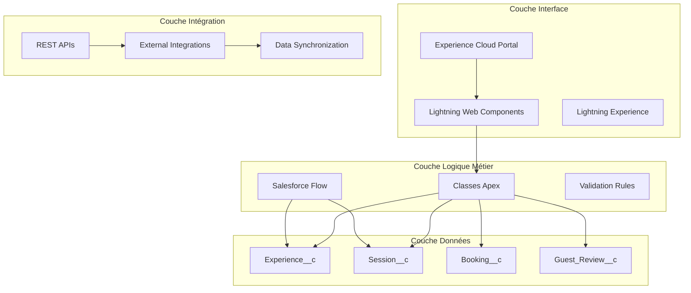
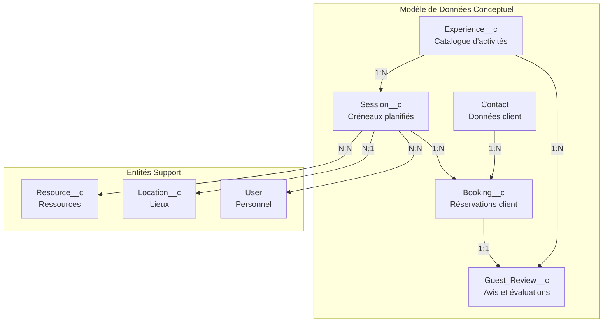
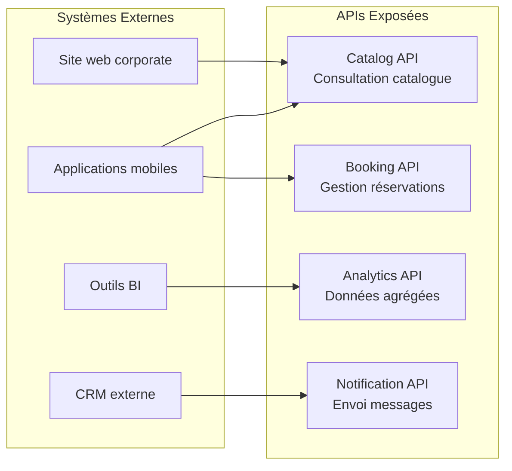
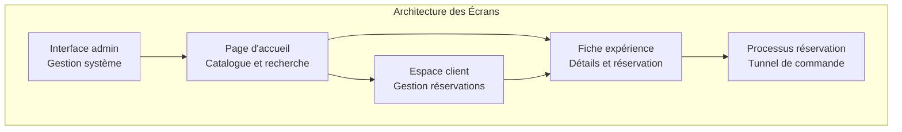
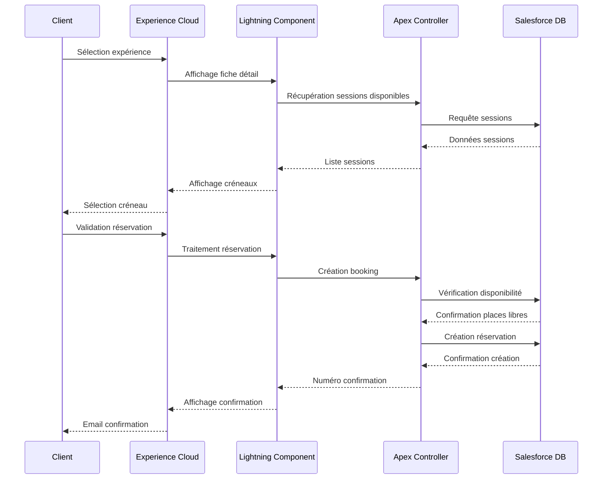

# Spécifications Fonctionnelles Détaillées (SFD)
## Cloud Resort Twin - Digital Twin Salesforce

---

## 1. Introduction

### 1.1 Objectif du document

Ce document présente les spécifications fonctionnelles détaillées (SFD) pour le système Cloud Resort Twin, une solution de jumeau numérique développée sur la plateforme Salesforce. L'objectif principal est de documenter de manière exhaustive toutes les fonctionnalités, processus métier, interfaces utilisateur, et exigences techniques nécessaires à l'implémentation et à la maintenance du système.

Le Cloud Resort Twin constitue une solution innovante de gestion hôtelière intégrée, permettant aux établissements touristiques de digitaliser leurs opérations, d'améliorer l'expérience client, et d'optimiser leurs processus internes. Cette plateforme exploite les capacités avancées de Salesforce Experience Cloud, Lightning Web Components, et Apex pour créer un écosystème numérique complet et interconnecté.

### 1.2 Portée et périmètre

Le périmètre de ce document couvre l'ensemble des fonctionnalités du système Cloud Resort Twin, incluant la gestion des réservations, l'expérience client personnalisée, les avis et évaluations, ainsi que l'interface d'administration. Le système s'appuie sur une architecture Salesforce native utilisant des objets personnalisés, des composants Lightning Web Components, et des processus automatisés via Apex et Flow.

Les domaines fonctionnels traités comprennent la gestion des expériences touristiques (Experience__c), la planification et réservation de sessions (Session__c et Booking__c), la collecte et analyse des retours clients (Guest_Review__c), ainsi que l'administration et la configuration du système. Le document détaille également les interfaces utilisateur via Experience Cloud, les intégrations avec des systèmes tiers, et les exigences de sécurité et performance.

### 1.3 Public cible

Ce document s'adresse à plusieurs catégories de professionnels impliqués dans le développement, l'implémentation, et la maintenance du système Cloud Resort Twin. Les développeurs Salesforce y trouveront les spécifications techniques détaillées pour l'implémentation des composants Lightning Web Components, des classes Apex, et des configurations d'objets. Les analystes métier et consultants fonctionnels pourront s'appuyer sur les descriptions des processus et règles de gestion pour accompagner les utilisateurs finaux.

Les administrateurs système et les équipes infrastructure disposeront des informations nécessaires concernant l'architecture technique, les exigences de performance, et les procédures de déploiement. Enfin, les équipes qualité et recette utiliseront les critères d'acceptation et scénarios de test pour valider le bon fonctionnement du système en conformité avec les exigences métier.

### 1.4 Documents de référence

Ce document s'appuie sur plusieurs sources de référence essentielles pour assurer la cohérence et la complétude des spécifications. La documentation officielle Salesforce concernant Experience Cloud, Lightning Web Components, et Apex constitue le socle technique de référence. Les bonnes pratiques de développement Salesforce DX et les standards de configuration des métadonnées sont également pris en compte.

Les spécifications générales fonctionnelles (SFG) du projet Cloud Resort Twin forment la base métier de ce document détaillé. La documentation du jumeau numérique existant, incluant la structure des objets personnalisés et les relations de données, a été analysée pour assurer la continuité avec l'existant. Les standards d'ergonomie et d'accessibilité web, ainsi que les réglementations sur la protection des données personnelles, sont intégrés dans les spécifications.

### 1.5 Glossaire et définitions

**Cloud Resort Twin** : Solution de jumeau numérique pour la gestion hôtelière développée sur Salesforce, permettant la digitalisation complète des opérations touristiques.

**Experience Cloud** : Plateforme Salesforce permettant de créer des portails et sites web personnalisés pour les clients, partenaires, et communautés.

**Lightning Web Components (LWC)** : Framework de développement d'interfaces utilisateur modernes et performantes sur la plateforme Salesforce.

**Apex** : Langage de programmation propriétaire Salesforce permettant l'implémentation de logique métier complexe et d'intégrations.

**Flow** : Outil Salesforce d'automatisation des processus métier par configuration plutôt que par code.

**Digital Twin** : Représentation numérique d'un système physique permettant la simulation, l'analyse, et l'optimisation des opérations.

**Guest Journey** : Parcours client complet depuis la découverte des services jusqu'à l'évaluation post-séjour.

**Session** : Instance spécifique d'une expérience touristique planifiée à une date et heure données.

**Booking** : Réservation effectuée par un client pour une session particulière.

---

## 2. Vue d'ensemble du système

### 2.1 Rappel du contexte

Le projet Cloud Resort Twin s'inscrit dans une démarche de transformation numérique du secteur hôtelier et touristique, répondant aux enjeux modernes d'expérience client personnalisée, d'efficacité opérationnelle, et de compétitivité digitale. Les établissements touristiques font face à des défis croissants : attentes clients élevées en matière de personnalisation, nécessité d'optimiser les revenus par une gestion dynamique des capacités, et besoin d'intégrer les canaux de distribution multiples dans une approche omnicanale cohérente.

L'évolution des comportements de consommation, accélérée par les transformations sociétales récentes, impose aux professionnels du tourisme de repenser leurs modèles opérationnels. Les clients recherchent des expériences sur-mesure, une communication fluide et instantanée, ainsi qu'une transparence totale dans leurs interactions avec les prestataires. Parallèlement, les établissements doivent optimiser leurs coûts opérationnels, améliorer leur productivité, et développer leur capacité d'adaptation aux fluctuations de demande.

### 2.2 Architecture fonctionnelle

L'architecture du Cloud Resort Twin repose sur une approche modulaire et scalable exploitant pleinement les capacités de la plateforme Salesforce. Le système s'articule autour de quatre couches principales : la couche de données avec les objets Salesforce personnalisés, la couche de logique métier implémentée en Apex et Flow, la couche d'interface utilisateur développée en Lightning Web Components, et la couche d'intégration permettant les échanges avec les systèmes tiers.

La couche de données structure l'information autour des entités métier centrales : Experience__c pour la gestion du catalogue d'expériences, Session__c pour la planification temporelle, Booking__c pour les réservations client, et Guest_Review__c pour la collecte des retours d'expérience. Ces objets sont interconnectés par des relations maître-détail et lookup permettant de maintenir la cohérence référentielle et d'optimiser les performances d'accès aux données.



### 2.3 Principes généraux

Le développement du Cloud Resort Twin s'appuie sur des principes architecturaux et fonctionnels garantissant la qualité, la maintenabilité, et l'évolutivité de la solution. Le principe de séparation des responsabilités guide la conception en isolant clairement la logique de présentation, la logique métier, et la gestion des données. Cette approche facilite la maintenance, les tests, et les évolutions futures du système.

L'approche "configuration over customization" privilégie l'utilisation des fonctionnalités standard de Salesforce avant le développement de composants sur-mesure. Cette stratégie réduit les coûts de développement et de maintenance tout en garantissant la compatibilité avec les évolutions de la plateforme. Les développements spécifiques sont réservés aux besoins métier ne pouvant être satisfaits par la configuration standard.

Le principe de réutilisabilité oriente la conception des composants Lightning Web Components et des classes Apex vers une approche modulaire permettant leur utilisation dans différents contextes. Les composants sont développés avec des interfaces génériques et des paramètres configurables pour maximiser leur potentiel de réutilisation.

### 2.4 Contraintes techniques et métier

Les contraintes techniques du projet sont principalement liées aux limitations de la plateforme Salesforce en termes de gouvernance et de performance. Les limites de gouvernance incluent les restrictions sur le nombre d'appels API, les volumes de données traitées, et les temps d'exécution des transactions. Ces contraintes imposent une conception optimisée des algorithmes et des requêtes pour maintenir des performances acceptables même avec des volumes de données importants.

Les contraintes de sécurité sont particulièrement strictes compte tenu de la nature des données traitées, incluant des informations personnelles de clients et des données commerciales sensibles. Le système doit respecter les réglementations en vigueur concernant la protection des données personnelles (RGPD) et implémenter des mécanismes robustes de contrôle d'accès et de traçabilité.

Les contraintes métier incluent la nécessité de maintenir une disponibilité élevée du système, particulièrement pendant les périodes de forte affluence touristique. Les temps de réponse doivent rester acceptables même lors de pics de charge, et le système doit être capable de gérer des montées en charge rapides sans dégradation de service.

---

## 3. Spécifications détaillées par fonctionnalité

### 3.1 Gestion des Expériences Touristiques

#### 3.1.1 Description générale

La fonctionnalité de gestion des expériences touristiques constitue le cœur métier du système Cloud Resort Twin. Elle permet aux administrateurs de créer, configurer, et maintenir un catalogue complet d'activités et services proposés aux clients. Cette fonctionnalité s'appuie sur l'objet personnalisé Experience__c qui centralise toutes les informations relatives aux expériences : descriptions détaillées, tarifications, disponibilités, prérequis, et contraintes opérationnelles.

Le système permet de structurer les expériences selon différentes typologies (activités sportives, culturelles, gastronomiques, bien-être) et de définir des attributs spécifiques pour chaque catégorie. Les expériences peuvent être configurées avec des variantes (durées différentes, niveaux de service, options additionnelles) permettant une personnalisation fine de l'offre selon les segments de clientèle ciblés.

#### 3.1.2 Acteurs concernés

Les **administrateurs resort** disposent des droits complets de création, modification, et suppression des expériences. Ils configurent les paramètres opérationnels, définissent les tarifications, et gèrent les disponibilités selon les contraintes de capacité et de saisonnalité. Les **managers d'activités** peuvent modifier les expériences relevant de leur domaine de responsabilité et ajuster les paramètres opérationnels en temps réel.

Les **agents de réservation** consultent le catalogue pour informer les clients et effectuer les réservations. Ils accèdent aux informations détaillées des expériences, vérifient les disponibilités, et appliquent les conditions commerciales appropriées. Les **clients finaux** via le portail Experience Cloud peuvent parcourir le catalogue, consulter les détails des expériences, et procéder aux réservations en libre-service.

#### 3.1.3 Prérequis

La création d'une nouvelle expérience nécessite la définition préalable des **catégories d'expériences** dans les listes de sélection personnalisées. Les **ressources nécessaires** (équipements, personnel, lieux) doivent être référencées dans le système pour permettre la vérification des contraintes de capacité. Les **grilles tarifaires** doivent être configurées avec les différents niveaux de prix selon les périodes et segments clients.

Les **autorisations et certifications** requises pour certaines activités doivent être documentées et intégrées dans les prérequis de l'expérience. Les **conditions météorologiques** et autres contraintes environnementales doivent être définies pour les activités en extérieur, permettant la gestion automatisée des annulations et reports.

#### 3.1.4 Scénarios détaillés

##### 3.1.4.1 Scénario nominal

L'administrateur accède à l'interface de gestion des expériences via Lightning Experience et sélectionne "Nouvelle Expérience" dans l'onglet Experience__c. Il saisit les informations de base : nom de l'expérience, catégorie, description courte et détaillée, durée, et capacité maximale. Le système valide automatiquement la cohérence des données saisies et vérifie l'unicité du nom d'expérience.

L'administrateur configure ensuite les paramètres opérationnels : ressources nécessaires, prérequis participants, restrictions d'âge, conditions physiques requises. Il définit la grille tarifaire avec les prix de base, les suppléments optionnels, et les conditions de réduction selon les profils clients. Le système calcule automatiquement les prix finaux en appliquant les règles commerciales configurées.

La configuration des créneaux de disponibilité s'effectue via un calendrier interactif permettant de définir les horaires récurrents, les exceptions saisonnières, et les périodes de maintenance. L'administrateur peut dupliquer des configurations existantes pour accélérer la création d'expériences similaires. Une fois la configuration terminée, l'expérience est soumise à un workflow d'approbation avant publication dans le catalogue client.

##### 3.1.4.2 Scénarios alternatifs

Dans le cas d'une **expérience saisonnière**, l'administrateur configure des dates de début et fin de disponibilité avec possibilité de définir des récurrences annuelles. Le système gère automatiquement l'activation et la désactivation de l'expérience selon le calendrier défini, et informe les clients des périodes d'indisponibilité.

Pour les **expériences avec prérequis complexes** (certifications, équipements spéciaux), l'administrateur utilise des formulaires conditionnels qui s'adaptent selon la catégorie sélectionnée. Le système propose automatiquement les prérequis standards selon la typologie d'activité et permet les ajustements spécifiques.

Lors de la **modification d'une expérience active**, le système vérifie l'impact sur les réservations existantes et propose des options de gestion : application des modifications aux nouvelles réservations uniquement, migration automatique des réservations existantes, ou notification manuelle des clients concernés.

##### 3.1.4.3 Scénarios d'exception

En cas de **conflit de ressources** lors de la création d'une nouvelle expérience, le système affiche un message d'alerte détaillant les conflits potentiels avec les expériences existantes. L'administrateur peut ajuster les créneaux horaires, modifier les ressources requises, ou forcer la création avec gestion manuelle des conflits.

Si les **données obligatoires sont incomplètes**, le système bloque la sauvegarde et affiche un résumé des champs manquants avec des liens directs vers les sections concernées. Un mécanisme de sauvegarde temporaire permet de reprendre la saisie ultérieurement sans perdre les données déjà saisies.

En cas d'**erreur technique** pendant la sauvegarde, le système tente automatiquement une nouvelle sauvegarde après un délai configuré. Si l'erreur persiste, les données sont sauvegardées temporairement et un ticket d'incident est créé automatiquement avec les détails techniques pour investigation.

#### 3.1.5 Règles de gestion

**RG-EXP-001** : Chaque expérience doit avoir un nom unique dans le système pour éviter les confusions lors des réservations et de la facturation.

**RG-EXP-002** : La capacité maximale d'une expérience ne peut pas être inférieure au nombre de participants déjà inscrits sur les sessions futures.

**RG-EXP-003** : Les modifications tarifaires ne s'appliquent qu'aux nouvelles réservations, sauf approbation explicite pour l'application rétroactive.

**RG-EXP-004** : Une expérience ne peut être supprimée que si aucune réservation future n'y est associée.

**RG-EXP-005** : Les expériences avec restrictions d'âge doivent inclure une vérification automatique lors de la réservation.

**RG-EXP-006** : Les prérequis de certification doivent être vérifiés avant la confirmation définitive de la réservation.

#### 3.1.6 Interfaces utilisateur

##### 3.1.6.1 Maquettes d'écrans

L'interface de gestion des expériences utilise une mise en page Lightning moderne avec une navigation par onglets pour organiser les différentes sections : Informations générales, Configuration opérationnelle, Tarification, et Disponibilités. La page principale affiche une liste filtrée des expériences avec des indicateurs visuels de statut (active, inactive, en attente d'approbation).

Le formulaire de création/modification utilise des sections repliables pour éviter la surcharge d'informations et faciliter la navigation. Des assistants contextuels guident l'utilisateur dans la saisie des informations complexes comme la configuration des tarifs ou la définition des prérequis.

##### 3.1.6.2 Comportements dynamiques

L'interface adapte dynamiquement les champs disponibles selon la catégorie d'expérience sélectionnée. Par exemple, les activités aquatiques affichent des champs spécifiques pour les conditions météorologiques et les niveaux de sécurité. Les calculs de prix se mettent à jour en temps réel lors de la modification des paramètres tarifaires.

Le calendrier de disponibilité propose une vue graphique interactive permettant de visualiser les créneaux libres et occupés. Les conflits de ressources sont signalés visuellement avec des codes couleur et des info-bulles explicatives.

##### 3.1.6.3 Interactions utilisateur

L'interface supporte les opérations en lot pour la gestion de plusieurs expériences simultanément : modification des tarifs saisonniers, mise à jour des disponibilités, changement de statut. Un système de favoris permet aux administrateurs de marquer les expériences fréquemment consultées pour un accès rapide.

La fonctionnalité de duplication intelligente analyse les expériences existantes et propose des templates pré-remplis pour accélérer la création d'expériences similaires. Les historiques de modifications sont accessibles via un panneau latéral avec possibilité de comparaison entre versions.

#### 3.1.7 Données manipulées

L'objet Experience__c centralise les données descriptives : Name (obligatoire, unique), Category__c (liste de sélection), Description__c (texte riche), Duration__c (nombre en heures), Max_Capacity__c (nombre entier), Base_Price__c (devise), et Status__c (actif/inactif/en_attente).

Les données opérationnelles incluent : Required_Resources__c (texte long multi-lignes), Prerequisites__c (texte riche), Age_Restrictions__c (formule), Weather_Dependency__c (case à cocher), et Seasonal_Availability__c (dates de début et fin).

Les métadonnées de gestion comprennent : Created_By__c, Creation_Date__c, Last_Modified_By__c, Last_Modified_Date__c, Approval_Status__c, et Version_Number__c pour la traçabilité complète des modifications.

#### 3.1.8 Validations et contrôles

**Validation de cohérence temporelle** : La durée de l'expérience doit être cohérente avec les créneaux horaires définis dans les disponibilités. Le système vérifie automatiquement que les sessions peuvent s'enchaîner sans conflit.

**Contrôle de capacité** : La capacité maximale doit être un nombre entier positif et raisonnable selon la catégorie d'expérience. Des seuils par défaut sont suggérés selon les typologies d'activités.

**Validation des prérequis** : Les prérequis doivent être formulés de manière claire et vérifiable. Le système propose des templates standard selon les catégories d'activités pour assurer la cohérence.

**Contrôle tarifaire** : Les prix doivent être positifs et cohérents avec les grilles tarifaires générales du resort. Les écarts importants déclenchent des alertes pour validation manuelle.

#### 3.1.9 Messages d'erreur

**ERR-EXP-001** : "Le nom de l'expérience existe déjà. Veuillez choisir un nom unique."

**ERR-EXP-002** : "La capacité maximale ne peut pas être inférieure au nombre de participants déjà inscrits ({nombre} participants)."

**ERR-EXP-003** : "La durée de l'expérience doit être comprise entre 15 minutes et 24 heures."

**ERR-EXP-004** : "Les ressources requises ne sont pas disponibles aux créneaux définis. Veuillez ajuster la planification."

**ERR-EXP-005** : "Les prérequis d'âge ne peuvent pas être définis avec une limite minimale supérieure à la limite maximale."

#### 3.1.10 Critères d'acceptation

**CA-EXP-001** : Un administrateur peut créer une nouvelle expérience avec toutes les informations obligatoires en moins de 5 minutes.

**CA-EXP-002** : Le système détecte et signale automatiquement les conflits de ressources lors de la configuration des disponibilités.

**CA-EXP-003** : Les modifications d'expériences sont tracées avec horodatage et identification de l'utilisateur.

**CA-EXP-004** : Les expériences inactives n'apparaissent pas dans le catalogue client mais restent accessibles aux administrateurs.

**CA-EXP-005** : La duplication d'expérience reprend 90% des informations de l'original avec adaptation automatique des références.

### 3.2 Gestion des Sessions et Planification

#### 3.2.1 Description générale

La gestion des sessions constitue le pilier opérationnel du système Cloud Resort Twin, transformant le catalogue d'expériences en créneaux réservables concrets. Cette fonctionnalité s'appuie sur l'objet Session__c qui instancie les expériences dans le temps et l'espace, permettant aux clients de réserver des créneaux spécifiques correspondant à leurs contraintes et préférences.

Le système de planification automatisée génère les sessions selon les paramètres de récurrence définis pour chaque expérience, en tenant compte des contraintes de ressources, des disponibilités du personnel, et des règles métier spécifiques. La planification dynamique permet l'ajustement en temps réel des capacités selon la demande prévisionnelle et les événements exceptionnels.

#### 3.2.2 Acteurs concernés

Les **planificateurs d'activités** configurent les modèles de récurrence, définissent les exceptions saisonnières, et ajustent les capacités selon les prévisions de fréquentation. Ils supervisent la génération automatique des sessions et interviennent manuellement pour les cas particuliers nécessitant une attention spécifique.

Les **coordinateurs opérationnels** gèrent les ressources humaines et matérielles affectées aux sessions, valident les plannings proposés par le système automatisé, et résolvent les conflits de ressources. Ils assurent la cohérence entre la planification théorique et les contraintes opérationnelles réelles.

Les **agents de réservation** consultent les sessions disponibles, vérifient les places libres en temps réel, et effectuent les réservations pour les clients. Ils peuvent également modifier les sessions existantes dans les limites de leurs autorisations et selon les règles de gestion définies.

#### 3.2.3 Prérequis

La création de sessions nécessite l'existence préalable d'**expériences configurées et approuvées** dans le système. Les **ressources requises** (personnel, équipements, espaces) doivent être disponibles et réservables via le module de gestion des ressources intégré.

Les **calendriers de disponibilité** du personnel qualifié doivent être synchronisés avec le système de planification pour éviter les conflits d'affectation. Les **contraintes saisonnières** et événements exceptionnels doivent être référencés pour permettre l'adaptation automatique des planifications.

#### 3.2.4 Scénarios détaillés

##### 3.2.4.1 Scénario nominal

Le planificateur accède au module de gestion des sessions et sélectionne l'expérience pour laquelle créer des sessions. Il définit la période de planification (semaine, mois, saison) et configure les paramètres de récurrence : jours de la semaine, heures de début, fréquence des sessions, et capacité par session.

Le système génère automatiquement la planification prévisionnelle en vérifiant la disponibilité des ressources requises pour chaque créneau. Les conflits potentiels sont signalés avec des propositions d'alternatives (modification d'horaires, réallocation de ressources, ajustement de capacité).

Le planificateur valide la planification proposée ou effectue des ajustements manuels selon les contraintes opérationnelles spécifiques. Une fois validée, la planification est publiée et les sessions deviennent disponibles à la réservation selon les règles de visibilité configurées (délai d'ouverture des réservations, restrictions par profil client).

##### 3.2.4.2 Scénarios alternatifs

Pour les **sessions événementielles ponctuelles**, le planificateur utilise le mode de création manuelle permettant de définir des sessions uniques avec des paramètres spécifiques (capacité augmentée, ressources exceptionnelles, tarification spéciale).

En cas de **modification d'expérience impactant les sessions futures**, le système propose plusieurs options : application automatique aux sessions sans réservation, notification des clients pour les sessions réservées avec proposition de migration, ou maintien des sessions existantes avec double référentiel temporaire.

Pour la **gestion des remplacements de personnel**, le système identifie automatiquement les sessions impactées et propose des solutions de réaffectation selon les qualifications disponibles et les préférences des clients déjà inscrits.

##### 3.2.4.3 Scénarios d'exception

En cas de **conditions météorologiques défavorables** pour les activités extérieures, le système déclenche automatiquement les procédures d'annulation ou de report selon les paramètres configurés pour chaque type d'expérience. Les clients sont notifiés automatiquement avec proposition de créneaux alternatifs.

Si une **ressource critique devient indisponible** (panne d'équipement, absence de personnel), le système identifie toutes les sessions impactées et propose des solutions : report automatique, réaffectation de ressources alternatives, ou annulation avec compensation selon les politiques définies.

En cas de **surbooking accidentel**, le système déclenche une procédure d'escalade avec notification automatique des responsables et proposition de solutions : augmentation ponctuelle de capacité, transfert vers sessions alternatives, ou compensation client selon les règles commerciales.

#### 3.2.5 Règles de gestion

**RG-SES-001** : Une session ne peut être créée que si toutes les ressources requises sont disponibles sur le créneau demandé.

**RG-SES-002** : L'intervalle minimum entre deux sessions de même expérience doit permettre le nettoyage et la préparation des équipements.

**RG-SES-003** : Les sessions ne peuvent être supprimées que si aucune réservation n'y est associée ou après annulation de toutes les réservations.

**RG-SES-004** : La capacité d'une session peut être augmentée mais pas diminuée en dessous du nombre de réservations existantes.

**RG-SES-005** : Les sessions annulées pour cause météorologique doivent proposer automatiquement des créneaux de report dans les 7 jours.

#### 3.2.6 Interfaces utilisateur

L'interface de planification utilise une vue calendaire interactive permettant de visualiser les sessions sur différentes échelles temporelles (jour, semaine, mois). Les sessions sont représentées par des blocs colorés selon leur statut (disponible, complète, annulée) avec indication du taux de remplissage.

Le panneau de configuration permet de définir les paramètres de récurrence via des formulaires intuitifs avec prévisualisation en temps réel. Les conflits de ressources sont signalés visuellement avec des codes couleur et des info-bulles détaillées.

#### 3.2.7 Données manipulées

L'objet Session__c contient : Experience__c (lookup obligatoire), Session_Date__c (date), Start_Time__c (heure), End_Time__c (heure calculée), Available_Spots__c (nombre), Reserved_Spots__c (formule), Status__c (disponible/complète/annulée).

Les données opérationnelles incluent : Assigned_Staff__c (lookup multiple), Required_Equipment__c (texte), Location__c (lookup), Weather_Conditions__c (texte), et Special_Instructions__c (texte long).

#### 3.2.8 Validations et contrôles

**Validation temporelle** : L'heure de fin doit être postérieure à l'heure de début, et la durée doit correspondre à celle définie dans l'expérience associée.

**Contrôle de capacité** : Le nombre de places disponibles doit être positif et cohérent avec la capacité de l'expérience et les contraintes de ressources.

**Validation des ressources** : Toutes les ressources assignées doivent être disponibles sur la période de la session avec vérification des conflits d'allocation.

#### 3.2.9 Messages d'erreur

**ERR-SES-001** : "Conflit de ressources détecté : {ressource} déjà assignée sur ce créneau."

**ERR-SES-002** : "La session se termine avant son heure de début. Veuillez vérifier les horaires."

**ERR-SES-003** : "Capacité insuffisante : {nombre} places déjà réservées sur cette session."

#### 3.2.10 Critères d'acceptation

**CA-SES-001** : Le système génère automatiquement un planning de sessions sur 3 mois en moins de 2 minutes.

**CA-SES-002** : Les conflits de ressources sont détectés et signalés avant la validation de la planification.

**CA-SES-003** : Les sessions annulées déclenchent automatiquement les notifications clients dans les 15 minutes.

### 3.3 Système de Réservation Client

#### 3.3.1 Description générale

Le système de réservation constitue l'interface principale entre les clients et l'offre de services du resort, matérialisé par l'objet Booking__c qui centralise toutes les informations relatives aux réservations client. Cette fonctionnalité permet aux clients de découvrir les expériences disponibles, de vérifier les créneaux libres, et de procéder à la réservation via une interface intuitive et sécurisée.

Le processus de réservation intègre une logique de tarification dynamique, des vérifications de disponibilité en temps réel, et un système de confirmation automatisé. Les clients peuvent gérer leurs réservations (consultation, modification, annulation) via leur espace personnel, avec application automatique des conditions commerciales et des politiques d'annulation configurées.

#### 3.3.2 Acteurs concernés

Les **clients finaux** utilisent le portail Experience Cloud pour consulter les expériences, vérifier les disponibilités, et effectuer leurs réservations en autonomie. Ils accèdent à leur historique de réservations, peuvent modifier ou annuler leurs réservations selon les conditions applicables.

Les **agents de réservation** traitent les demandes complexes, assistent les clients dans leurs choix, et peuvent effectuer des réservations avec des conditions particulières (tarifs négociés, groupes, événements spéciaux). Ils ont accès aux fonctionnalités avancées de gestion des réservations.

Les **responsables commerciaux** supervisent les performances de réservation, analysent les tendances de demande, et peuvent appliquer des conditions commerciales exceptionnelles pour optimiser le taux de remplissage.

#### 3.3.3 Prérequis

La réalisation d'une réservation nécessite l'existence d'un **compte client actif** avec les informations de base validées (nom, prénom, email, téléphone). Les **sessions disponibles** doivent être planifiées et publiées avec des places libres.

Les **conditions commerciales** (tarifs, politiques d'annulation, conditions de modification) doivent être configurées et à jour. Le **système de paiement** doit être opérationnel pour traiter les transactions selon les modes de paiement acceptés.

#### 3.3.4 Scénarios détaillés

##### 3.3.4.1 Scénario nominal

Le client se connecte au portail Experience Cloud et accède au catalogue d'expériences via une interface de recherche permettant le filtrage par catégorie, date, durée, et prix. Il sélectionne une expérience qui l'intéresse et consulte la fiche détaillée avec description, photos, prérequis, et avis d'autres clients.

Le client choisit une date souhaitée et le système affiche les sessions disponibles avec les créneaux horaires et le nombre de places restantes. Il sélectionne une session et le système vérifie en temps réel la disponibilité avant de proposer les options de personnalisation (nombre de participants, services additionnels).

Le client saisit les informations des participants (noms, âges si requis, informations spéciales) et le système calcule automatiquement le tarif en appliquant les réductions applicables. Après validation du panier, le client procède au paiement via l'interface sécurisée intégrée.

Une fois le paiement confirmé, le système génère automatiquement la réservation avec un numéro unique, envoie les confirmations par email, et met à jour les disponibilités des sessions concernées. Le client reçoit les informations pratiques (lieu de rendez-vous, équipements à prévoir, contacts) par email et SMS.

##### 3.3.4.2 Scénarios alternatifs

Pour les **réservations de groupe**, le client peut indiquer le nombre total de participants et le système propose automatiquement les sessions avec une capacité suffisante. Des tarifs de groupe peuvent s'appliquer automatiquement selon les seuils configurés.

En cas de **session complète**, le système propose automatiquement des créneaux alternatifs sur la même journée ou les jours suivants, avec possibilité de s'inscrire sur une liste d'attente en cas de désistement.

Pour les **réservations de dernière minute**, le système peut appliquer des tarifs préférentiels ou des conditions d'annulation modifiées selon les politiques commerciales configurées pour optimiser le taux de remplissage.

##### 3.3.4.3 Scénarios d'exception

En cas d'**erreur de paiement**, le système maintient une réservation temporaire pendant 15 minutes permettant au client de corriger les informations ou changer de mode de paiement. Passé ce délai, la réservation temporaire est annulée et les places remises en vente.

Si une **session est annulée après réservation** (météo, problème technique), le système notifie automatiquement le client par email et SMS, propose des créneaux alternatifs, et traite automatiquement le remboursement selon les conditions applicables.

En cas de **double réservation accidentelle**, le système détecte les doublons potentiels et propose au client de confirmer ou d'annuler la réservation en doublon avec traitement automatique du remboursement.

#### 3.3.5 Règles de gestion

**RG-BOOK-001** : Une réservation ne peut être confirmée que si le paiement est validé ou si un mode de paiement différé est autorisé.

**RG-BOOK-002** : Les modifications de réservation ne sont autorisées que dans les délais définis par les conditions commerciales de l'expérience.

**RG-BOOK-003** : Les annulations donnent lieu à remboursement selon un barème dégressif basé sur le délai d'annulation.

**RG-BOOK-004** : Le nombre total de participants d'une réservation ne peut excéder la capacité restante de la session.

**RG-BOOK-005** : Les prérequis d'âge et de condition physique doivent être vérifiés avant la confirmation finale.

#### 3.3.6 Interfaces utilisateur

L'interface de réservation utilise un design responsive adapté aux différents appareils (desktop, tablette, mobile) avec une navigation intuitive guidant le client étape par étape. Le catalogue d'expériences présente des fiches visuelles attractives avec photos, descriptions synthétiques, et indicateurs de popularité.

Le processus de réservation suit un tunnel de conversion optimisé avec indicateur de progression, récapitulatifs à chaque étape, et possibilité de retour en arrière. Les informations de paiement sont saisies dans un environnement sécurisé avec indicateurs visuels de sécurité.

#### 3.3.7 Données manipulées

L'objet Booking__c contient : Session__c (lookup obligatoire), Customer__c (lookup), Booking_Date__c (date/heure), Number_of_Participants__c (nombre), Total_Amount__c (devise), Status__c (confirmée/annulée/en_attente), Payment_Status__c (payée/en_attente/remboursée).

Les informations participants sont stockées dans : Participants_Details__c (JSON), Special_Requirements__c (texte), Emergency_Contact__c (texte), et Dietary_Restrictions__c (liste de sélection multiple).

#### 3.3.8 Validations et contrôles

**Validation de disponibilité** : Vérification en temps réel que le nombre de places demandées est disponible sur la session sélectionnée.

**Contrôle des prérequis** : Validation que tous les participants respectent les critères d'âge, de condition physique, et de certification requis.

**Validation financière** : Vérification que le montant calculé correspond aux tarifs en vigueur et que les réductions appliquées sont légitimes.

#### 3.3.9 Messages d'erreur

**ERR-BOOK-001** : "Session complète : il ne reste que {nombre} places disponibles pour {nombre_demandé} participants."

**ERR-BOOK-002** : "Participant {nom} ne respecte pas les prérequis d'âge ({âge_min}-{âge_max} ans requis)."

**ERR-BOOK-003** : "Échec du paiement : {raison}. Veuillez vérifier vos informations bancaires."

#### 3.3.10 Critères d'acceptation

**CA-BOOK-001** : Un client peut effectuer une réservation complète en moins de 5 minutes via le portail.

**CA-BOOK-002** : Les disponibilités affichées sont mises à jour en temps réel avec un délai maximum de 30 secondes.

**CA-BOOK-003** : Les confirmations de réservation sont envoyées dans les 2 minutes suivant le paiement.

---

## 4. Gestion des données

### 4.1 Modèle de données conceptuel

Le modèle de données du Cloud Resort Twin s'articule autour de quatre entités principales interconnectées par des relations logiques reflétant les processus métier du secteur touristique. L'architecture relationnelle garantit la cohérence des données tout en optimisant les performances d'accès et de manipulation.

L'entité **Experience__c** constitue le référentiel central du catalogue d'activités, contenant les informations descriptives, tarifaires, et opérationnelles de chaque expérience proposée. Cette entité parent est reliée aux sessions par une relation un-vers-plusieurs, permettant l'instanciation temporelle des expériences.

L'entité **Session__c** matérialise les créneaux réservables en associant une expérience à des paramètres spatio-temporels spécifiques. Chaque session hérite des caractéristiques de l'expérience parent tout en permettant des ajustements contextuels (capacité, tarifs, conditions particulières).



### 4.2 Dictionnaire de données

#### Objet Experience__c (Expériences)

| Champ | Type | Obligatoire | Description |
|-------|------|-------------|-------------|
| Name | Texte(80) | Oui | Nom unique de l'expérience |
| Category__c | Liste sélection | Oui | Catégorie d'activité |
| Description__c | Texte riche | Oui | Description détaillée |
| Short_Description__c | Texte(255) | Oui | Résumé pour catalogue |
| Duration__c | Nombre(3,2) | Oui | Durée en heures |
| Max_Capacity__c | Nombre(3,0) | Oui | Capacité maximale |
| Base_Price__c | Devise(8,2) | Oui | Prix de base |
| Age_Min__c | Nombre(2,0) | Non | Âge minimum requis |
| Age_Max__c | Nombre(2,0) | Non | Âge maximum autorisé |
| Physical_Requirements__c | Liste sélection | Non | Exigences physiques |
| Required_Equipment__c | Texte long | Non | Équipements nécessaires |
| Weather_Dependent__c | Case à cocher | Non | Dépendance météo |
| Status__c | Liste sélection | Oui | Statut (Actif/Inactif) |
| Approval_Status__c | Liste sélection | Oui | Statut d'approbation |
| Created_Date__c | Date/Heure | Auto | Date de création |
| Last_Modified_Date__c | Date/Heure | Auto | Dernière modification |

#### Objet Session__c (Sessions)

| Champ | Type | Obligatoire | Description |
|-------|------|-------------|-------------|
| Name | Formule | Auto | Nom auto-généré |
| Experience__c | Lookup | Oui | Référence expérience |
| Session_Date__c | Date | Oui | Date de la session |
| Start_Time__c | Heure | Oui | Heure de début |
| End_Time__c | Formule | Auto | Heure de fin calculée |
| Available_Spots__c | Nombre(3,0) | Oui | Places disponibles |
| Reserved_Spots__c | Formule | Auto | Places réservées |
| Remaining_Spots__c | Formule | Auto | Places restantes |
| Location__c | Lookup | Non | Lieu de l'activité |
| Assigned_Guide__c | Lookup | Non | Guide assigné |
| Status__c | Liste sélection | Oui | Statut session |
| Weather_Conditions__c | Texte(100) | Non | Conditions météo |
| Special_Instructions__c | Texte long | Non | Instructions spéciales |
| Cancellation_Reason__c | Texte(255) | Non | Raison d'annulation |

#### Objet Booking__c (Réservations)

| Champ | Type | Obligatoire | Description |
|-------|------|-------------|-------------|
| Name | Formule | Auto | Numéro de réservation |
| Session__c | Lookup | Oui | Session réservée |
| Customer__c | Lookup | Oui | Client réservant |
| Booking_Date__c | Date/Heure | Auto | Date de réservation |
| Number_of_Participants__c | Nombre(2,0) | Oui | Nombre de participants |
| Participants_Details__c | Texte long | Non | Détails participants |
| Total_Amount__c | Devise(8,2) | Oui | Montant total |
| Payment_Status__c | Liste sélection | Oui | Statut paiement |
| Payment_Method__c | Liste sélection | Non | Mode de paiement |
| Status__c | Liste sélection | Oui | Statut réservation |
| Confirmation_Number__c | Texte(20) | Auto | Numéro confirmation |
| Special_Requirements__c | Texte long | Non | Exigences spéciales |
| Emergency_Contact__c | Texte(255) | Non | Contact d'urgence |
| Cancellation_Date__c | Date/Heure | Non | Date d'annulation |
| Refund_Amount__c | Devise(8,2) | Non | Montant remboursé |

#### Objet Guest_Review__c (Avis clients)

| Champ | Type | Obligatoire | Description |
|-------|------|-------------|-------------|
| Name | Formule | Auto | Nom auto-généré |
| Booking__c | Lookup | Oui | Réservation associée |
| Experience__c | Lookup | Oui | Expérience évaluée |
| Customer__c | Lookup | Oui | Client évaluateur |
| Overall_Rating__c | Nombre(2,1) | Oui | Note globale /5 |
| Service_Rating__c | Nombre(2,1) | Non | Note service /5 |
| Value_Rating__c | Nombre(2,1) | Non | Note rapport qualité/prix |
| Review_Title__c | Texte(100) | Non | Titre de l'avis |
| Review_Text__c | Texte long | Non | Commentaire détaillé |
| Review_Date__c | Date | Auto | Date de l'avis |
| Recommended__c | Case à cocher | Non | Recommande ou non |
| Status__c | Liste sélection | Oui | Statut (publié/modéré) |
| Moderation_Notes__c | Texte long | Non | Notes de modération |

### 4.3 Règles de cohérence des données

**Cohérence temporelle** : Les dates de session doivent être postérieures à la date de création et les heures de fin calculées automatiquement selon la durée de l'expérience. Les réservations ne peuvent être créées que pour des sessions futures avec un délai minimum configurable.

**Cohérence de capacité** : Le nombre de participants d'une réservation ne peut excéder la capacité disponible de la session. La somme des participants de toutes les réservations d'une session ne peut dépasser la capacité maximale définie.

**Cohérence financière** : Les montants des réservations doivent correspondre aux tarifs en vigueur au moment de la réservation. Les remboursements ne peuvent excéder le montant payé et doivent respecter les politiques d'annulation configurées.

**Cohérence référentielle** : Toute réservation doit référencer une session existante et active. Toute session doit référencer une expérience approuvée et active. Les avis ne peuvent être créés que pour des réservations confirmées et dont la session est passée.

### 4.4 Gestion des référentiels

**Référentiel des catégories d'expériences** : Liste de valeurs standardisée incluant Sports nautiques, Activités terrestres, Bien-être, Gastronomie, Culture, Aventure, Famille. Chaque catégorie définit des attributs spécifiques et des templates de configuration.

**Référentiel des statuts** : Statuts standardisés pour chaque objet avec workflow de transition contrôlé. Les changements de statut déclenchent automatiquement les actions associées (notifications, mise à jour de disponibilités, calculs financiers).

**Référentiel géographique** : Lieux et zones d'activités référencés avec coordonnées GPS, capacités d'accueil, équipements disponibles, et contraintes d'accès. Intégration avec les services de géolocalisation pour optimisation des parcours.

**Référentiel tarifaire** : Grilles de prix par catégorie, saison, et segment client avec règles de calcul automatisées. Gestion des promotions, réductions groupes, et tarifs préférentiels avec dates de validité.

### 4.5 Archivage et purge

**Politique de rétention** : Les données opérationnelles (réservations, sessions) sont conservées 7 ans pour conformité comptable et fiscale. Les données client sont conservées selon les préférences de consentement avec purge automatique après inactivité prolongée.

**Archivage automatisé** : Transfert mensuel des données de plus de 2 ans vers un système d'archivage externe avec maintien d'un index de recherche. Les données archivées restent accessibles en lecture seule pour les besoins réglementaires et analytiques.

**Purge sécurisée** : Suppression définitive des données personnelles selon les demandes RGPD avec certificat de destruction. Anonymisation des données statistiques pour préservation des analyses historiques sans compromission de la vie privée.

---

## 5. Interfaces et intégrations

### 5.1 Interfaces utilisateur

#### 5.1.1 Ergonomie générale

L'interface utilisateur du Cloud Resort Twin adopte les principes de design moderne centrés sur l'expérience utilisateur, privilégiant la simplicité, l'intuitivité, et l'accessibilité. Le design system s'appuie sur le framework Lightning Design System de Salesforce, personnalisé avec la charte graphique Coral Cloud Resorts pour assurer une cohérence visuelle forte et une identité de marque distinctive.

La palette chromatique utilise des tons apaisants évoquant l'environnement marin et tropical : bleu océan profond pour les éléments principaux, turquoise clair pour les accents, blanc pur pour les arrière-plans, et touches de corail pour les appels à action. Cette harmonie colorielle crée une atmosphère relaxante et professionnelle, renforçant l'image de marque du resort.

La typographie privilégie la lisibilité avec des polices sans-serif optimisées pour l'affichage numérique. Les hiérarchies typographiques sont clairement établies avec des tailles, graisses, et espacements cohérents facilitant la lecture rapide et la compréhension des informations. Les contrastes respectent les standards d'accessibilité WCAG 2.1 niveau AA pour garantir l'utilisabilité par tous les profils d'utilisateurs.

#### 5.1.2 Navigation

L'architecture de navigation suit un modèle hiérarchique intuitif avec navigation principale horizontale et navigation secondaire contextuelle. Le menu principal expose les sections fonctionnelles majeures : Catalogue d'expériences, Mes réservations, Profil client, et Support. Chaque section utilise une navigation par onglets pour organiser les sous-fonctionnalités sans surcharger l'interface.

Le système de fil d'Ariane indique constamment la position de l'utilisateur dans l'arborescence et permet le retour rapide aux niveaux supérieurs. Les liens de navigation utilisent des libellés explicites évitant le jargon technique pour faciliter la compréhension par tous les profils d'utilisateurs, y compris les moins familiers avec les outils numériques.

La navigation mobile adopte un pattern de menu hamburger pour optimiser l'espace d'affichage tout en conservant l'accès à toutes les fonctionnalités. Les gestes de navigation tactile sont supportés (swipe, pinch-to-zoom) pour améliorer l'expérience sur les appareils tactiles.

#### 5.1.3 Gestion des droits d'accès

Le système de droits d'accès s'appuie sur le modèle de sécurité Salesforce avec des profils et ensembles d'autorisations configurés selon les rôles fonctionnels. Les **clients finaux** accèdent via Experience Cloud avec des droits limités à la consultation du catalogue, la gestion de leurs réservations personnelles, et la soumission d'avis.

Les **agents de réservation** disposent de droits étendus pour consulter et modifier les réservations de tous les clients, avec accès aux fonctionnalités de recherche avancée et de gestion des cas particuliers. Ils peuvent appliquer des conditions commerciales spécifiques dans les limites de leurs autorisations.

Les **administrateurs** ont accès complet aux fonctionnalités de configuration : gestion du catalogue d'expériences, planification des sessions, configuration des tarifs, et administration des utilisateurs. Les actions sensibles (suppression, modification tarifaire) nécessitent une double validation pour prévenir les erreurs.

### 5.2 Interfaces systèmes

#### 5.2.1 APIs exposées

Le Cloud Resort Twin expose plusieurs APIs REST pour permettre l'intégration avec des systèmes tiers et applications mobiles. L'**API Catalog** fournit l'accès en lecture au catalogue d'expériences avec filtrage par catégorie, disponibilité, et critères tarifaires. Cette API supporte la pagination et le cache pour optimiser les performances lors de consultations fréquentes.

L'**API Booking** permet la création, modification, et annulation de réservations via des appels sécurisés. Elle intègre la vérification de disponibilité en temps réel, le calcul automatique des tarifs, et la gestion des workflows de confirmation. Les réponses incluent les numéros de confirmation et les informations pratiques nécessaires aux clients.

L'**API Analytics** expose les données agrégées de fréquentation, satisfaction client, et performance commerciale pour alimenter les tableaux de bord externes et outils de business intelligence. Les données sont anonymisées et agrégées pour respecter les contraintes de confidentialité.



#### 5.2.2 APIs consommées

Le système consomme plusieurs APIs externes pour enrichir les fonctionnalités et automatiser les processus. L'**API météorologique** fournit les prévisions en temps réel pour les activités extérieures, permettant l'alerte automatique et la gestion proactive des annulations météo.

L'**API de géolocalisation** optimise les recommandations d'itinéraires pour les clients et calcule les temps de déplacement entre activités. Elle intègre les données de trafic en temps réel pour proposer les meilleurs créneaux selon les contraintes de mobilité.

L'**API de paiement** sécurise les transactions financières avec support de multiples moyens de paiement (cartes bancaires, portefeuilles électroniques, paiement différé). Elle gère l'authentification forte, la tokenisation des données sensibles, et les processus de remboursement automatisés.

L'**API de communication** (SMS, email, notifications push) automatise l'envoi des confirmations, rappels, et alertes aux clients selon leurs préférences de communication. Elle inclut la personnalisation des messages et le tracking de délivrabilité.

#### 5.2.3 Formats d'échange

Les échanges de données utilisent prioritairement le format **JSON** pour sa légèreté et sa compatibilité universelle avec les technologies web modernes. La structure des messages suit les standards REST avec des codes de statut HTTP explicites et des messages d'erreur structurés facilitant le débogage.

Les **webhooks** permettent la notification en temps réel des événements significatifs (nouvelle réservation, annulation, modification de session) vers les systèmes abonnés. Le format des payloads est standardisé avec versioning pour assurer la compatibilité lors des évolutions.

Pour les intégrations nécessitant des volumes importants de données, le système supporte l'**export/import par fichiers CSV** avec mapping configurable des champs. Les fichiers incluent des métadonnées de validation et des checksums pour garantir l'intégrité des transferts.

#### 5.2.4 Protocoles de communication

Les communications utilisent exclusivement **HTTPS/TLS 1.3** pour garantir la confidentialité et l'intégrité des échanges. L'authentification s'appuie sur **OAuth 2.0** avec tokens JWT pour sécuriser l'accès aux APIs sans compromettre les performances.

Les APIs implémentent le **rate limiting** pour prévenir les abus et garantir la qualité de service pour tous les consommateurs. Les limites sont configurables par client et par type d'endpoint selon les besoins métier et les contraintes techniques.

Le système supporte la **compression GZIP** pour optimiser la bande passante, particulièrement importante pour les clients mobiles avec connexions limitées. Les réponses incluent les headers de cache appropriés pour minimiser les appels redondants.

---

## 6. Gestion des erreurs et exceptions

### 6.1 Typologie des erreurs

Le système Cloud Resort Twin catégorise les erreurs selon leur origine et leur impact pour permettre un traitement approprié et une résolution efficace. Les **erreurs utilisateur** résultent d'actions incorrectes ou de données invalides saisies par les utilisateurs : tentative de réservation sur une session complète, non-respect des prérequis d'âge, informations de paiement incorrectes. Ces erreurs sont traitées avec des messages explicites guidant l'utilisateur vers la correction.

Les **erreurs système** proviennent de dysfonctionnements techniques internes : timeouts de base de données, limites de gouvernance Salesforce atteintes, indisponibilité temporaire de services tiers. Ces erreurs déclenchent des mécanismes de retry automatique et des procédures d'escalade vers les équipes techniques.

Les **erreurs métier** correspondent à des violations de règles de gestion : tentative de modification d'une réservation hors délai autorisé, dépassement de capacité lors de réservations simultanées, conflits de ressources lors de la planification. Ces erreurs nécessitent souvent une intervention manuelle pour résolution.

Les **erreurs de sécurité** incluent les tentatives d'accès non autorisé, les anomalies dans les patterns d'utilisation, et les violations de politiques de sécurité. Ces erreurs déclenchent immédiatement des alertes sécuritaires et peuvent conduire à la suspension temporaire d'accès.

### 6.2 Stratégies de gestion d'erreur

La stratégie de gestion d'erreur privilégie la **récupération automatique** chaque fois que possible pour minimiser l'impact sur l'expérience utilisateur. Les erreurs temporaires (timeouts réseau, surcharge momentanée) déclenchent des mécanismes de retry avec backoff exponentiel pour éviter l'aggravation de la situation.

Le **graceful degradation** permet au système de continuer à fonctionner avec des fonctionnalités réduites en cas de défaillance partielle. Par exemple, si l'API météorologique est indisponible, les activités extérieures restent réservables avec un avertissement sur les conditions météo non vérifiées.

Le **circuit breaker pattern** protège le système contre les défaillances en cascade en isolant automatiquement les composants défaillants. Si un service externe devient indisponible, le circuit breaker empêche les appels supplémentaires pendant une période déterminée, permettant au service de récupérer.

La **compensation transactionnelle** garantit la cohérence des données lors d'erreurs survenant dans des processus multi-étapes. Si une réservation échoue après le paiement, le système déclenche automatiquement le remboursement et libère les ressources réservées.

### 6.3 Logging et traçabilité

Le système implémente un **logging structuré** utilisant des formats standardisés (JSON) pour faciliter l'analyse automatisée et la recherche d'incidents. Chaque log inclut un identifiant unique de corrélation permettant de tracer un processus complet à travers tous les composants du système.

Les **niveaux de log** sont configurés selon l'environnement : DEBUG pour le développement avec logging exhaustif, INFO pour la production avec événements significatifs, WARN pour les situations anormales mais gérées, ERROR pour les dysfonctionnements nécessitant une intervention.

La **traçabilité des actions utilisateur** enregistre toutes les opérations sensibles (créations, modifications, suppressions) avec horodatage, identification de l'utilisateur, et détails de l'action. Ces logs servent à l'audit de sécurité et à la résolution de litiges.

Le **monitoring en temps réel** analyse les patterns de logs pour détecter les anomalies et déclencher des alertes proactives. Les seuils d'alerte sont configurables selon les métriques métier (taux d'erreur, temps de réponse, volume de transactions).

### 6.4 Récupération d'erreur

Les **mécanismes de retry automatique** s'appliquent aux erreurs temporaires avec des stratégies différenciées selon le type d'opération. Les lectures peuvent être retentées immédiatement, les écritures utilisent un délai progressif pour éviter les conflits, et les appels d'APIs externes respectent les politiques de rate limiting.

La **sauvegarde progressive** préserve les données saisies par l'utilisateur en cas d'erreur, permettant la reprise du processus sans perte d'information. Les formulaires complexes sauvegardent automatiquement les données toutes les 30 secondes dans le stockage local du navigateur.

Les **procédures de rollback** permettent l'annulation des opérations partiellement réalisées en cas d'erreur critique. Le système maintient des points de contrôle permettant le retour à un état cohérent connu sans corruption de données.

La **notification proactive** informe les utilisateurs des problèmes affectant leurs opérations avec estimation des délais de résolution et propositions d'alternatives. Les notifications sont personnalisées selon le profil utilisateur et le canal de communication préféré.

---

## 7. Sécurité fonctionnelle

### 7.1 Authentification

Le système d'authentification du Cloud Resort Twin s'appuie sur les mécanismes robustes de Salesforce Identity, garantissant un niveau de sécurité élevé tout en préservant l'expérience utilisateur. L'**authentification multi-facteurs (MFA)** est obligatoire pour tous les utilisateurs administrateurs et optionnelle pour les clients, avec support des méthodes TOTP, SMS, et applications d'authentification.

L'**authentification unique (SSO)** permet aux utilisateurs internes d'accéder au système via leurs identifiants d'entreprise, utilisant les protocoles SAML 2.0 ou OpenID Connect selon les infrastructures en place. Cette approche réduit la prolifération des mots de passe et centralise la gestion des accès.

Pour les clients finaux, le système propose une **authentification sociale** permettant la connexion via les comptes Google, Facebook, ou Apple, réduisant les frictions d'inscription tout en maintenant la sécurité. Les données récupérées sont limitées aux informations strictement nécessaires (nom, email) avec consentement explicite.

La **gestion des mots de passe** impose des critères de complexité configurables (longueur minimale, mixité de caractères, exclusion des mots courants) et une rotation périodique pour les comptes privilégiés. Les mots de passe sont hachés avec des algorithmes résistants (bcrypt, scrypt) et salés individuellement.

### 7.2 Autorisation

Le modèle d'autorisation utilise le **contrôle d'accès basé sur les rôles (RBAC)** de Salesforce, complété par des règles de partage granulaires pour adapter les permissions aux besoins métier spécifiques. Les rôles sont organisés hiérarchiquement reflétant la structure organisationnelle du resort.

Les **permissions d'objet** définissent les opérations autorisées (création, lecture, modification, suppression) pour chaque type d'entité selon le rôle utilisateur. Les **permissions de champ** permettent un contrôle granulaire sur les informations accessibles, masquant par exemple les données financières aux utilisateurs non autorisés.

Les **règles de partage dynamiques** adaptent automatiquement les accès selon les critères métier : un guide ne peut consulter que les sessions qui lui sont assignées, un client n'accède qu'à ses propres réservations, un manager régional ne voit que les activités de sa zone géographique.

Le **principe de moindre privilège** guide l'attribution des droits, accordant uniquement les permissions strictement nécessaires à l'accomplissement des tâches. Les élévations temporaires de privilèges sont possibles via un workflow d'approbation pour les besoins exceptionnels.

### 7.3 Audit et traçabilité

Le **journal d'audit complet** enregistre toutes les actions sensibles avec horodatage précis, identification de l'utilisateur, adresse IP source, et détails de l'opération effectuée. Ces logs sont immutables et stockés dans un système séparé pour prévenir la falsification.

La **traçabilité des modifications** maintient un historique complet des changements sur les données critiques (expériences, tarifs, réservations) avec possibilité de consultation des versions antérieures et identification des responsables des modifications.

Le **monitoring des accès** détecte automatiquement les patterns d'utilisation anormaux : connexions depuis des géolocalisations inhabituelles, tentatives d'accès répétées, volumes d'activité exceptionnels. Ces anomalies déclenchent des alertes et peuvent conduire à la suspension préventive d'accès.

Les **rapports de conformité** automatisés facilitent la démonstration du respect des réglementations applicables (RGPD, PCI-DSS pour les paiements) avec export des données d'audit dans les formats requis par les autorités de contrôle.

### 7.4 Protection des données sensibles

La **classification des données** catégorise les informations selon leur sensibilité : publiques (catalogue d'expériences), internes (plannings de personnel), confidentielles (données client), secrètes (informations financières). Chaque catégorie bénéficie de protections adaptées.

Le **chiffrement en transit** utilise TLS 1.3 pour tous les échanges réseau, avec certificats validés et épinglage de certificats pour les applications mobiles. Le **chiffrement au repos** protège les données stockées avec des clés gérées par Salesforce Shield Platform Encryption.

L'**anonymisation et pseudonymisation** des données personnelles permettent les analyses statistiques sans compromettre la vie privée. Les identifiants clients sont remplacés par des tokens irréversibles dans les environnements d'analyse et de test.

La **gestion des consentements RGPD** automatise la collecte, le stockage, et le respect des préférences de confidentialité des clients. Le système permet la portabilité des données et l'effacement sur demande avec certificats de destruction sécurisée.

---

## 8. Exigences non fonctionnelles détaillées

### 8.1 Performance

#### 8.1.1 Temps de réponse

Les exigences de temps de réponse sont définies selon les types d'opération et les profils d'utilisation pour garantir une expérience utilisateur optimale. Les **pages de consultation** (catalogue d'expériences, détails d'activités) doivent s'afficher en moins de 2 secondes sur connexion standard (10 Mbps), avec optimisation pour les connexions mobiles limitées.

Les **opérations de réservation** critiques pour l'expérience client doivent être traitées en moins de 5 secondes de bout en bout, incluant la vérification de disponibilité, le calcul tarifaire, et la confirmation. Ce délai intègre les appels aux APIs de paiement externes qui peuvent introduire de la latence.

Les **requêtes de recherche et filtrage** dans le catalogue doivent retourner des résultats en moins de 1 seconde pour maintenir la fluidité de navigation. L'indexation optimisée et la mise en cache des résultats fréquents contribuent à atteindre ces performances.

Les **notifications en temps réel** (confirmations, alertes météo, modifications de session) doivent être délivrées dans les 30 secondes suivant l'événement déclencheur pour maintenir la pertinence de l'information.

#### 8.1.2 Débit

Le système doit supporter un **débit de pointe** de 500 réservations simultanées pendant les périodes de forte affluence (ouvertures de saison, événements spéciaux) sans dégradation significative des performances. Cette capacité correspond aux pics observés sur des resorts de taille comparable.

La **bande passante** requise est dimensionnée pour 2000 utilisateurs simultanés avec un débit moyen de 100 KB/s par session, soit environ 200 Mbps de bande passante totale. La compression des contenus et l'optimisation des images réduisent ces besoins de 40%.

Les **APIs externes** doivent supporter 1000 appels/minute en continu avec des pics à 5000 appels/minute pour gérer les synchronisations de données et les intégrations tierces. Le rate limiting et la mise en cache réduisent la charge sur les systèmes externes.

#### 8.1.3 Volumétrie

Le système est dimensionné pour gérer **100 000 expériences** actives simultanément avec **1 million de sessions** planifiées sur une période glissante de 12 mois. Cette capacité permet la gestion de multiple resorts ou l'extension à des réseaux d'établissements.

La base de données doit stocker **10 millions de réservations** historiques avec leurs données associées (participants, paiements, avis) tout en maintenant des performances d'accès acceptables. L'archivage automatisé des données anciennes préserve les performances sur les données actives.

Les **fichiers multimédias** (photos d'expériences, vidéos promotionnelles) représentent un volume estimé de 1 TB avec croissance de 100 GB/an. Le stockage utilise des CDN pour optimiser la délivrance selon la géolocalisation des utilisateurs.

### 8.2 Disponibilité

Le système vise une **disponibilité de 99.9%** sur les heures d'ouverture (6h-24h) soit moins de 9 heures d'indisponibilité par an. Cette exigence exclut les maintenances planifiées annoncées 48h à l'avance et réalisées en dehors des heures de pointe.

La **redondance géographique** assure la continuité de service en cas de défaillance d'un datacenter Salesforce. La réplication des données critiques et la bascule automatique limitent l'interruption de service à moins de 15 minutes.

Le **plan de continuité d'activité** définit les procédures de basculement en mode dégradé permettant les opérations essentielles (nouvelles réservations, consultations) même en cas de défaillance partielle du système.

Les **fenêtres de maintenance** sont planifiées en dehors des heures d'affluence (2h-6h du matin) avec notification préalable aux utilisateurs. Les mises à jour critiques de sécurité peuvent nécessiter des interventions exceptionnelles avec préavis réduit.

### 8.3 Scalabilité

L'**architecture cloud-native** de Salesforce permet une montée en charge automatique selon la demande sans intervention manuelle. Les ressources de calcul et de stockage s'ajustent dynamiquement aux pics de charge avec facturation à l'usage.

La **scalabilité horizontale** des composants Lightning Web Components permet l'ajout de serveurs frontaux pour gérer l'augmentation du nombre d'utilisateurs simultanés. Le load balancing automatique répartit la charge de manière optimale.

La **croissance des données** est gérée par des stratégies d'archivage et de partitioning automatiques. Les anciennes données sont déplacées vers des tiers de stockage moins coûteux tout en restant accessibles pour les besoins analytiques.

L'**extensibilité fonctionnelle** permet l'ajout de nouveaux modules (spa, golf, excursions) sans refonte architecturale majeure grâce à la conception modulaire et aux APIs standardisées.

### 8.4 Compatibilité

Le système supporte les **navigateurs web modernes** : Chrome 90+, Firefox 88+, Safari 14+, Edge 90+ avec dégradation gracieuse sur les versions antérieures. Les fonctionnalités avancées (notifications push, géolocalisation) nécessitent des navigateurs récents.

La **compatibilité mobile** est assurée par le design responsive et les Progressive Web Apps (PWA) permettant une expérience native sur iOS 13+ et Android 8+. L'application fonctionne en mode offline limité pour la consultation des réservations existantes.

L'**interopérabilité** avec les systèmes de gestion hôtelière standards (PMS) utilise des APIs REST et des formats d'échange standardisés (JSON, XML). Les connecteurs préconfigurés facilitent l'intégration avec les solutions majeures du marché.

La **conformité réglementaire** assure le respect des standards de sécurité (PCI-DSS), de protection des données (RGPD), et d'accessibilité (WCAG 2.1) selon les juridictions d'exploitation.

### 8.5 Utilisabilité

L'**interface intuitive** permet à un utilisateur novice de réaliser sa première réservation en moins de 10 minutes sans formation préalable. Les parcours utilisateur sont optimisés avec des indicateurs de progression et des aides contextuelles.

L'**accessibilité universelle** respecte les standards WCAG 2.1 niveau AA avec support des lecteurs d'écran, navigation au clavier, et contrastes élevés pour les utilisateurs malvoyants. Les contenus sont disponibles en plusieurs langues avec adaptation culturelle.

Le **support utilisateur** intègre une aide en ligne contextuelle, un chatbot pour les questions fréquentes, et un système de tickets pour les demandes complexes. Les temps de réponse visent moins de 2 heures en journée pour les demandes urgentes.

La **formation utilisateur** est facilitée par des tutoriels interactifs, des vidéos de démonstration, et une documentation utilisateur maintenue à jour. Les nouvelles fonctionnalités sont introduites progressivement avec des tours guidés.

---

## 9. Tests et validation

### 9.1 Stratégie de test

La stratégie de test du Cloud Resort Twin adopte une approche pyramidale multi-niveaux garantissant la qualité et la fiabilité du système à chaque étape du développement. Les **tests unitaires** forment la base de la pyramide avec une couverture de code minimale de 85% pour les classes Apex et 90% pour les composants Lightning Web Components critiques.

Les **tests d'intégration** vérifient le bon fonctionnement des interactions entre composants, particulièrement les flux de données entre objets Salesforce et les appels aux APIs externes. Ces tests utilisent des environnements de sandbox dédiés avec des jeux de données représentatifs des conditions de production.

Les **tests fonctionnels** automatisés couvrent les parcours utilisateur complets depuis l'interface, utilisant des outils comme Selenium ou Playwright pour simuler les interactions réelles. Ces tests incluent les vérifications de performance et de compatibilité navigateur.

Les **tests de charge** simulent des conditions de pic d'utilisation pour valider les exigences de performance et identifier les goulots d'étranglement potentiels. Ils utilisent des outils spécialisés comme JMeter ou LoadRunner avec des scénarios représentatifs des patterns d'usage réels.

### 9.2 Cas de test fonctionnels

#### Cas de test CT-001 : Réservation simple
**Objectif** : Valider le processus complet de réservation d'une expérience par un client.
**Prérequis** : Client authentifié, expérience disponible avec sessions libres.
**Étapes** :
1. Accès au catalogue d'expériences
2. Sélection d'une expérience "Plongée découverte"
3. Choix d'une session avec 2 participants
4. Saisie des informations participants
5. Validation du panier et paiement
6. Réception de la confirmation

**Résultat attendu** : Réservation créée avec statut "Confirmée", email de confirmation envoyé, places décomptées de la session.

#### Cas de test CT-002 : Gestion session complète
**Objectif** : Vérifier le comportement lors d'une tentative de réservation sur session complète.
**Prérequis** : Session avec toutes les places réservées.
**Étapes** :
1. Tentative de réservation sur la session complète
2. Affichage du message d'indisponibilité
3. Proposition de sessions alternatives
4. Inscription sur liste d'attente

**Résultat attendu** : Message explicite, alternatives proposées, liste d'attente fonctionnelle.

#### Cas de test CT-003 : Modification de réservation
**Objectif** : Valider les règles de modification selon les délais.
**Prérequis** : Réservation existante dans les délais de modification.
**Étapes** :
1. Accès à la réservation depuis l'espace client
2. Modification du nombre de participants
3. Recalcul automatique du tarif
4. Validation des modifications

**Résultat attendu** : Modification acceptée, nouveau tarif appliqué, confirmation mise à jour.

#### Cas de test CT-004 : Annulation météo
**Objectif** : Tester la gestion automatique des annulations météorologiques.
**Prérequis** : Session d'activité extérieure, alerte météo configurée.
**Étapes** :
1. Déclenchement d'alerte météo défavorable
2. Annulation automatique des sessions concernées
3. Notification des clients inscrits
4. Proposition de créneaux de report

**Résultat attendu** : Annulation automatique, notifications envoyées, alternatives proposées.

### 9.3 Jeux de données de test

Les jeux de données de test reproduisent fidèlement la complexité et la diversité des données de production pour garantir la validité des tests. Le **jeu de données de base** comprend 50 expériences réparties sur 8 catégories avec variété de durées, capacités, et prérequis représentant l'offre type d'un resort.

Les **données clients** incluent 1000 profils avec diversité démographique (âges, nationalités, préférences) et historiques de réservation variés. Ces profils permettent de tester les règles métier spécifiques aux différents segments de clientèle.

Les **données de sessions** couvrent une période de 6 mois avec répartition réaliste selon les saisonnalités et patterns de fréquentation. Elles incluent des sessions complètes, partiellement réservées, et disponibles pour tester tous les scénarios.

Les **données de référence** (lieux, équipements, personnel) sont cohérentes avec un établissement réel et permettent de tester les contraintes de ressources et les conflits de planification.

### 9.4 Critères de validation

**Critères fonctionnels** :
- 100% des cas de test de régression passent avec succès
- Tous les parcours utilisateur critiques sont validés
- Les règles de gestion sont appliquées correctement
- Les calculs tarifaires sont exacts à 100%

**Critères de performance** :
- Temps de réponse < 2 secondes pour 95% des requêtes
- Support de 500 utilisateurs simultanés sans dégradation
- Traitement de 100 réservations/minute en pic
- Disponibilité > 99.9% sur la période de test

**Critères de sécurité** :
- Aucune vulnérabilité critique détectée
- Tests de pénétration validés
- Conformité RGPD vérifiée
- Chiffrement des données sensibles validé

**Critères d'utilisabilité** :
- Taux de succès > 95% pour les tâches critiques
- Temps de réalisation conforme aux objectifs
- Satisfaction utilisateur > 4/5
- Accessibilité WCAG 2.1 AA validée

### 9.5 Procédures de recette

La **recette fonctionnelle** suit un processus structuré en 4 phases : préparation des environnements, exécution des tests selon les scripts validés, analyse des résultats, et validation formelle par les utilisateurs métier. Chaque anomalie est classifiée selon sa criticité et fait l'objet d'un suivi jusqu'à résolution.

La **recette technique** vérifie la conformité aux exigences non fonctionnelles avec tests de charge, tests de sécurité, et validation des procédures d'exploitation. Elle inclut la vérification des sauvegardes, des procédures de restauration, et des plans de continuité.

La **recette utilisateur** implique les utilisateurs finaux dans la validation des fonctionnalités avec des scénarios réels sur leurs postes de travail habituels. Cette phase valide l'ergonomie, la formation, et l'adéquation aux processus métier.

Le **processus de validation** formalise l'acceptation par la maîtrise d'ouvrage avec signature des procès-verbaux de recette. Les critères d'acceptation doivent être atteints à 100% pour les fonctionnalités critiques et à 95% pour les fonctionnalités secondaires.

---

## 10. Annexes

### 10.1 Maquettes détaillées

Les maquettes détaillées illustrent les interfaces utilisateur principales avec spécifications précises des éléments graphiques, interactions, et comportements dynamiques. Chaque maquette inclut les annotations fonctionnelles, les règles d'affichage conditionnel, et les spécifications responsive pour les différents formats d'écran.



### 10.2 Matrices de traçabilité

La matrice de traçabilité établit les liens entre exigences métier, spécifications fonctionnelles, composants techniques, et cas de test pour garantir la couverture complète des besoins. Elle facilite l'analyse d'impact lors des modifications et assure la cohérence entre les différents niveaux de spécification.

| Exigence Métier | Spécification Fonctionnelle | Composant Technique | Cas de Test |
|-----------------|----------------------------|-------------------|-------------|
| EXI-001 : Réservation en ligne | 3.3 Système de réservation | BookingController.cls | CT-001, CT-002 |
| EXI-002 : Catalogue expériences | 3.1 Gestion expériences | ExperienceService.cls | CT-010, CT-011 |
| EXI-003 : Planification sessions | 3.2 Gestion sessions | SessionScheduler.cls | CT-020, CT-021 |
| EXI-004 : Avis clients | 3.4 Gestion avis | ReviewComponent.js | CT-030, CT-031 |

### 10.3 Exemples de données

Les exemples de données illustrent la structure et le contenu des objets Salesforce avec des valeurs réalistes facilitant la compréhension des développeurs et testeurs. Ces exemples servent de référence pour la création des jeux de données de test et la validation des formats d'échange.

**Exemple Experience__c** :
```json
{
  "Name": "Plongée découverte récif corallien",
  "Category__c": "Sports nautiques",
  "Duration__c": 3.5,
  "Max_Capacity__c": 8,
  "Base_Price__c": 95.00,
  "Age_Min__c": 12,
  "Description__c": "Découverte des fonds marins exceptionnels..."
}
```

**Exemple Session__c** :
```json
{
  "Experience__c": "a001234567890ABC",
  "Session_Date__c": "2025-03-15",
  "Start_Time__c": "09:00:00",
  "Available_Spots__c": 8,
  "Status__c": "Disponible"
}
```

### 10.4 Diagrammes de séquence

Les diagrammes de séquence détaillent les interactions entre composants pour les processus complexes, facilitant la compréhension des flux de données et la résolution des problèmes d'intégration.



### 10.5 Workflows détaillés

Les workflows détaillés documentent les processus métier complexes avec les points de décision, les actions automatisées, et les interventions manuelles requises. Ils servent de référence pour la configuration des Flow Salesforce et la formation des utilisateurs.

**Workflow de traitement des réservations** :
1. **Réception demande** : Validation des données et vérification des prérequis
2. **Contrôle disponibilité** : Vérification temps réel des places libres
3. **Calcul tarifaire** : Application des règles de prix et réductions
4. **Traitement paiement** : Interface avec le système de paiement sécurisé
5. **Confirmation réservation** : Génération du numéro et envoi des notifications
6. **Mise à jour disponibilités** : Décompte des places et mise à jour du statut session

**Workflow de gestion des annulations météo** :
1. **Réception alerte météo** : Interface avec l'API météorologique
2. **Identification sessions impactées** : Sélection selon les critères de dépendance météo
3. **Notification automatique** : Envoi des alertes aux clients concernés
4. **Proposition alternatives** : Recherche de créneaux de report disponibles
5. **Traitement des remboursements** : Application des politiques d'annulation
6. **Mise à jour planning** : Réorganisation des sessions selon les nouvelles contraintes

---

**Document généré automatiquement**  
**Version:** 1.0  
**Date:** Janvier 2025  
**Projet:** Cloud Resort Twin - Digital Twin Salesforce  

---